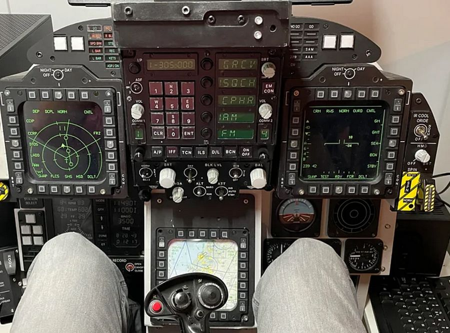

# Screen Export

DCS offers exporting and arranging in-game screens on multi-monitor setups. For
example displaying the content of the DSCG screen on a second monitor.

 (_Setup with RWR
exported to a small monitor_)

This allows for making great setups, in particular when owning some smaller
extra monitors; and is especially useful for SimPit builders.



DCS interface for this expects users to define what is called a **Viewport**.
The F-4E currently supports this feature for the following screens:

| Screen       | Viewport Name       |
| ------------ | ------------------- |
| DSCG (Pilot) | `F4E_Dscg_Pilot`    |
| DSCG (WSO)   | `F4E_Dscg_Wso`      |
| HUD          | `F4E_HeadUpDisplay` |
| RWR          | `F4E_Rwr`           |

> 💡 The DSCG screen of the cockpit the player is currently not sitting in will
> not render any content.
>
> In order to work, the DSCG screens currently require also exporting the
> viewport `F4E_Dscg_Tv`, a width and height of `1` pixel suffices though.

> 🚧 Support for other screens is in development:
>
> - `F4E_Cameras_AvtrTimeIndicatorPilot`
> - `F4E_Cameras_AvtrTimeIndicatorWso`
> - `F4E_EoTgtDesignatorSystem_BitDisplay`
> - `F4E_EoTgtDesignatorSystem_RangeIndicator`
> - `F4E_UhfRadio_FrequencyChannelIndicator`
>
> Depending on which screens are exported it can currently cause a bug with
> textures bleeding onto the center of the screen (around the HUD).

Of special interest are also programs such as
[Helios](https://github.com/HeliosVirtualCockpit/Helios/wiki) which simplify the
entire process and lets users create even complex setups with ease.

## Viewport

In order to make use of the feature, players can define a special file in their
Saved Games `MonitorSetup` folder for DCS, for example:

> `C:\Users\John Doe\Saved Games\DCS\Config\MonitorSetup\`

Such a file would for example be called `MySetup.lua` and look similar to this:

```lua
_ = function(p)
  return p
end

name = _("MySetup")
Description = "This is my setup"

Viewports = {
  Center = {
    x = 0,
    y = 0,
    width = 3840,
    height = 2160,
    viewDx = 0,
    viewDy = 0,
    aspect = 3840 / 2160
  }
}

GU_MAIN_VIEWPORT = {
  x = 0,
  y = 0,
  width = 3840,
  height = 2160
}

UIMainView = {
  x = 0,
  y = 0,
  width = 3840,
  height = 2160
}

function reconfigure_for_unit(unit_type)
  if unit_type == "F-14B" or unit_type == "F-14A-135-GR" or unit_type == "F-14A-135-GR-Early" then
    F14_VDI = {
      x = 1016,
      y = 1450,
      width = 525,
      height = 525
    }

    F14_HSD = {
      x = 1016,
      y = 1985,
      width = 525,
      height = 525
    }
  elseif unit_type == "M-2000C" then
    RIGHT_MFCD = {
      x = 879,
      y = 1580,
      width = 800,
      height = 800
    }
  elseif unit_type == "F-4E-45MC" then
    F4E_Dscg_Pilot = {
      x = 3840,
      y = 2160 - 1527,
      width = 300,
      height = 300
    }
    F4E_Dscg_Wso = {
      x = 3840 + 300,
      y = 2160 - 1527,
      width = 300,
      height = 300
    }
    F4E_HeadUpDisplay = {
      x = 3840 + 300 + 300,
      y = 2160 - 1527,
      width = 300,
      height = 300
    }
    F4E_Rwr = {
      x = 3840 + 300 + 300 + 300,
      y = 2160 - 1527,
      width = 300,
      height = 300
    }

    F4E_Dscg_Tv = {
      x = 3840,
      y = 2160 - 1527 + 300,
      width = 1,
      height = 1
    }
  else
    LEFT_MFCD = {
      x = 3840,
      y = 2160 - 1527,
      width = 700,
      height = 700
    }

    RIGHT_MFCD = {
      x = 3840 + 700,
      y = 2160 - 1527,
      width = 700,
      height = 700
    }
  end
end
```

Once created, this setup will now appear within DCS for selection in the
graphics settings:


The way the setup works is that you first sum up the resolution of all monitors
that you want to use combined. This will be the target resolution to render DCS
at. The example uses two monitors, one at a `3840x2160` resolution and the other
at `2715x1527`, combined that makes a virtual monitor resolution of `6555x2160`.


The exact arrangement is defined in the Windows Display Settings:


In the setup-file, one has to now define several viewports for DCS. This tells
the game where on the virtual monitor to render which scene. The format looks as
follows:

```lua
NAME_OF_THE_VIEWPORT = {
  x = ..., -- x-coordinate of top left corner, in pixels
  y = ..., -- y-coordinate of top left corner, in pixels
  width = ..., -- width to use for the scene, in pixels
  height = ... -- height to use for the scene, in pixels
}
```

The main scenery of DCS is defined and placed on the virtual monitor through the
following viewports:

```lua
Viewports = {
  Center = {
    x = 0,
    y = 0,
    width = 3840,
    height = 2160,
    viewDx = 0,
    viewDy = 0,
    aspect = 3840 / 2160
  }
}

GU_MAIN_VIEWPORT = {
  x = 0,
  y = 0,
  width = 3840,
  height = 2160
}

UIMainView = {
  x = 0,
  y = 0,
  width = 3840,
  height = 2160
}
```

In the example setup this will render the main scenery of the game on the
`3840x2160` monitor arranged on the left.

The following section in the file lets you define custom viewports per aircraft
type:

```lua
function reconfigure_for_unit(unit_type)
  if unit_type == "F-14B" or unit_type == "F-14A-135-GR" or unit_type == "F-14A-135-GR-Early" then
    ...
  elseif unit_type == "M-2000C" then
    ...
  elseif unit_type == "F-4E-45MC" then
    ...
  else
    ... -- any other aircraft
  end
end
```

Within this construct one can now declare custom viewports, for example

```lua
F4E_Dscg_Pilot = {
  x = 3840,
  y = 2160 - 1527,
  width = 300,
  height = 300
}
```

will place the DSCG screen on the second monitor as follows:


## Modding

Viewports, once defined by users in their monitor setups, are then picked up by
the modules code in the respective _Indicator-lua-files_, which can be found for
example in:

> `C:\Programs\DCS\Mods\aircraft\F-4E\Cockpit\Scripts`

As an example, the HUD declares at the end of
`Scripts\HeadUpDisplay\Indicator\init.lua` the following two lines

```lua
dofile(LockOn_Options.common_script_path .. "ViewportHandling.lua")
try_find_assigned_viewport("F4E_HeadUpDisplay")
```

which will try to see if the user created a viewport called `F4E_HeadUpDisplay`
and if so, render the scene there.

Modders can follow this approach to easily create new viewports in modules that
do not officially support them yet.
