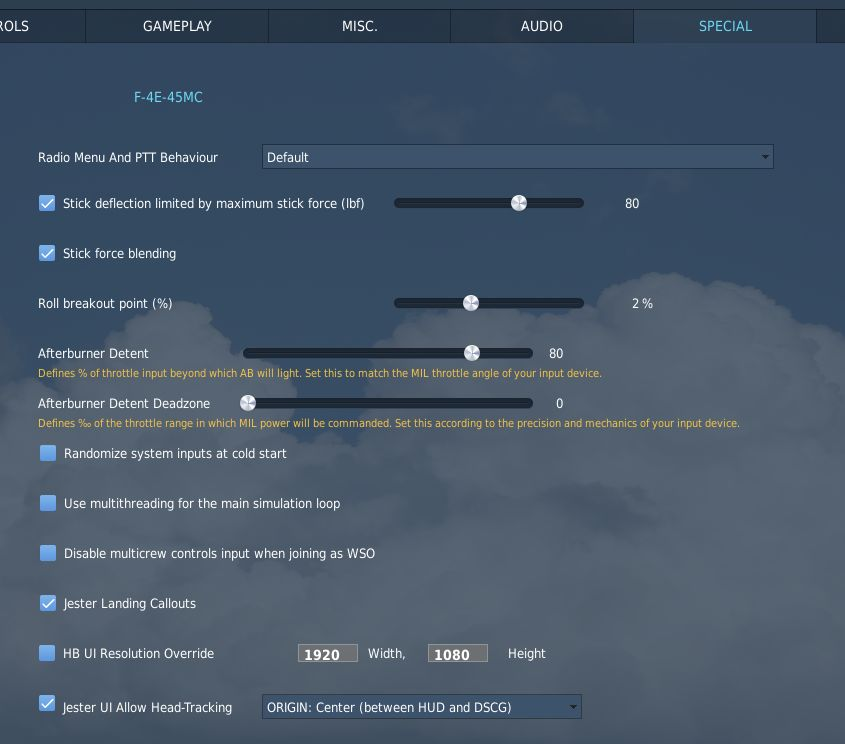
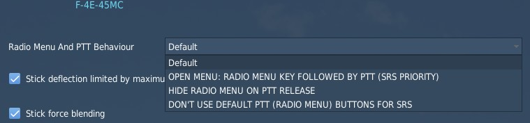
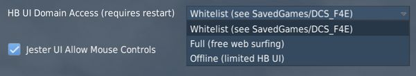
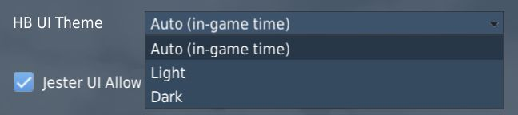
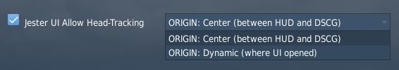

# 专用设置

鬼怪在 DCS 中有数个选项可在 _专用设置_ 菜单中进行设置。

## 无线电菜单和 PTT 行为

下拉式菜单来选择按键通话的行为。

| 选项     | 关闭菜单 | 菜单必须打开 | 导出话音 |
| -------- | -------- | ------------ | -------- |
| 默认     | ❌       | ❌           | ✅       |
| 打开菜单 | ❌       | ✅           | ✅       |
| 松开隐藏 | ✅       | ❌           | ✅       |
| 不导出   | ❌       | ❌           | ❌       |

各列有以下作用：

- 关闭菜单 - 松开按键后，DCS 通信菜单将自动关闭
- 菜单必须打开 - 只有当 DCS 通信菜单当前打开时，按键才起作用
- 导出话音 - 按下后，话音将导出到 SRS 等工具中

## 驾驶杆最大杆力偏转限制

限制飞行员拉动驾驶杆的最大力（磅力），即力度。

效果主要体现在大过载机动过程中操纵飞机时，可以防止意外拉出极大过载。

> 💡 例如，在某些情况下，将驾驶杆一直向后拉需要超出人力。有了这一设置，当真实驾驶杆的拉力超过这一极
> 限时，游戏中的飞行驾驶杆就会受到限制，无法再向后移动。这样还能避免意外拉到 20 G 并立即昏迷的情况
> ，因为真实驾驶杆没有或减少了力反馈。

## 杆力调配

当驾驶杆移动到最大行程会导致产生过大的力时，激活此功能将减小产生的力，从而提高操纵精度，同时也有助
于防止意外拉出极大的过载。

## 驾驶杆中位平滑区

平滑飞机系统施加的力，这些系统会使驾驶杆偏离中立位置 (见
[摆重与膜盒](../systems/flight_controls_gear/flight_controls.md#摆重与膜盒))。选定周期越长，这些系
统对驾驶杆动作的影响就越小。

可以让使用非力反馈硬件的用户更容易应对驾驶杆中立位置突然发生变化，并通常能实现更稳定的飞行。

## AFCS 临界死区

驾驶杆输入的百分比（横滚和俯仰分开），超过该数值后，AFCS 系统将识别到飞行员驾驶杆移动出中立配平位（
力传感器开关关闭）。

死区影响 AFCS 横滚和俯仰通道的工作，使其无法对抗飞行员的输入。也就是说，当将驾驶杆移动到死区外时
，AFCS 将其视为飞行员想要控制飞机，并且 AFCS 将停止尝试修正移动。越过横滚临界点时将短暂禁用横滚增稳
以及坡度角保持和航向保持。越过俯仰临界点时将短暂禁用俯仰姿态保持和高度保持。

> 💡 该死区处在 DCS 轴死区 _“之上”_ ，因此如果轴设置的基础死区数值越高，那么玩家应当随之降低 AFCS
> 临界死区。请注意，在基础死区数值已经较低的情况下，如果临界数值也设置较低（如 0%），即使松开驾驶杆
> ，由于驾驶杆可能仍未完全保持中立，将导致某些自动驾驶功能无法接通。

默认数值为横滚 1%，俯仰 2%。

> 💡 可以使用杆量指示器并查看其下方的文字来查看是否超出临界点。

详见 [力传感器](../systems/flight_controls_gear/flight_controls.md#力传感器)。

## 加力推力限位

两个选项，用于定义在物理硬件油门输入的某一点（0 至 100%），飞机将开启加力燃烧室。

也就是说，如果设置为 80%，飞机的军推动力区间将在物理油门的 0% 至 80% 之间，而剩余的 20% 将控制加力
燃烧室区间。

死区选项可用于分割后加力燃烧室的开启和关闭点。例如，将死区设置为 20‰，将限位点设置为 80%，那么加力
燃烧室将在油门输入的 82% 处开启，78% 处关闭。

## 以 WSO 加入驾驶舱时禁用多人机组操纵设备输入

如果勾选选项，在多人游戏中以 WSO 加入真人飞行员一起飞行时，玩家的本地操纵设备输入（驾驶杆、方向舵脚
蹬和油门）将被默认忽略。玩家可以使用指定的键绑定切换回本地输入。

## Jester 着陆标注

如果启用，Jester 将在着陆时通过标注飞机高度来协助飞行员，与民航中的情况类似。

> 💡 现实世界中的鬼怪 WSO 不会在着陆时提供协助。

## 通过涂装和尾号保存状态

选中后，启用飞机状态留存系统。允许在出击时保存和加载飞机状态。

首次使用时必须按下 **初始化留存飞机状态** (<kbd>LCTRL</kbd>+<kbd>P</kbd>) 快捷键来开始追踪当前飞机
。后续任何使用相同涂装与尾号组合执行的任务都将再次加载该特定的飞机。

详见 [9.6. 状态留存](persistence.md)。

> 💡 任务作者可超控这项设置，见 [9.12. 任务编辑器](mission_editor.md#状态留存)

## HB UI

## 分辨率超控

如 Jester 转盘、手册、虚拟浏览器等用户界面元素的缩放和定位是通过一个固定的分辨率来实现的，该分辨率
必须与游戏界面的分辨率相匹配。

如果不选中该选项，分辨率将根据屏幕设置自动决定。不过，在某些情况下，尤其是使用 VR 或多显示器设置时
，自动检测可能会失效并计算出错误的分辨率。

如果 UI 元素出现错位，例如 Jester 转盘没有居中，甚至被切断，请检查此设置并手动调整分辨率，直到 UI
能正确显示。

### 偏置

允许水平和垂直移动 UI。正值向右或向下移动，负值向左或向上移动。

通常情况下，应保持默认 0 px。不过，在某些情况下（例如使用 VR 并设置为在左眼或右眼渲染，同时未勾选
_“使用 DCS 系统分辨率”_ 选项时），UI 有可能被截断。该设置允许将 UI 视野内，但同时放弃 UI 正确对准位
置（例如 Jester UI 在屏幕上居中）。

### 域名访问

定义 HB UI 可访问哪些域名。

**完整** 允许自由流量，可使用 [虚拟浏览器](virtual_browser.md) 浏览任何网站。

默认选项 **白名单** 使用白名单文件定义可访问的网站。只能访问文件中设置的域名规则。默认规则的设置支
持所有 HB UI 功能和虚拟浏览器的实用网站，如 _YouTube_。

首次启动鬼怪时，文件将自动创建在

`C:\用户\(用户名)\保存的游戏\DCS_F4E\hbui_whitelist.txt`

位置。

选择 **离线** 将禁用虚拟浏览器和所有其它需要激活联网的 HB UI 功能和元素。

### 主题

允许选择 UI 使用的颜色主题。所有 UI 元素都支持浅色和深色主题。

默认选项 **自动** 将根据游戏中的时间动态选择主题。昼间为浅色，夜间任务为深色。

## Jester UI

### 动画速度

数值用来作为 Jester UI 中的特定动画效果调整系数，例如轮盘的开关动画或选中项目时的闪烁效果。

默认速度值为 1.0。大于该值将加速动画，小于 1.0 将减慢动画速度。有效范围为 0.01 至 1000。

> 💡 使用类似 1000 可有效地禁用动画。虽然会影响视觉体验，但当 UI 响应迟缓时选项可能有所帮助。

### 允许使用鼠标控制 Jester UI

勾选选项后，允许使用鼠标在 Jester UI 项目上移动和左键点击进行交互。

如果只希望使用头部跟踪以及鼠标自动检测又过于频繁，例如当鼠标放在椅子扶手上时，则可以禁用该选项。

### Jester UI 允许头部跟踪

选中后，Jester UI 允许通过移动游戏中人物模型的头部来移动光标。如果没有方便的头部跟踪设备（如
TrackIR 或 VR），则可以禁用。

> 💡 跟踪选项根据移动方式来动态选择。即使启用了头部追踪功能，仍可使用如使用鼠标或将光标分配到某个轴
> 上之类的其它选项。

下拉菜单中可选择头部跟踪行为：

- 中心 - 视角原点位于飞机中心
- 动态 - 视角原点位于 UI 打开的位置

选择 _中心_ 需要在操作 UI 时看向前方而 _动态_ 允许从任何视角位置使用头部跟踪。不过， _动态_ 选项会
导致在频繁关闭和重新打开 UI 时不得不寻找光标。此外， _动态_ 选项在 VR 中的意义不大，因为此时 UI 的
所有元素都会呈现在前方。

> 💡 Jester 问答框始终使用中心类型，要求向前看。

#### 最大角度

定义头部偏离中心以到达 UI 边缘所需的偏转角度（单位：度）。

换句话说，默认值减小 10°，头部跟踪就会对头部移动更加敏感，而增大值则会降低灵敏度。

> 💡 VR 用户可能会觉得较低的角度更舒适，因为在 VR 中，头部移动与游戏的转换通常为 1:1。

#### 死区

定义识别到头部移动以及激活头部跟踪的头部偏离 UI 中心所需的角度（单位：度）。

如果头部移动的角度小于死区（默认为 0.5°），光标将自动设置在中心位置，不会移动。

> 💡 用户在玩游戏时，如果使用高和十分敏感的游戏-头转换，可能会发现稍微增加这个值是很有用的。

#### 原始角度 Y 轴偏置

定义垂直方向上偏置头部跟踪中心点的角度（单位为度）。负数向下移动，反之向上。默认设置为 0°。

在自然朝前无法正确对准中心点时，可使用该设置来进行调整。也就是说，当从自然的头部位置打开菜单时，光
标已经出现了位移而不在居中位，调整此设置可以缓解这一问题。

## 使用雷达杆控制光标

勾选后，用于控制 [天线手控](../cockpit/wso/right_console/front_section.md#antenna-hand-control) 的
按键绑定也可用于移动用于偏置轰炸和类似模式的光标，来抛弃
[纵/横向距离拨轮](../cockpit/wso/right_console/center_section.md#along-track-wheel) 按键绑定。

## 力反馈

### 增益

对于使用力反馈杆的用户，该设置可用于调整各个轴的力反馈增益。

横滚和俯仰轴的默认值设置为 100%。数值越大，摇杆使用的力越大，数值越小，力越小。

### 强制关闭

选中选项后，驾驶杆将表现为非力反馈模式。即：即使连接了力反馈驾驶杆，或勾选了 DCS 通用设置中的“ _使
用力反馈_ ”选项框，驾驶杆仍将保持非力反馈模式。

## 更低的模拟更新率

**实验性选项** 可用来降低飞机主要组件的更新速度。

勾选后可以降低 CPU 的压力，提高 CPU 瓶颈机器的游戏性能。

不过，这不仅会导致视觉效果变差（如动画运行速度变慢），还会导致某些系统性能降低。例如，运行速度较慢
的 Pave Spike 无法再快速更新其地面稳定算法。因此，勾选该选项可能会引发问题并导致出现错误。

## 更低的 HB UI 刷新率

选中后，所有 HB UI 元素的渲染速度都会大幅降低。

降低渲染速度后助于在显示 HB UI 元素时通过减少 CPU 负载来提高性能。不过，这也会导致 UI 动画看起来不
再流畅。
