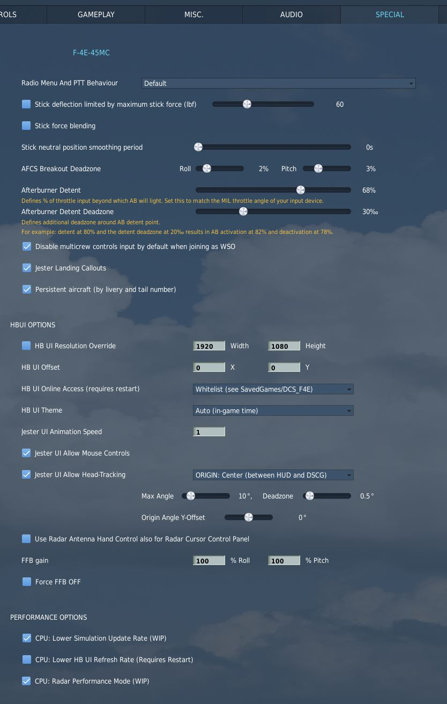

# Special Options

The Phantom offers several options that can be set within the _Special Option_
menu in DCS.

## Radio Menu and PTT Behavior

Dropdown to select the behavior of the push to talk bind for the radio.

| Option          | Close Menu | Menu must be open | Talk over SRS |
| --------------- | ---------- | ----------------- | ------------- |
| Default         | ❌         | ❌                | ✅            |
| Open Menu       | ❌         | ✅                | ✅            |
| Hide on Release | ✅         | ❌                | ✅            |
| No Export       | ❌         | ❌                | ❌            |

## Stick Deflection Limit

Limits the maximum force in lbf (Pound-Force), i.e. strength, the pilot is able
to pull the stick with.

This effect is mostly seen when controlling the aircraft during high G maneuvers
and can prevent accidentally pulling extreme Gs.

## Stick Force Blending

When maximum movement of the stick would result in excessive forces being
generated, having this activated will scale down the generated force to improve
handling precision, but also can help to prevent accidentally pulling extreme
Gs.

## Roll Breakout Point

Percentage of stick input after which the Roll and Trim system will recognize
pilot input and stop overwriting and fighting it.

## Afterburner Detent

Two options to define at which point of the physical hardware throttle input (0
to 100%) the aircraft will light the afterburner.

That is, if set to 80%, the MIL power range of the aircraft will be commanded
between 0% and 80% of your physical throttle, while the remaining 20% will
control the afterburner range.

The deadzone option can be used to split the points in the range at which the
afterburner will be turned on and off. For example, setting 2% for the deadzone
and 80% for the detent results in afterburner activation at 82% and deactivation
at 78% of throttle input.

## Randomize System Inputs

When unchecked, during cold start all switches and knobs will be in their
initial OFF positions. Allowing for a quick start by just following procedures.

When checked, switch positions will be randomized during cold-start, as if the
previous pilot did not properly return everything back to their initial
positions. To ensure a correct startup, the crew hence must check and confirm
each switch in the proper position before following a cold-start procedure.

## Performance Balancer

Under normal conditions, the systems and components in the aircraft are
simulated with a fixed update-rate.

With this option checked, the update rate of some less important systems (such
as animations) is scaled dynamically based on the current CPU usage. This means
that if the system has a hard time keeping high FPS, the rate on which less
important systems are simulated is dynamically tuned down to stress the CPU less
and possibly achieve higher FPS.

> 💡 Due to dynamic nature of this system, having it enabled might result in
> broken track/replay files.

## Disable WSO Multi-Crew Controls

When checked, when playing as WSO in Multiplayer with a human pilot, any stick
and throttle input will be deactivated to prevent accidentally messing with the
pilot and screwing up the flight.

## Jester Landing Callouts

If enabled, Jester will assist the pilot during landing by calling out aircraft
altitude, similar as seen in civilian aviation.

> 💡 Real Phantom WSOs did not assist during landing.
