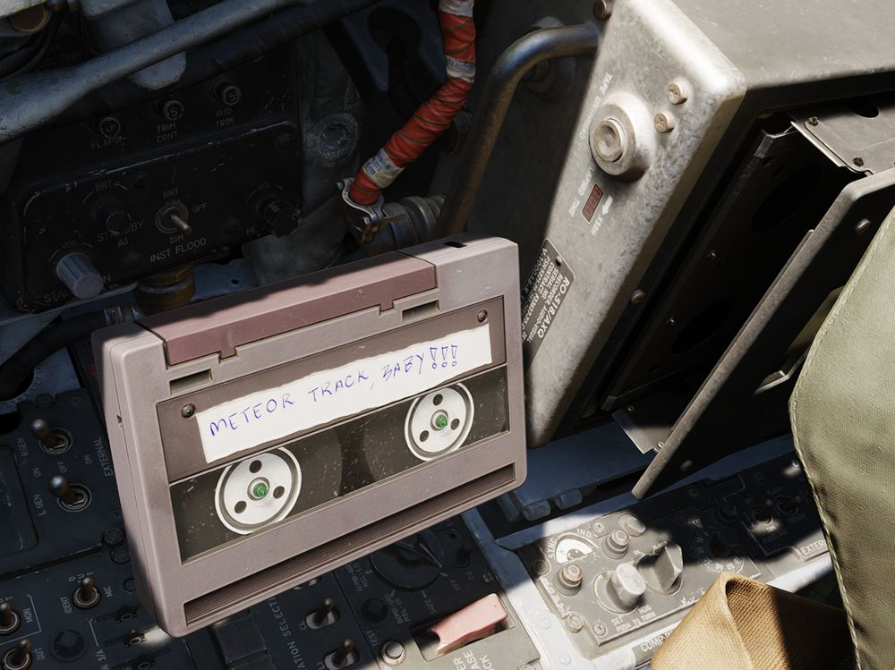
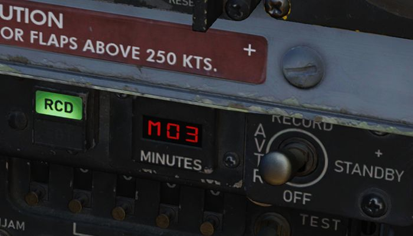

# Tape Player

Although not present in the real Phantom, our aircraft is equipped with a Tape
Player to listen and rock to great tunes in-flight!

Therefore, the **Airborne Video Tape Recorder** doubles as recorder and, if
inserting a special music cassette, as music player.

> 💡 The songs can also be found in highest quality in
> `<DCS Install Folder>\Mods\aircraft\F-4E\Music\Of Ghosts and Thunder (Meteor F-4 OST)`.

## Controls

The AVTR and most of its controls are to the right of the pilot seat, see
[2.1.10.3 AVTR System](../cockpit/pilot/right_console/aft_section.md#airborne-video-tape-recorder)
for details. Status lights and its mode switch can be found on the main panel in
the WSO cockpit, see
[2.2.2 AVTR Control](../cockpit/wso/left_sub_panel.md#avtr-control).

> 💡 Jester can set the mode from his UI under _"Systems > AVTR Recorder"_.

To swap the cassettes, the AVTR first has to be turned off by setting its mode
to OFF. Then, the EJECT button can be pressed to open the cassette holder.

Once the cassette is out, it can be swapped by clicking on it. Insert the
cassette back by left-clicking the holder.

With the music tape loaded, songs can be played by setting the mode switch to
RECORD. The RECORDER ON lamp next to the pilots left knee indicates the status
and rotating it will adjust the volume.

The AVTR shows the soundtrack currently playing on its display for Elapsed Time,
e.g. `M01` for the first track. Tracks can be skipped by using either the
UNTHREAD button or by clicking on the RCD/EOT lamp in the WSO cockpit.

If the tape has finished playing all songs, the EOT lamp illuminates and
explicitly commanding the next track will start the first track again.

## Custom Songs

The Tape Player automatically fetches any song found in

`<DCS Install Folder>\Mods\aircraft\F-4E\Sounds\TapePlayer`

and plays them in alphabetical order.

Note that it is necessary for DCS that each song is also set up as a
[SDEF](modding/jester/voice_files.md#sdef) file in

`<DCS Install Folder>\Mods\aircraft\F-4E\Sounds\sdef\TapePlayer`

To add your own songs, simply put them into the above folder and create the
corresponding SDEF file. Make sure to restart DCS, as sounds are loaded during
start of the game.

> 💡 If you have trouble getting a custom song to work, try out the file format
> **OGG** for the sound file. Also make sure the file names do not contain any
> special Unicode characters, such as `·` or `你好`, DCS tends to crash on
> those.
>
> To speedup loading times DCS introduced a song cache. Unfortunately, this
> mechanism disables the ability to load custom songs. Either replace the
> existing soundtracks with yours (so that they share the same name), or
> manually delete the sound cache file `sdef.tar`.
