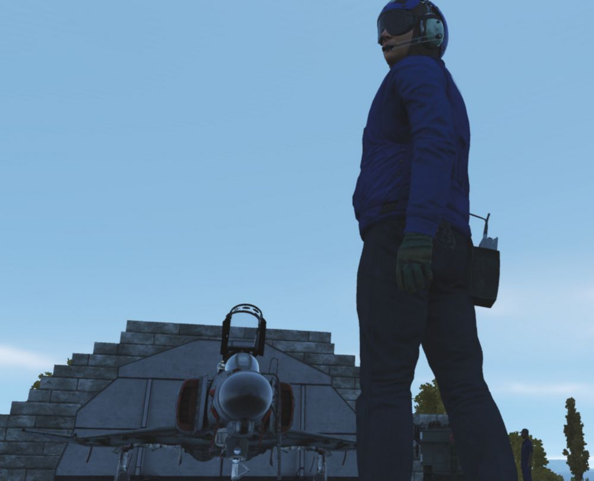
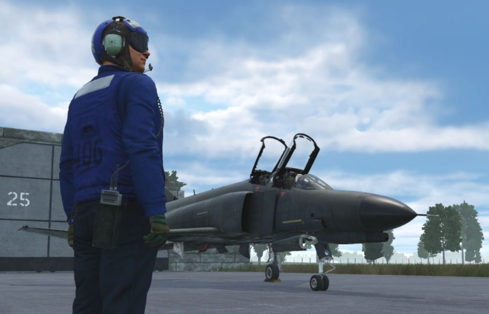

# Training Missions

## Lessons

These missions, we like to call them "lessons", have been designed in such a way that, as a
beginner, everything important that you need for a successful start with your new F-4E Phantom II is
explained.

## Goals

The stated goal of these lessons is that after completing them once or several times, you can
say: "Hey, I think I now know how this thing works (again)".
You can use the lessons as "initial training" or as so-called "recurrent training". Whenever
you haven't flown for a long time and need a refresher. By the way: We recommend a refresher
every 90 days at least ...

Please note that the lessons require a certain level of knowledge and basic flying skills. In the
lessons we don't explain flying as such, but rather the aircraft, its systems and their usage, and
the behavior. The lessons may therefore be understood as a kind of "interactive type training in the
cockpit seat" and not as "basic flying training".

## Your way through

Due to the design, systems and age of the jet, it has many pecularities. Precise application of
system knowledge in daily duty on this wonderful aircraft is the key to success. With the F-4E
Phantom II you will be challenged in so many ways. So be ready! We leave it up to you whether you
want to get in the air immediately without studying the manual, or whether you want to read upon it
before your first flight ...

Decide for yourself!

If you want to fly immediately, the training lessons will provide you with enough knowledge to
successfully complete these flights. You can even study this section or other parts of the manual
during your flights; this is another innovation in the DCS F-4E Phantom II. The lessons can be
paused at any time if necessary. Of course, you are welcome to practice multi-tasking and fly at the
same time as studying the manual; that's not explicitly forbidden! Learning by doing is the basic
strategy for the training lessons, but you will be required to read through the manual and carefully
study the systems if you want to become a real pro.

## Procedures

We have depicted the most important "normal procedures" of the aircraft and have based the lessons
very much on reality. These procedures should also be based as closely as possible on the real
procedures, although we were aware that it wouldn't be possible to implement everything in the
simulation. Think, for example, of the ejection seat harness, the oxygen mask and its test, the
transponder, the IFF system, or similar systems. Some steps are left out because they are already
set correctly after spawning the aircraft and to really speed up the lesson to get you in the air;
of course you may check them as well.

Therefore, not all procedures are depicted as can be found in real aircraft manuals; some of
them had to be changed, shortened, or omitted entirely. Nevertheless, for example, we
simulated putting on the helmet (including sun protection visor and sun glasses), an immersive
innovation in DCS.

## Our way

We thought a lot about how best to explain the operation of such a complex aircraft with training
missions. Where do you start, where do you end? How detailed should it be so that a "nerd" doesn't
miss anything, how superficial can it be so that a "leisure gamer" doesn't lose interest? How tight
are the checks whether the player is adhering to the procedures and the planned flight route? A
basic idea at Heatblur has always been to get players "in the air" as quickly as possible, without
them having to spend hours watching introductory videos or studying thick books. All of this caused
us a lot of headaches...

In any case, we spared no expense, effort and discussions to serve both types of players more or
less "equally". As you can imagine, such a project is not entirely trivial, and you have to make a
lot of compromises when designing the lessons. Sometimes, you have to tell hardliners: "Hey, this
might be too difficult for the players and not really relevant to the simulation, eventhough it
would be extra cool!" You have to convince other team members to do things they personally don't
like: Hey, that's exactly what the players need, but a little different please!

Fortunately, we had professional help from SME's (real former Phantom pilots and weapons systems
officer and even instructors). These guys helped us with so many decisions, and spiced the product
with their knowledge and experience. Conversely, they slapped us on the wrist if we left out
something they thought was important.

In a complex development process that such a high-quality DCS module requires, there are many
obstacles and limitations, but also many opportunities and possibilities. That's why we made it a
point right from the start to present the handling of the aircraft's systems as comprehensively as
possible.

We hope you like what you have in hands now!

## Lessons Overview

This section is limited to the description of the first 4 lessons:

- Lesson 01 - Startup
- Lesson 02 - Taxi
- Lesson 03 - Normal Takeoff
- Lesson 04 - Visual approach

## General Tips and Tricks

It rarely happens that you get stuck in a procedure, or you don't know exactly what to do
next.

Here are some general tips & tricks as created by testers during the testing phase:

- For lessons starting on the ground, the noise might be very loud. You have three options:
  - Wait until the other jets have taken off before beginning with the lesson.
  - You are allowed to close the canopy whenever you need to (default binding is LCTRL+C), despite
    the F-4 usually closes it very lately
  - Adjust the audio volume of DCS to suit the autio hardware you are using.
- If you have troubles with a very dark cockpit, a few things can be done:
  - Use the internal cockpit illumination on the COCKPIT LIGHTS panel (right side):
    - The CONSOLE OFF/BRT knob
    - The INSTR PANEL knob
    - The CONSOLE FLOOD light switch
    - The INST FLOOD light switch

- Set the SYSTEM option "Cockpit Global Illumination" to ON
- Set the SYSTEM option "Gamma" to 2.0 or higher values.

## Emergencies

There are situations in which the triggers of a lesson no longer work properly for some unknown
reason. Fortunately, this only happens very rarely! This usually results in the highlights (the
yellow helper boxes) no longer being shown or hidden correctly, or the logic circuits no longer
reacting correctly to events in the simulation. We experienced this ourselves during the testing
phase and would like to at least inform you about it here and now.

The influence of the time acceleration function on the stability of the lessons is not documented,
but to be on the safe side we advise against using the time acceleration function.

If you got stuck in a lesson, you should take the following actions:

- Stay calm! The two most important pilot rules apply:
  1. Aviate, navigate, communicate.
  2. Don't crash, and above all: don't break anything!

- Check whether everything in the aircraft is actually set up as required according to the
  checklist/procedure. If necessary, go up the list a few steps and again check each step
  individually, starting from the top by asking yourself: What is written in the book? >
  How did I set it up?

- If that doesn't help:
  Jump back one, or even more steps (how to do this is explained above)

- If that doesn't help either:
  Jump back to the beginning of the procedure (how to do this is explained above)

- If all that doesn't help:
  - Quit the mission and save the DEBRIEFING (log-file) and the TRACK (trk-file) in the
    debriefing screen
  - If you suspect a bug, please open a new ticker in the DCS forum > Heatblur Simulations >
    Phantom area using this link: <https://forum.dcs.world/forum/919-dcs-f-4-phantom/>. Please
    add as much information as possible in order to help us finding a possible issue. Thank
    you for your support!
  - In any case, we recommend to restart DCS and load the mission again. Sorry for that!

## Lesson 01 - Startup

### Lesson 01 - Kobuleti airfield

The airfield has a picturesque location between the mountains to the south and the Black Sea
to the west. Here is a photo of the airfield, taken a month ago from a helicopter, looking S-
W.

The entire F-4E Phantom II training for your year (July 1995 syllabus) will be held in Kobuleti.
The choice fell on an airfield in the Caucasus region for understandable reasons, as this map is
delivered with DCS as standard. The designated training areas in the south of Georgia (designated
as "Training Area W" and "Training Area E") offer a sufficiently large playground for training,
including supersonic flights.

### Lesson 01 - Weather

The weather has been very bad in the last few days. A persistent Black Sea depression had brought a
lot of rain. However, stabilization occurred last night and morning. Dry air mass flows in from the
east. The mid-level cloud layer is expected to break up. The weather forecast predicts that the
clouds will no longer be a problem in about an hour and the temperature will rise quickly due to
strong sunshine. However, ground-level haze is still to be expected as the ground has stored a lot
of moisture and heavy evaporation from the sun is to be expected.

### Lesson 01 - Slots

Your fellow pilots will begin their flights immediately, your flight a little later. The airfield is
a very noisy environment, so wait until the jets currently positioned on the runway have taken off
before beginning with the lesson. Then the noise level should be somewhat tolerable... hopefully at
least.

Currently registered sorties for this afternoon:

- #1 Dodge 41 (AI, already in the air)
- #2 Dodge 31 (AI, already in the air)
- #3 Dodge 21 & 22 (AI, at the start)
- #4 Dodge 11 (you, at parking position #25)

All Dodge flights complete familiarization and training flights at the airfield.

### Lesson 01 - Aircraft

Your aircraft is "cold & dark" on the ramp #25, the nose is pointed towards the runway, and is
prepared and fully fueled. The Dash-60 ground power unit is already in place left of your jet.

The technician responsible for the aircraft, also called the "crew chief", is already in front of
your aircraft and waiting to support you. You can communicate with him using the Jester menu > CREW
CHIEF.

By the way, his assistant is standing by on your left side, next to the Dash-60 ground power
unit.

You've just sat down in the ejection seat and are starting to check the cockpit. You may be saying
to yourself  "Damn, I'm blown away by everything I see, but I guess I don't know what I'm doing...".

Don't worry, your instructor, who is also your WSO for today's flight, will guide you through
the lesson!

### Lesson 01 - Audio & text

Your instructor speaks from the back seat, always listen carefully. Assume that everything he says
is important. As an aid, all of the text he speaks is displayed at the top right of the screen. If
you don't notice or understand something, you can always read it above. The text remains visible on
the screen for a maximum of 1000 seconds until it either disappears or is replaced by new text.

Note that whenever you missed one of the text messages, you can access the message log by pressing
the key "Escape" and then selecting MESSAGES HISTORY and read after.

### Lesson 01 - Tasks & steps

The lessons are divided into tasks, which are based on the names of the procedures. These
tasks are divided into individual steps, whereby the steps go hand in hand with the individual
items in the procedure.
The tasks for this lesson are:

- Task 1: Check the aircraft and essential switches before applying external power.
- Task 2: Perform the internal inspection of the aircraft.
- Task 3: Prepare the aircraft for engine start.
- Task 4: Start the engines.

### Here are some special tips for lesson 01

- Task 4:
  Let the instructor speak to the end of each instruction, there is enough time for the
  actions to be carried out.
- Task 4 > Step 4b:
  Be careful when opening the fuel, this should not be done before 10% RPM! If you see the
  EGT rising above 700°C, immediately cut off the fuel by moving the throttle lever to the
  "OFF" position. Note: engine parameters may vary slightly depending on the environmental
  conditions. Only the EGT value is to be monitored very closely!

## Lesson 02 - Taxi

### Lesson 02 - Weather

The weather changes slowly but noticeably. The clouds start breaking up, and the forcast
regarding the ground-level haze was correct. Wind speed and direction haven't changed so far.

### Lesson 02 - Slots

Slots haven't changed.

- #1 Dodge 41 (AI, already on ground, refuelling)
- #2 Dodge 31 (AI, already on ground, refuelling)
- #3 Dodge 21 & 22 (AI, at the start)
- #4 Dodge 11 (you, at parking position #25)

All Dodge flights complete familiarization and training flights at the airfield.

### Lesson 02 - Aircraft

Your aircraft is already "hot on the ramp #25" with both engines running, the nose is pointed
towards the runway. All aircraft systems are set to the positions in which you left in the previous
lesson. The Dash-60 ground power unit is already removed.

The "crew chief" has changed his position to forward right of your aircraft and is waiting to
support you.

His assistant is standing by on your forward left side.

### Lesson 02 - Audio & text

Your instructor speaks from the back seat, always listen carefully. Assume that everything he says
is important. As an aid, all of the text he speaks is displayed at the top right of the screen. If
you don't notice or understand something, you can always read it above. The text remains visible on
the screen for a maximum of 1000 seconds until it either disappears or is replaced by new text.

Note that whenever you missed one of the text messages, you can access the message log by pressing
the key "Escape" and then selecting MESSAGES HISTORY and read after.

### Lesson 02 - Tasks & steps

The lessons are divided into tasks, which are based on the names of the procedures. These
tasks are divided into individual steps, whereby the steps go hand in hand with the individual
items in the procedure. The tasks for this lesson are:

- Task 1: Check the aircraft before moving on own power.

- Task 2: Taxi to holding point RWY 07.

### Lesson 02 - Tips & tricks

Here are some special tips for lesson 02:

- Task 1 > Step 7:
  The flight controls check can be omitted in case it becomes too difficult. Use the FIRE
  TEST BUTTON on the instrument panel before or during performing this check to skip it. The
  reason for this is that for this check a few things have to be done in parallel:
  - Listening to our instructor
  - Performing the inputs on the flight control system (movements and button/switch
    presses/settings)
  - Listening to the confirmation given by the crew chief
  - Pressing "Spacebar" after receiving the crew chief's confirmation

- Task 1 > Step 7f & 7h: The crew chief will not respond when you set the rudder to the neutral
  position.

- Task 2 > Introduction:
  Observe that the audio containing the taxi clearance by ATC is played through your UHF
  radio. Therefore, if you turn off or tune down the volume of the radio, or route the audio
  signal to some other audio device tuned down in volume, you might not hear the call
  correctly. In any way, the spoken text can be read on the upper right corner of the screen,
  and the lesson continues normally.

- Task 2 > Step 1a)
  Use the power levers very gently! Once the aircraft started rolling, pull back the power
  levers to idle and carefully control the taxi speed using minimum power together with
  the wheel brakes.

## Lesson 03 - Normal Takeoff

### Lesson 03 - Weather

The weather is changing noticeably with every minute. The clouds continue breaking up, and the
ground-level haze is still there. Wind speed and direction haven't changed so far.

### Lesson 03 - Slots

Slots haven't changed.

- #1 Dodge 41 (AI, already on ground)
- #2 Dodge 31 (AI, already on ground)
- #3 Dodge 21 & 22 (AI, already on ground)
- #4 Dodge 11 (you, at the holding point for runway 07)

All Dodge flights complete familiarization and training flights at the airfield.

### Lesson 03 - Aircraft

Your aircraft is already "hot on the holding point for runway 07" with both engines running, the
nose is pointed towards the runway. All aircraft systems are set to the positions in which you
left in the previous lesson.

### Lesson 03 - Audio & text

Your instructor speaks from the back seat, always listen carefully. Assume that everything he says
is important. As an aid, all of the text he speaks is displayed at the top right of the screen. If
you don't notice or understand something, you can always read it above. The text remains visible on
the screen for a maximum of 1000 seconds until it either disappears or is replaced by new text.

Note that whenever you missed one of the text messages, you can access the message log by pressing
the key "Escape" and then selecting MESSAGES HISTORY and read after.

### Lesson 03 - Tasks & steps

The lessons are divided into tasks, which are based on the names of the procedures. These tasks
are divided into individual steps, whereby the steps go hand in hand with the individual items in
the procedure. The tasks for this lesson are:

- Task 1: Check aircraft while being positioned at the holding point for RWY 07.
- Task 2: Line-up the aircraft on RWY 07
- Task 3: Check essential aircraft systems while being lined up on RWY 07
- Task 4: Perform a normal take-off (slats & flaps "out" & "down") on RWY 07
- Task 5: Perform a normal climb at 350kts or M0.9 (whichever is reached first), by following
  turnpoints 1, 2 and 3.
- Task 6: Perform cruise checks.

### Lesson 03 - Tips & tricks

Here are some special tips for lesson 03:

- Task 1 > Steps 4a - 4e:
  The flight controls check only requires to check if the stick is moving freely (at least 50%
  of the stick deflection must be made). You can also check the rudder, but this is not
  required by that step.

- Task 1 > Step 10:
  Having the MASTER CAUTION alert active indicates something is or at least was wrong. So
  reset it, then check if it stays out.

- Task 2 > Step 1:
  Observe that the audio containing the line-up clearance by ATC is played through your UHF
  radio. Therefore, if you turn off or tune down the volume of the radio, or route the audio
  signals to some other audio device tuned down in volume, you might not hear the call
  correctly. In any way, the spoken text can be read on the upper right corner of the screen,
  and the lesson continues.

- Task 4 > Introduction
  Observe that the audio containing the take-off clearance by ATC is played through your UHF
  radio. Therefore, if you turn off or tune down the volume of the radio, or route the audio
  signals to some other audio device tuned down in volume, you might not hear the call
  correctly. In any way, the spoken text can be read on the upper right corner of the screen,
  and the lesson continues.

- Task 4 > Step 5:
  For beginners, we recommend to perform the first take-off without afterburner (just MIL
  power, which means 100% rpm without afterburner), despite we know that taking off with
  afterburner is a ton of fun. The reason behind is, that you will then be able to hear all
  call-outs of your instructor, because the time needed for the take-off is long enough.
  Whenever you think you manage all steps by heart that are necessary for a safe take-off
  without any instructions, go for a take-off with afterburner. Please don't tell our SME's
  that this text exists at all, and never tell someone that you have followed the
  recommendation ...

- Take-off:
  Before taking off, go through the takeoff procedure. You need to remember the items by heart:
  - No NGS after 70 knots
  - Full aft STICK by 80 knots
  - Hold 10 to 12° NOSE UP
  - Raise the GEAR & FLAPS as soon as airborne
  - TRIM as needed

- Task 4 > Step 8:
  In DCS, with the current wind situation (no cross wind component), it is really not
  necessary to use the nose gear steering. You will only be reminded by the instructor in case
  you use the nose gear steering above 70 knots.
- Task 4 > Step 11:
  Pitch trim is best done in a number of quick pulses instead of one long press to avoid over-
  trimming.

- Task 4 > Steps 13:
  Make sure to have flaps retracted before reaching 250 knots, but there is a certain safety
  buffer and they should not be damaged at exactly 250 knots.

- Task 5 > Step 1:
  Make sure to fly a heading of about 064° and climb after lift-off.
  Make sure to fly at an airspeed of not more than 350 knots.
  Fly a shallow climb when using no afterburner (about 10° pitch angle).
  Fly a steep climb when using afterburner (about 30° pitch angle).

- After reaching a certain altitude and airspeed with gear and flaps up, the lesson is
  accomplished. You may continue the climb following the route which is commanded by your
  instructor. If you got "lost in space", open up the F-10 map, click on your aircraft, and
  observe the planned flightroute; you may then follow it more easily.

- Task 6 > Step 1d:
  There is currently no way of comparing the values on both altimeters. This step was kept in
  the procedure just in case you need it when operating with a real WSO in the rear seat.

## Lesson 04 - Visual approach

### Lesson 04 - Weather

The weather has become pretty nice. The clouds have disappeared more or less, and the ground-level
haze is less visible due to the quickly rising temperature. Wind speed and direction still haven't
changed so far.

### Lesson 04 - Slots

Slots haven't changed.

- #1 Dodge 41 (AI, already on ground)
- #2 Dodge 31 (AI, already on ground)
- #3 Dodge 21 & 22 (AI, already on ground)
- #4 Dodge 11 (you, in-flight inbound turnpoint 7)

All Dodge flights complete familiarization and training flights at the airfield.

### Lesson 04 - Aircraft

Your aircraft is already "in flight" inbound turnpoint 7 at 22,000ft altitude at Mach 0.7. All
systems are set in a way as they would be after a typical air-to-air training, thus it will be
required to prepare the aircraft for the upcoming approach and landing.

### Lesson 04 - Audio & text

Your instructor speaks from the back seat, always listen carefully. Assume that everything he says
is important. As an aid, all of the text he speaks is displayed at the top right of the screen. If
you don't notice or understand something, you can always read it above. The text remains visible on
the screen for a maximum of 1000 seconds until it either disappears or is replaced by new text.

Note that whenever you missed one of the text messages, you can access the message log by pressing
the key "Escape" and then selecting MESSAGES HISTORY and read after.

### Lesson 04 - Tasks & steps

The lessons are divided into tasks, which are based on the names of the procedures. These tasks are
divided into individual steps, whereby the steps go hand in hand with the individual items in the
procedure.

The tasks for this lesson are:

- Task 1: Check aircraft for landing while in cruise flight.
- Task 2: Prepare the aircraft for landing while in the downwind RWY 07.
- Task 3: Land the aircraft on RWY 07.
- Task 4: Secure the aircraft while taxiing back to the parking position PRK 25.

### Lesson 04 - Tips & tricks

Here are some special tips for lesson 04:

- Trim the jet:
  Pitch trim is best done in a number of quick pulses instead of one long press to avoid
  over-trimming.
- Autopilot:
  Use the autopilot modes "attitude hold" and "altitude hold" whenever you think you need your hands
  free. The system is a great assistant, so use it!
- DME distances:
  DME distance information is shown on the lower left corner of the HSI.

- HSI course settings:
  The course setting can be changed with the COURSE SET KNOB on the lower right corner of the HSI:

- Task 1 > Step 4:
  If you can't reach the COMM Antenna Select Switch, move the throttles back for a moment.

- Task 1 > Step 8:
  The transition altitude in this particular region is 4,000m (13,120 ft), and the transition level
  is
  flight level 140 (FL140, which is 14,000 feet). When you descend through 14,000 feet, you have to
  set your altimeter to the value of the local QNH (which today is 29.84 in/HG). It's no big deal if
  you forget about that, it is not relevant for the outcome of the lesson.
- PENETRATION / DESCENT:
  Follow the instructions as good as possible. You may engage the attitude hold autopilot during
  descent and focus on airspeed and power management. Don't forget to set the QNH once passing the
  transition level (in this case 14,000 feet).
- PENETRATION / TURN:
  Fly a shallow left turn. If you have already reached 2,500 feet altitude, good. If you are still
  higher, continue descending during the left turn until reaching 2500 feet. Keep an eye on your
  sink
  rate. Fly smoothly, and don't work hard on the stick. Intercept radial 064 as good as you can in
  order to align on the runway heading. Treat her like a lady, and think ahead! Use the F-10 map if
  you got lost in space. Don't rush into Batumi airspace.
  Landing permission is already given. You are the last flight approaching the airfield for the next
  two hours.
- Task 2:
  Remember these five items by heart: GEAR / FLAPS / HYDRAULIC PRESSURE / WARNING LIGHTS / ANTI SKID
- Task 3:
  If you fly correct airspeeds, all instructions can be heard until the end. If you rush, the
  timeline
  becomes compressed and the sequence of events then may become overwhelming.
  During the approach continuously cross check Pitch / Power / Trim. Look out for the runway, adjust
  your heading with slight roll maneuvers if necessary. Rise the seat in case you have troubles
  seeing
  the runway at higher angles of attack. Fly gently, follow the instructions, and think ahead!
- Go-around:
  In case you have the slightest doubt that you cannot manage a safe landing: GO AROUND. Fly the
  missed approach procedure by entering a short left hand traffic pattern at 1500 feet at 250 knots.
  Take your time, be patient with yourself, don't rush and keep an eye on airspeed and altitude!
- Landing / flare:
  The aircraft was certified for carrier landings. If you don't flare before touchdown at a 2°
  to 3° approach path, you WILL slam the aircraft into the runway. This causes wear to the wheels
  and the landing gear legs, but nothing more. You may decide on your own if you want to flare just
  a bit to decrease the sink rate slightly. Sink rates above 3 to 4 m/s (600 to 700 ft/min)
  depending on weight, might damage the landing gear though.
- Landing / touchdown:
  Make sure to stay aligned with the centerline using rudder only. Prepare yourself to deploy the
  drag chute, which stabilizes the aircraft during the landing roll. Taxi to the end of the runway
  and then leave it to the right side!
- Taxi:
  Follow the marshaller after leaving the runway. If you struggle performing the "After landing
  procedure " while taxiing, you may stop the aircraft on the taxi way for that. The car though
  will not stop. When finished with the procedure, continue taxiing to your initial parking
  position, nose pointed towards shelter "25", and stop there.
