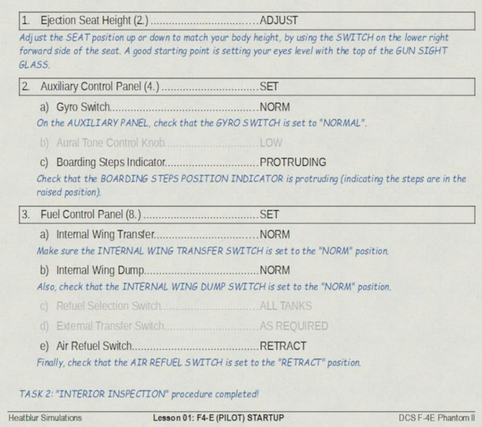
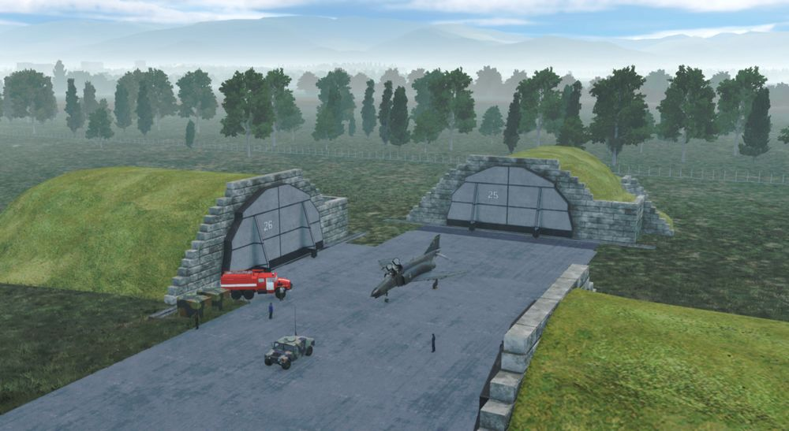

# Training Missions

## Lessons

These missions, we like to call them "lessons", have been designed in such a way that, as a
beginner, you are explained everything important that you need for a successful start with
your new F-4E Phantom II.

## Goals

The stated goal of these lessons is that after completing them once or several times, you can
say: "Hey, I think I now know how this thing works (again)".
You can use the lessons as "initial training" or as so-called "recurrent training". Whenever
you haven't flown for a long time and need a refresher. By the way: We recommend a refresher
every 90 days at least ...

## Demarcation

First of all, it should be said that the lessons require a certain level of knowledge and
basic flying skills. In the lessons we don't explain flying, but rather the aircraft, its
systems and their usage, and the behavior. The lessons may therefore be understood as a kind
of "interactive type training in the cockpit seat" and not as "basic flying training".

## Procedures

We have depicted the most important "normal procedures" of the aircraft and have based
ourselves very much on reality. These procedures should also be based as closely as possible
on the real procedures, although we were already aware that not everything would be possible
to implement in the simulation. Think, for example, of the ejection seat harness, the oxygen
mask and its test, the transponder, the IFF system, or similar. Some steps are left out
because they are already set correctly after spawning the aircraft and to really speed up the
lesson to get you in the air; of course you may check them as well.

Therefore, not all procedures are depicted as can be found in real aircraft manuals; some of
them had to be changed, shortened, or omitted entirely. Nevertheless, for example, we
simulated putting on the helmet (including sun protection visor and sun glasses), an immersive
innovation in DCS.

Here is an example of the "BEFORE INTERIOR INSPECTION" procedure. It shows a few steps left
out for speeding up the lesson. Its about Task 1, steps 1 to 3. It shows 3 steps, with step 2
consisting of 3 sub-steps with step b) left out, and with step 3 consisting of 5 sub-step with
steps c) and d) left out.

## Our way

We thought a lot about how best to explain such a complex aircraft during training missions.
Where do you start, where do you end? How detailed should it be so that a "nerd" doesn't miss
anything, how superficial can it be so that a "leisure gamer" doesn't lose interest? How
exactly is it checked whether the player is adhering to the guidelines and the planned route?
A basic idea at Heatblur has always been to get the player "in the air" as quickly as
possible, without them having to spend hours watching introductory videos or studying thick
books. All of this caused us a lot of headaches...

In any case, we spared no expense, effort and discussions to serve both types of players more
or less "equally". As you can imagine, such a project is not entirely trivial, and you have to
make a lot of compromises when designing the lessons. You have to say to hardliners: "Hey,
this might be too complicated for the player and not really relevant to the simulation, even
if it would be cool!" You have to convince other team members to do things they personally
don't like: Hey, that's exactly what we need, but a little different please!
Fortunately, we had professional help from SME's (real former Phantom pilots and weapons
systems officers). They helped us with many decisions and accelerated the production process
with their knowledge and experience. Conversely, they slapped us on the wrist if we didn't do
something they thought was important.

In a complex development process that such a high-quality DCS module requires, there are many
obstacles and limitations, but also many opportunities and possibilities. That's why we made
it a point right from the start to present the handling of the aircraft's systems as
comprehensively as possible.

## Your way

Due to the design, systems and age of the jet, it has many "idiosyncrasies". The precise
application of system knowledge in your - hopefully - daily operations is the key to success.
With the F-4E Phantom II you will be challenged in many ways:
So be ready!

We leave it up to you whether you want to get "in the air" immediately and without studying
the manual in detail, or whether you want to read up on it before your first flight:
Decide for yourself!

If you want to fly immediately, the training lessons will provide you with enough knowledge to
successfully complete these flights. You can even study the manual during the flight; this is
another innovation in the DCS F-4E Phantom II. The lessons can be paused at any time if
necessary. Of course, you are welcome to practice multi-tasking and fly at the same time as
studying the manual; that's not explicitly forbidden!

## Lesson 01 - Startup

### Lesson 01 - Kobuleti airfield

The airfield has a picturesque location between the mountains to the south and the Black Sea
to the west. Here is a photo of the airfield, taken a month ago from a helicopter, looking S-
W.

The entire F-4E Phantom II training for your year (July 1995 syllabus) will be held in
Kobuleti. The choice fell on an airfield in the Caucasus region for understandable reasons, as
this map is delivered with DCS as standard. The designated training area in the south of
Georgia (labelled "Training Area W/E") offers a sufficiently large playground for training,
including supersonic flights.

### Lesson 01 - Weather

The weather has been very bad in the last few days. A persistent Black-sea depression had
brought a lot of rain. However, stabilization occurred last night and morning. Drier air
masses flow in from the east. The mid-level cloud layer is expected to break up. The weather
forecast predicts that the clouds will no longer be a problem in about an hour and the
temperature will rise quickly due to strong sunshine. However, ground-level haze is still to
be expected as the ground has stored a lot of moisture and heavy evaporation from the sun is
to be expected.

### Lesson 01 - Slots

Your fellow pilots got the first slots, your turn comes a little later. The airfield is a very
noisy environment, so wait until the jets that are currently positioned on the runway have
taken off before starting the lesson. Then the noise level should be somewhat tolerable...
hopefully at least.
Currently registered for this afternoon:
Dodge 31 (AI, already in the air)
Dodge 41 (AI, already in the air)
Dodge 21 (AI, at the start)
Dodge 22 (AI, at the start)
Dodge 11 (you, at parking position #25)
All Dodge flights complete familiarization and training flights at the airfield.

### Lesson 01 - Aircraft

Your aircraft is "cold & dark" on the ramp number #25, the nose is pointed towards the runway,
and is prepared and fully fueled.

The technician responsible for the aircraft ("crew chief") is already in front of your
aircraft and waiting to support you. You can communicate with him using the Jester menu > CREW
CHIEF.

By the way, his assistant is standing by on your left side, next to the Dash-60 ground power
unit.

You've just sat down in the ejection seat and are starting to check the cockpit, and you may
be thinking to yourself, "Damn, I'm blown away by everything I see, but I guess I don't know
what I'm doing...".

Don't worry, your instructor, who is also your WSO for today's flight, will guide you through
the lesson!

### Lesson 01 - Audio & text

Your instructor speaks from the back seat, always listen carefully. Assume that everything he
says is important. As an aid, all of the text he speaks is displayed at the top right of the
screen. If you don't notice or understand something, you can always read it above. The texts
remain visible on the screen for a maximum of 1000 seconds until they either disappear by
themselves or are replaced by new texts.

### Lesson 01 - Tasks & steps

The lessons are divided into tasks, which are based on the names of the procedures. These
tasks are divided into individual steps, whereby the steps go hand in hand with the individual
items in the procedure.
The tasks for this lesson are:

- Task 1: Check the aircraft and essential switches before applying external power.

- Task 2: Perform the internal inspection of the aircraft.

- Task 3: Prepare the aircraft for engine start.

- Task 4: Start the engines.

### Lesson 01 - Tips & tricks

It rarely happens that you get stuck in a procedure, or you don't know exactly what to do
next.

Here are some general tips & tricks as created by testers during the testing phase:

- Initially, wait until the other jets have taken off before beginning with the lesson.

- Adjust the volume of DCS to suit the audio hardware you are using.

- Press "Pause" whenever you need to interrupt the lesson; the simulation pauses
  completely.

- Press "Active Pause" whenever you want to check something but want the simulation to
  continue running.

- You can skip playing the audio and text instructions if you carry out the corresponding
  action before the instructor has finished speaking, or - if this is intended for the
  corresponding step - simply press the key "Spacebar". Note that the aircraft system
  status must be set according to the instructions in order to be able to continue with
  the next step.

- You can jump back one step in a task. You can do this via the communication menu > F10
  Other ... "Back to step #". This is possible for most of the steps. The aircraft status
  is then automatically reset to the appropriate status. Please give the simulation a
  little time to adjust everything accordingly.

- You can jump to the beginning of a task. This works via the communication menu > F10
  Other ... "Back to procedure introduction". This is possible for many tasks. The
  aircraft status is then automatically reset to the appropriate status. Please give the
  simulation a little time to adjust everything accordingly.

- If you don't need the automatically displayed checklists, you can hide them via the
  communication menu > F10 Other ... "Disable pictures".

- If you don't need help in the form of yellow frames around cockpit elements, you can
  hide them via the communication menu > F10 Other ... "Disable highlights".

- You can show the DCS internal kneeboard at any time. Flip back a few pages and you will
  find the lesson related checklists there too, they are exactly the same as those that
  can be displayed automatically.

### Here are some special tips for lesson 01

- Task 4:
  Let the instructor speak to the end of each instruction, there is enough time for the
  actions to be carried out.

- Task 4: Step 4b)
  Be careful when opening the fuel, this should not be done before 10% RPM! If you see the
  EGT rising above 700°C, immediately cut off the fuel by moving the throttle lever to the
  "OFF" position. Note: engine parameters may vary slightly depending on the environmental
  conditions. Only the EGT value is to be monitored very closely!

### Emergencies

There are situations in which the logic of the lesson no longer works properly for some
unknown reason. Fortunately, this only happens very rarely! This usually results in the help
boxes no longer being shown or hidden correctly, or the logic circuits no longer reacting
correctly to events in the simulator. We experienced this ourselves during the testing phase
and would like to at least inform you about it here and now.

By the way, the influence of the time acceleration function on the stability of the lessons is
not documented, but to be on the safe side we advise against using the time acceleration
function.

If you are absolutely stuck in the lesson, you should take the following steps one after the
other:

- Stay calm; the two most important pilot rules apply:
    1. Aviate, navigate, communicate.
    2. Don't crash, and above all: don't break anything!

- Check whether everything in the aircraft is actually set up as required according to the
  checklist/procedure. If necessary, go up the list a few steps and again check each step
  individually, starting from the top by asking yourself: What is written in the book? >
  How did I set it up?

- If that doesn't help:
  Jump back one, or even more steps (how to do this is explained above)

- If that doesn't help either:
  Jump back to the beginning of the procedure (how to do this is explained above)

- If all that doesn't help:
    - Quit the mission and save the DEBRIEFING (log-file) and the TRACK (trk-file) in the
      debriefing screen
    - If you suspect a bug, you can open a new ticker in the Phantom area of the DCS
      Forum. Note: The more information there is, the more likely we are to find errors.
    - In any case, we recommend to restart DCS and load the mission again. Sorry for that!

## Lesson 02 - Taxi

### Lesson 02 - Weather

The weather changes slowly but noticeably. The clouds start breaking up, and the forcast
regarding the ground-level haze was correct. Wind speed and direction haven't changed so far.

### Lesson 02 - Slots

Slots haven't changed.
Dodge 31 (AI, already on ground, refuelling)
Dodge 41 (AI, already on ground, refuelling)
Dodge 21 (AI, at the start)
Dodge 22 (AI, at the start)
Dodge 11 (you, at parking position #25)
All Dodge flights complete familiarization and training flights at the airfield.

### Lesson 02 - Aircraft

Your aircraft is already "hot on the ramp number #25" with both engines running, the nose is
pointed towards the runway. All aircraft systems are set to the positions in which you left in
the previous lesson.

The "crew chief" has changed his position to front right of your aircraft and is waiting to
support you.

His assistant is standing by on your front left side. The Dash-60 ground power unit is already
removed.

### Lesson 02 - Audio & text

Your instructor speaks from the back seat, always listen carefully. Assume that everything he
says is important. As an aid, all of the text he speaks is displayed at the top right of the
screen. If you don't notice or understand something, you can always read it above. The texts
remain visible on the screen for a maximum of 1000 seconds until they either disappear by
themselves or are replaced by new texts.

### Lesson 02 - Tasks & steps

The lessons are divided into tasks, which are based on the names of the procedures. These
tasks are divided into individual steps, whereby the steps go hand in hand with the individual
items in the procedure.

The tasks for this lesson are:

- Task 1: Check the aircraft before moving on own power.

- Task 2: Taxi to holding point RWY 07.

### Lesson 02 - Tips & tricks

The basic tips are the same as for Lesson 01 (see above).
Here are some special tips for lesson 02:

- Task 2 > Introduction
Observe that the audio containing the taxi clearance by ATC is played through your UHF radio.
Therefore, if you turn off or tune down the volume of the radio, or route the audio signals to some
other audio device tuned down in volume, you might not hear the call correctly. In any way, the
spoken text can be read on the upper right corner of the screen, and the lesson continues.

- Task 2 > Step 1a)
  Use the power levers very gently! Once the aircraft started rolling, pull back the power
  levers to idle and carefully control the taxi speed using minimum power together with
  the wheel brakes.

- Task 1 > Step 7)
  The flight controls check can be omitted in case it becomes too difficult. Use the FIRE
  TEST BUTTON on the instrument panel before or during performing this check to skip it.
  The reason for this is that for this check a few things have to be done in parallel:
    - Listening to our instructor
    - Performing the inputs on the flight control system (movements and button/switch
      presses/settings)
    - Listening to the confirmation given by the crew chief
    - Pressing "Spacebar" after receiving the crew chief's confirmation
