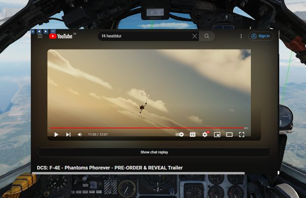
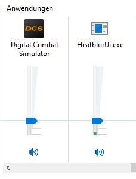
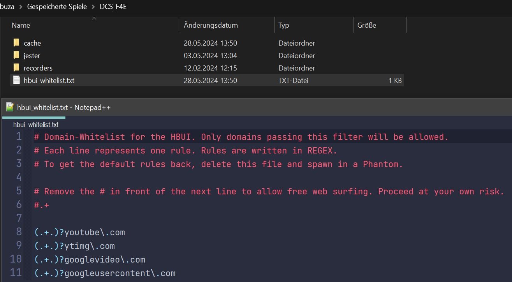

# Virtual Browser

To enhance in-flight studies of the aircraft or simply to overcome some
downtime, a virtual browser can be opened (by default
<kbd>RCTRL</kbd>+<kbd>V</kbd>).

The browser enables users to

- watch tutorial videos,
- read documentation provided by third parties,
- listen to a music playlist while flying,
- or also playing some browser games and much more.

The UI is embedded in-game, can be resized and moved around. Buttons on the top
left corner allow for quick navigation.

## Session

Session data is memorized and saved locally in a folder like

`C:\Users\John Doe\Saved Games\DCS_F4E\cache\`

Clearing this folder will reset all browser preferences and settings.

If required, sound level of the browser can be controlled via the volume mixer
provided by Windows through the **HeatblurUi.exe** entry.

## Whitelist

The Virtual Browser, by default only allows websites that pass a
domain-whitelist filter.

The whitelist is automatically created at

`C:\Users\John Doe\Saved Games\DCS_F4E\hbui_whitelist.txt`

when launching the Phantom for the first time.

To unlock the full browser experience, uncomment the line `#.+`, so that it is
just `.+`. That will cause any website to pass the filter.

Note that removing rules from the list can lock you out of using certain
features, for example an [Olympus](https://github.com/Pax1601/DCSOlympus)
powered live-editor.

> 💡 The whitelist applies to all HB UI elements, not just the Virtual Browser.
