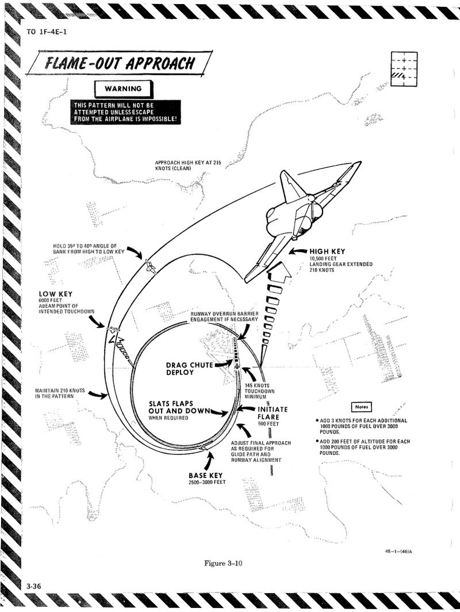

# LANDING EMERGENCIES

## SINGLE-ENGINE LANDING

| Step   | System/Condition        | Action               |
|--------|---------------|----------------------|
| 1. | Reduce the airplane gross weight to minimum practical.     |    |
| 2. | Inlet ramp on good engine     |  CHECK FULLY RETRACTED  |
| 3. | All unessential electrical equipment     |  OFF  |
| 4. | Make a fully configured 17 unit AOA apporach     |    |

## EMERGENCY LANDING PATTERN

The emergency landing pattern is a pattern to be flown
when engine thrust is available and an emergency exists
or there is a malfunction which could result in an
emergency. The primary objective of the pattern is to land
the aircraft safely in the first attempt with least amount
of risk. Because of the many variables involved, such as
type of emergency, position and altitude in relation to the
field, gross weight, fuel remaining, weather, populated
areas, runway length, availability of arresting gear, etc.,
astandard pattern cannot be prescribed. Depending on the
circumstances it might be desirable to utilize GCA, make
a straight-in approach, enter the pattern from downwind
or base leg, or make a 360° overhead pattern. Because of
the various circumstances, the pilot’s evaluation of all
factors and his judgment will determine the type of
landing pattern to be flown. However, there are some
general guidelines which are applicable regardless of
approach selected: Reduce gross weight to minimum
practical. In the pattern and before establishing the
landing configuration, maintain a minimum maneuvering
airspeed of 230 knots (250 knots, single engine). The
pattern should be planned to avoid abrupt, steep or hard
turns and large or abrupt power changes especially with
a flight control malfunction or a hydraulic system failure.
Circumstances permitting, a long straight-in final should
be planned and the landing configuration established
when on final. The air refuel switch should be placed to
EXTEND prior to landing to depressurize the fuel tanks.
Should the nature of the emergency or other factors
dictate establishing the landing configuration prior to
final, 230 knots — flaps up, or 200 knots - slats flaps OUT
AND DOWN should be maintained until established on
final. These airspeeds will provide a margin of safety for
maneuvering flight. If the pattern must be entered on
downwind, base or from an overhead pattern, the pattern
should be expanded, the landing configuration established
prior to final, and roll-out on final should be at least 2-
3 miles out. A normal 2-3° glide slope should be flown. For
most emergencies, final approach airspeeds are increased
and AOA decreased to provide adequate aircraft handling
characteristics.

## FLAME-OUT APPROACH

