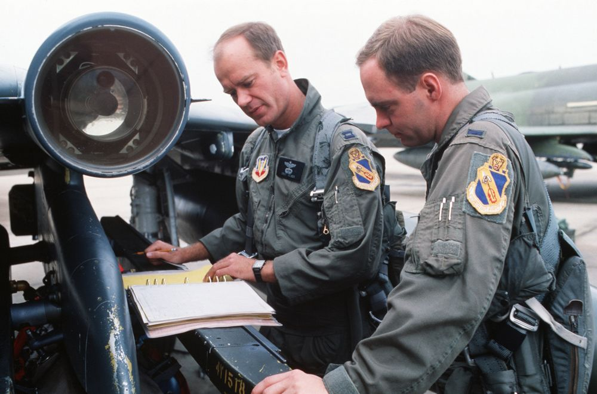

# Emergency Procedures

<!-- would be cool to have some emergency "frame" (2-colored stripe around page) like in manual -->

This section contains procedures to be followed to correct
an emergency condition. These procedures will insure
maximum safety for the crew and/or aircraft until a safe
landing or other appropriate action is accomplished. The
procedures are arranged in the most desirable sequence
for the majority of cases; therefore, the steps should be
performed in the listed sequence unless the pilot can
determine a good cause for deviation. Multiple
emergencies, adverse weather, and other peculiar
conditions may require modification of these procedures.
The critical items **(BOLD FACE LETTERS)** contained in the
various emergency procedures cover the most adverse
conditions. **Aircrew members should be able to accomplish
bold face procedures without reference to the checklist.**
The nature and severity of the encountered emergency
will dictate the necessity for complying with the critical
items in their entirety. It is essential, therefore, that
aircrews determine the correct course of action by use of
common sense and sound judgement. As soon as possible,
the pilot should notify the WSO, flight or flight leader, and
tower of any existing emergency and of the intended
action.

The terms "Land as soon as **possible**" and "Land as soon
as **practical**" are used in this section. These terms are
defined as follows:

**Land as soon as possible** - An emergency will be declared.
A landing should be accomplished at the nearest suitable
airfield considering the severity of the emergency,
weather conditions, field facilities, ambient lighting,
aircraft gross weight, and command guidance.

**Land as soon as practical** - Emergency conditions are less
urgent, and although the mission is to be terminated, the
degree of the emergency is such that an immediate
landing at the nearest adequate airfield may not be
necessary.

The following basic rules apply to all aircraft emergencies
and should be thoroughly understood by all aircrew:

1. Maintain aircraft control.
2. Analyze the situation and take proper action.
3. Land as soon as practical.

See the [Definitions](../intro/definitions.md) for an explanation of the symbology used.

> 💡 This section contains only the most important emergency procedures.

<!-- TODO: maybe add warning from the flight manual -->
> 🚧 This section is under construction.
