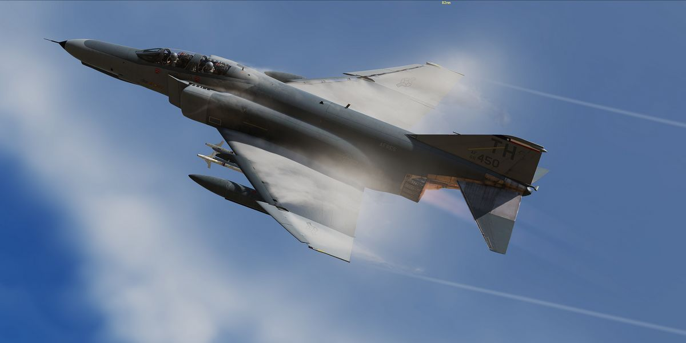

# Imprint

Heatblur Simulations™\
Ulica Wrzosowa 11, 72-602, Świnoujście, Poland

Contact: <support@heatblur.se>

<https://store.heatblur.com/>

## The Heatblur F-4E Team

Nicholas Dackard, Creative Director and Lead Artist\
Krzysztof Sobczak, Technical Director and Lead Programmer\
Aleksander Studen-Kirchner, Lead Producer and Narrative Lead\
Daniel Tischner, Senior Programmer (UI, Systems and AI)\
Dominik Głowacki, Senior Programmer (Systems, Avionics, AI)\
Szymon Skarzyński, Senior Programmer (Systems, Avionics, AI)\
Andrew O’Donnell, Senior Programmer (Flight Dynamics and Engines)\
Joshua Nelson, Senior Programmer (Weapons, Radar and Systems)\
Terje Lindtveit, Programmer (Flight Dynamics and Engines)\
Zander Labuschagne, Programmer (Systems and Avionics)\
Will Harradine, Programmer (Systems and Avionics)\
Igor Własny, Programmer (Systems and Avionics)\
Yannis Leon Bößmann, Junior Programmer, Manual Editor\
Nicola Faggiani, Artist, 3D Model\
Davi Bernardino, Artist, 3D Model and Textures\
Leon Foty, Artist, 3D Model\
Ben Mährlein, Liveries and Art\
Kenneth Ellis, Lead Author Manual\
Andreas Sandin, Lead Design and Web-Design\
Adrian Caparzo, Video Editing and Trailers\
Grayson Frohberg, Voice of the JESTER-AI\
Jonathan Williams, Voice of the CREW CHIEF\
Gabriel Stangl, Training Missions and Lessons\
Daria Kurhuzova, Administrative Assistant

### See You In The Skies

