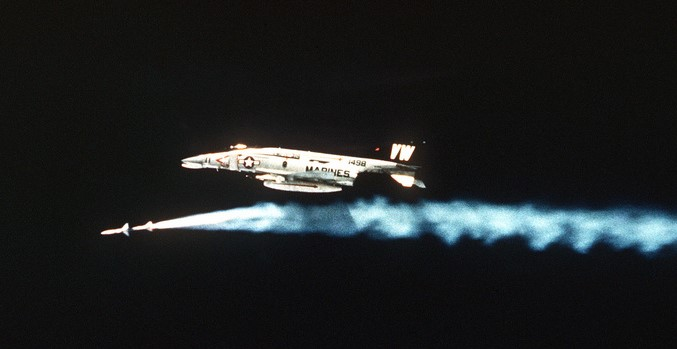

# F-4E Air to Air Kills

The F-4E Phantom II, an upgraded version of the F-4 Phantom series, played a significant role in
air-to-air combat during the Vietnam War. Equipped with the AIM-7 Sparrow missile, a radar-guided
weapon with beyond-visual-range capabilities, the F-4E had a notable advantage in engagements.

In Vietnam, F-4E pilots engaged in dogfights against various enemy aircraft. The Sparrow missile
allowed them to target adversaries from a distance, contributing to the aircraft's success. Key USAF
pilots, such as Steve Ritchie and Chuck DeBellevue, achieved ace status by securing five or more
air-to-air victories.

The total number of air-to-air kills attributed to the F-4E Phantom II, combining both the USAF and
USN, is estimated to be around 21 during the Vietnam War, includeing 4 MIG-19s, 17 MiG-21s. However,
this figure may vary across sources. In total F-4C/D/E Variants shot down 107 MiG Jets hence the
name "Biggest distributor of MiG parts".

Despite its effectiveness, the F-4E faced challenges in close-quarters combat due to the initial
absence of an internal cannon. Modifications, including the addition of an M61 Vulcan cannon,
addressed this limitation and improved the aircraft's performance in close-range engagements.

The success of the F-4E Phantom II in Vietnam solidified its reputation as a versatile and
formidable fighter, and it continued to serve in air forces worldwide for many years.

 _a Marine F-4 Phantom II from
Marine Fighter/Attack Squadron 314 firing one AIM-7 Missile_
