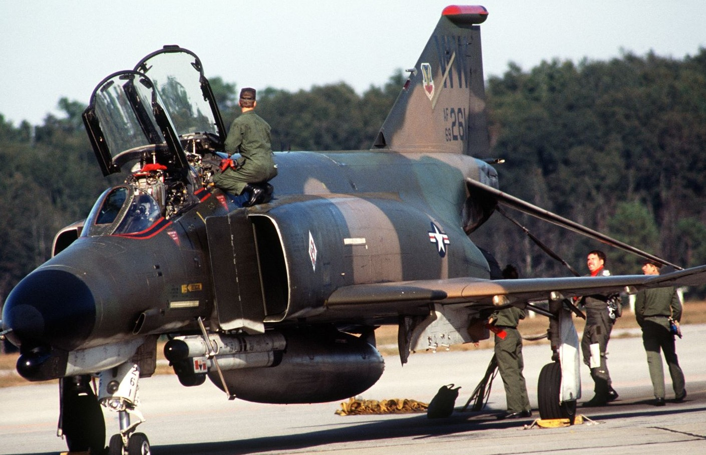

# F-4E First Flights by Nation

The F-4 was used widely by several NATO and allied countries. Because of that it reached
many _first flight_ milestones in the various countries.

| Nation        | McDonnell Number | BuNo/USAF Serial | Date               |
| ------------- | ---------------- | ---------------- | ------------------ |
| United States | 2234             | 66-284           | June 30th, 1967    |
| Israel        | 3492             | 68-396           | May 26th, 1969     |
| Australia     | 3847             | 69-0304          | June 26th, 1970    |
| Japan         | 4037             | 69-7463          | January 14th, 1971 |
| Iran          | 4093             | 69-7711          | March 2nd, 1971    |
| Greece        | 4439             | 72-01500         | January 29th, 1974 |
| Turkey        | 4525             | 73-01016         | June 17th, 1974    |
| Germany       | 4946             | 75-00628         | May 5th, 1977      |
| South Korea   | 4966             | 76-0493          | July 28th, 1977    |

_The crew of an F-4 Phantom II aircraft completes a post-flight inspection_
