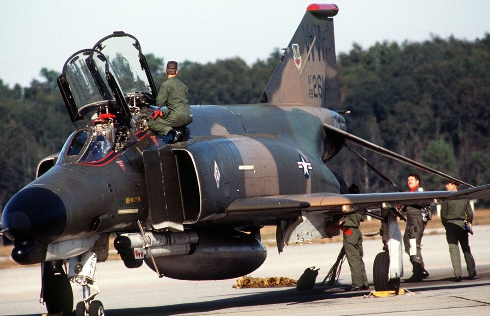

# F-4E First Flights by Nation

F-4战斗机被许多北约及其盟国广泛使用，因此它在不同国家有着多个 _“首飞”_ 的记录。

| 国家          | 麦道编号         | BuNo/USAF 序列   | 日期               |
| ------------- | ---------------- | ---------------- | ------------------ |
| 美国          | 2234             | 66-284           | 1967 年 6 月 30 日    |
| 以色列         | 3492             | 68-396           | 1969 年 5 月 26 日     |
| 澳大利亚       | 3847             | 69-0304          | 1970 年 6 月 26 日    |
| 日本          | 4037             | 69-7463          | 1971 年 1 月 14 日 |
| 伊朗          | 4093             | 69-7711          | 1971 年 3 月 2 日    |
| 希腊          | 4439             | 72-01500         | 1974 年 1 月 29 日 |
| 土耳其        | 4525             | 73-01016         | 1974 年 6 月 17 日    |
| 德国          | 4946             | 75-00628         | 1977 年 5 月 5 日      |
| 韩国          | 4966             | 76-0493          | 1977 年 7 月 28 日    |

_F-4 “鬼怪” II的机组人员完成飞行后检查_
