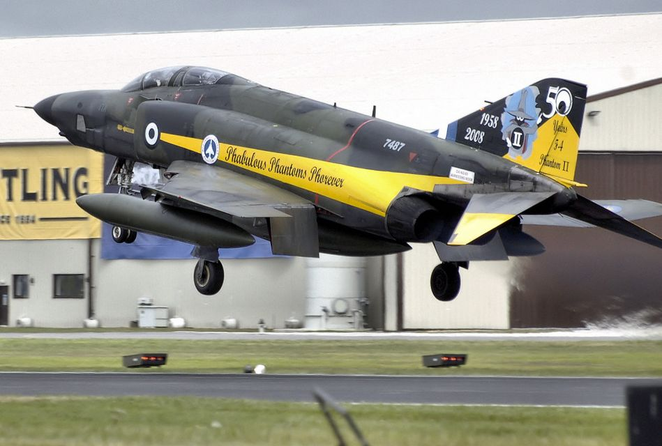
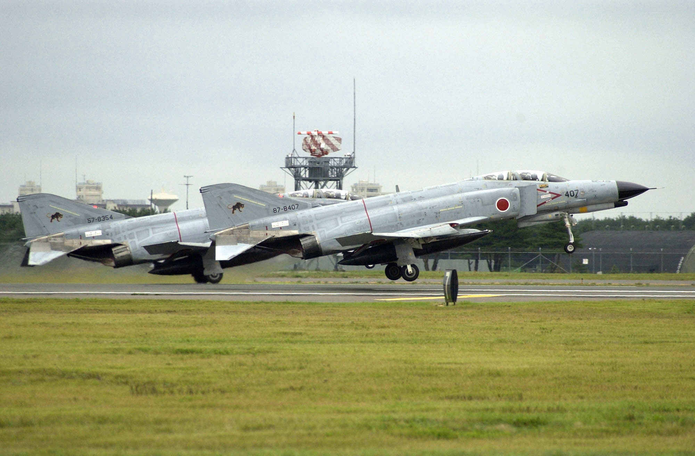
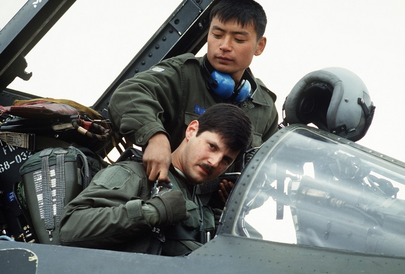

# Foreign Service: The Legacy of a Phantom

The F-4's legacy did not stop at the US border. Its performance made it of
interest to many US allies of its era, and the Phantom II remains in limited
service as of this writing. With the F-4E being the most numerous of the type,
it was natural that it would be the model with the furthest reach.

Amidst the ever-evolving landscape of military technology, foreign operators of
the F-4E undertook comprehensive upgrades and modernization efforts. These
initiatives were aimed at extending the aircraft's service life and enhancing
its combat capabilities. The F-4E, with its powerful
engines, evolved to meet the demands of contemporary warfare, solidifying its
place as a venerable platform in the arsenals of its adoptive nations.

The F-4E Phantom II's foreign service was not merely a chapter in the history of
military aviation, but a saga that unfolded across continents and through the
corridors of geopolitical power. Its adaptability, longevity, and combat prowess
etched the Phantom into the collective memory of the nations that flew it,
leaving an enduring legacy in the skies it once dominated.

_Hellenic Air Force RF-4E Phantom II lands at RIAT 2008, UK_

## Israel

The first nation to receive the F-4E on export, Israel, designated it **Kurnass
(Sledgehammer)**.

Phantom would see combat with the IAF within months of delivery, seeing multiple
kills in the war of attrition against Egypt and skirmishes with Syria. The 1973
Yom Kippur War would see the Phantom acquit itself spectacularly, downing 85
Arab aircraft in exchange for 5 lost in air combat. But it was the Phantom's
performance as an air-to-ground asset that would draw the most focus from the
IAF, seeing the F-4E specializing in that role, as the F-15 and F-16 were made
available to the nation for export purchase.

The Kurnass would ultimately receive a number of vital upgrades to keep the type
viable beginning in 1987, with the installation of the APG-76 radar, a new
mission computer and HUD, and the ability to deliver the Popeye air-to-surface
missile. The IAF would ultimately receive between 212 and 222 F-4Es.

## Australia

Australia would be the second import customer for the F-4E, but only on a
limited time basis. Twenty-four F-4Es were provided to the RAAF on a lease basis
by the United States as a stopgap measure due to delays in deliveries of the
F-111C.

The F-4E would operate in Australian service for just three years, from September 
1970 to 1973. Australian aircrews were impressed with the Phantom's
performance for their needs, and while the US offered to let the RAAF buy the
leased airframes outright, this offer was ultimately rejected.

## Japan

_F-4EJ Kais of the JASDF of the 8th Hikōtai taking off in 2002, US Navy Photo_

With permission from the US State Department and license terms with McDonnell
Douglas, Mitsubishi Heavy Industries would build the F-4E locally, designated as
the F-4EJ. The -4EJ would be provided compatibility with Japanese-built weapons,
but the omission of the refuelling probe and AJB-7 bombing computer due to treaty
restrictions on the JASDF.

The -4EJ was updated as the 'Kai' in 1984, receiving the APG-66J radar and ASM-1
and - 2 anti-shipping missiles. The F-4EJ would serve Japan for over 40 years, with
the final examples being withdrawn in March of 2021.

## Iran

First receiving the F-4E in 1971, the IIAF received 177 F-4Es through various
delivered batches into the late 1970s. In the aftermath of the Iranian
Revolution, now-IRIAF F-4Es saw extensive use - and numerous successes, against
the forces of Saddam Hussein.

The first raid on the Osirak Nuclear Plant in September 1980 was performed by
four F-4Es, damaging the reactor and control facilities; this raid preempted the
more famous IAF attack on the same facility that destroyed it permanently. In
similar fashion, April 1981 saw F-4Es as the primary strike aircraft during the
raid on all three airfields of the H-3 complex in western Iraq.

The conflict with Iraq came at a substantial cost to both airframes and crews,
with Western weapons embargoes severely limiting the ability of the IRIAF to
maintain the Phantom II effectively. By the end of the war, even local estimates
put the available number of flyable F-4s below four dozen. While local industry
attempted to revitalize the Phantom in the aftermath of the conflict, current
evaluations put their total F-4 force near 60, between their remaining F-4D,
F-4E, and RF-4Es.

## Greece

The Hellenic Air Force's initial F-4E deliveries began in 1974, with annual
deliveries stopped due to politics in 1981. The HAF's combined Phantom II force
topped out at 121 airframes purchased (F-4E and RF-4E), with reinforcement
stocks of former USAF jets, bringing that number to its final value in the
post-Desert Storm drawdown.

Upgrades by DASA to Greek Phantoms have been extensive and were built around a
similar model to the Luftwaffe's F-4F ICE. Most notably, the HAF F-4E has
received the APG-65 for AMRAAM (including a replacement digital BUS), HUD, and
LITENING pod compatibility.

The HAF Phantoms have also received specific upgrades based on their intended
squadron roles, with inertial navigation replacement and GPS inclusion for those
specializing in the air-to-surface role. Greece currently retains over 30
Phantoms on active duty.

## Turkey

Turkey's Phantom service has been extensive, with over 160 F-4Es procured (along
with an additional 60+ RF-4Es), beginning in 1974. Deliveries of Phantoms have
been both new build and former USAF, and in the mid-90s, Israeli Aerospace
Industries (IAI) was tapped to bring them into the next century.

Based around a proposed upgrade program for the IAF, the F-4E Terminator 2020
deleted over 1600 lbs of excess weight from the aircraft by wiring and hydraulic
system replacements, integrated the Elta M-2032 radar, a full HOTAS
implementation, MFDs, a true HUD, and extensive weapons systems updates, Popeye
and GBU integration, as well as the LITENING II targeting pod. The Turkish Air
Force intends to maintain the remaining 30 or so airframes in service until the
mid-2030s.

## Germany

_F-4Fs of the German Air Force in 1998, USAF Photo_

Primarily an F-4F and RF-4E customer - the largest F-4 export recipient with 263
delivered overseas, Germany would purchase 10 F-4Es to be based in the United
States for the type conversion of their aircrews training alongside USAF units.

## South Korea

_A Korean Air Force crew chief helps a 497th Tactical Fighter Squadron pilot
into the cockpit of his F-4E during Exercise TEAM SPIRIT 1986_

A long-time F-4 recipient, South Korea supplanted its force of F-4Ds with brand
new F-4Es beginning in 1977, ultimately purchasing a total of 103.

South Korea was the recipient of the final US-built F-4 Phantom, 78-0744, in
October 1979. As of this writing, the RoKAF retains the F-4E in service, with
the intention of withdrawing it in 2024.

## Egypt

The final F-4E export customer, Egypt, received purchasing rights through its
peace treaty with Israel and the Peace Pharaoh agreement; rather than newly build
airframes, Egypt received 35 former USAF aircraft.

The Phantom was ultimately a precursor towards the nation's purchase of the
F-16, and went through initial difficulties in servicing by their maintenance
crews. McDonnell Douglas advisors aided the Egyptian squadrons in getting their
operational ready rates back up to standard, and the Phantom II went on to serve
the EAF into the late 90s.
