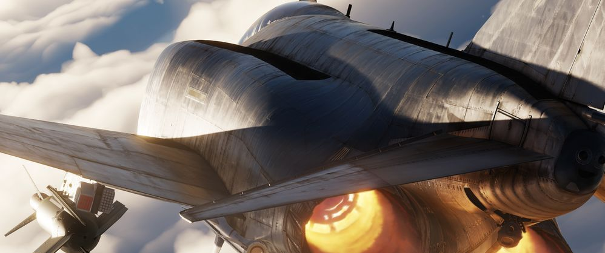
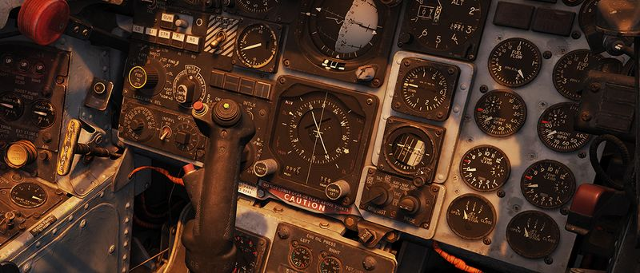
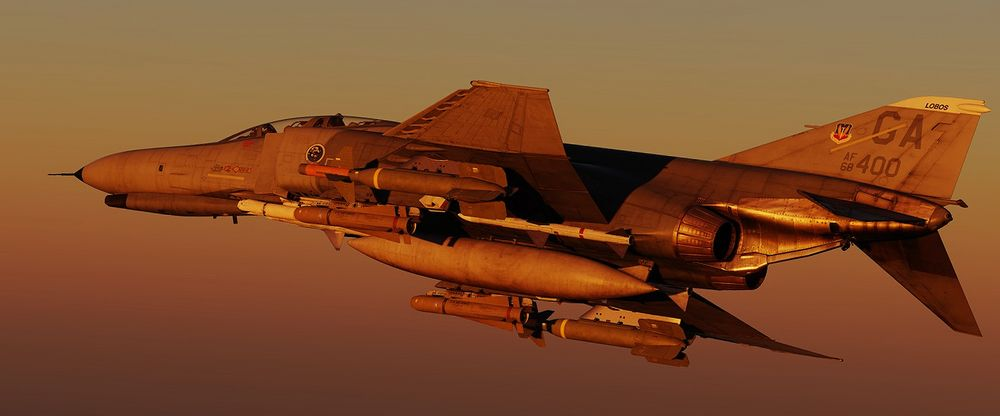

# 简介

亲爱的玩家们，

为 DCS 开发的：Heatblur Simulations F-4E“鬼怪”II。
经过多年的开发和无数小时的研究，我们很荣幸能最深入地为玩家重现这款传奇战机。
玩家可以作为飞行员和 WSO 驾驶“鬼怪”，与 JESTER-AI（玩家的WSO AI）合作，或与朋友一起进行多人游戏。

我们不仅忠实重现了“鬼怪”的飞行力学模型、系统、航电、雷达、RWR 和武器投放，还尝试通过该模组来创新，为我们未来的模组奠定重要的基础，并一如既往地尝试扩展飞行模拟的边界。
从可以在座舱盖写字等**生活质量方面的小改进**，到**交互式机工长**，“鬼怪”还采用了我们新一代基于组件的模拟框架——飞机是由**数千个独立组件**连接而成的。
从仪表指针到操纵面，每个组件都会影响飞机的状态，甚至会产生**磨损**。
从模拟电源到最小灯泡以及沿途所有节点的精确电力消耗，从驱动液压系统的液压油，进而驱动飞行操纵面，一切基于质量物理的模型——一切都自然发生，相互影响，而不再是“脚本”。
这意味着不稳定的电力消耗可能会导致灯泡闪烁，或者您可以利用重力在发生故障时放下起落架，或者飞机的正确和错误使用会影响每个单独组件的磨损程度——我们以前从未尝试过像 F-4E“鬼怪”II 这样深入的模拟。
DCS：F-4 代表着目前最身临其境的 **冷战战斗机模拟** ！

有了这样的创新和深度模拟，用户的学习曲线当然会增加。
这就是为什么我们必须在学习工具方面进行创新，从本手册开始，使我们的模组既适合休闲玩家，也适合爱好者。
玩家可以**在飞行中打开手册**进行阅读，但更好的是，玩家可以在飞行中点击任何开关（使用输入组合），手册就会在正确的章节中打开，**解释驾驶舱中的开关**或系统功能，而此时玩家正驾驶着雷鸣般的喷气式飞机在空中飞驰。
我们还改变了手册的底层结构，使其可以**开源**，社区成员可以通过 Github 轻松地贡献自己的力量，因为千人千面总比一个人思考要好。
这同时还提高了手册在移动设备中的可读性。
我们为玩家们添加了许多项目的超链接，以方便**连接**驾驶舱和系统概述章节，手册还包括许多检查单和程序，在 EA 模组发布时还将添加 **“课程”部分**。
在执行训练任务时将同时提供完整的书面课程。
现在，训练任务将与手册中的书面课程整合在一起进行学习，玩家将能够在训练任务中返回某一步骤，能够阅读并暂停（不再为错过的项目重新开始），还能在执行任务前做好相应的准备。
最重要的是，玩家的培训将由真F-4 飞行员和真F-4 WSO 教官进行指导，还有谁能比他教得更好呢？

我们希望玩家们都能享受学习和驾驶 F-4E“鬼怪”II 的乐趣——随心所欲地深入飞行。
在这段令人兴奋的旅程中，**祝玩家们好运，经历更多有趣的冒险**，当然，请务必检查六点方向！

Heatblur 团队，\
_Nicholas Dackard, Heatblur Simulations, CEO and Founder_

