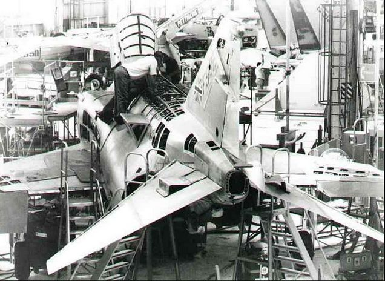

# 技术规格: F-4E

| 翼展                   | 38' 5" (11.7 米)             |
| ---------------------- | -------------------------------- |
| 翼展（折叠）            | 27' 7" (8.4 米)              |
| 机长                   | 63' (19.2 米)                |
| 高度                   | 16' 5" (5 米)                |
| 机翼面积                | 530 sqft (49.2 m² )              |
| 翼载                   | 78 lb/sqft (380 kg/m² )          |
| 空重                 | 30328 lb (13757 千克)            |
| 最大起飞重量           | 61795 lb (28030 千克)            |
| 干推力                 | 23810 lbf (105.92 kN)           |
| 加力推力               | 35690 lbf (158.76 kN)           |
| 升限                   | ~56,000' (~17070 米)             |
| 最高空速               |  2.23 马赫; 1280 kn (2370 km/h) |
| 作战范围（转场）          | 1457 nmi (2699 km)             |

