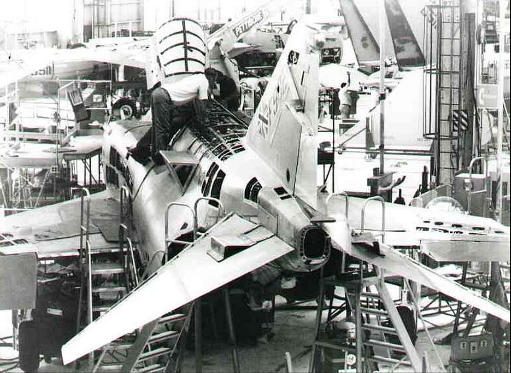

# Technical Specifications: F-4E

| Wingspan               | 38' 5" (11.7 meters)             |
| ---------------------- | -------------------------------- |
| Wingspan (Folded)      | 27' 7" (8.4 meters)              |
| Length                 | 63' (19.2 meters)                |
| Height                 | 16' 5" (5 meters)                |
| Wing Area              | 530 sqft (49.2 m² )              |
| Wing Loading           | 78 lb/sqft (380 kg/m² )          |
| Empty Weight           | 30,328 lb (13,757 kg)            |
| Maximum Takeoff Weight | 61,795 lb (28,030 kg)            |
| Thrust (Dry)           | 23,810 lbf (105.92 kN)           |
| Thrust (Afterburner)   | 35,690 lbf (158.76 kN)           |
| Combat Ceiling         | ~56,000' (~17,070 m)             |
| Maximum Speed          | Mach 2.23; 1,280 kn (2,370 km/h) |
| Range (Ferry)          | 1,457 nmi (2,699 km)             |

