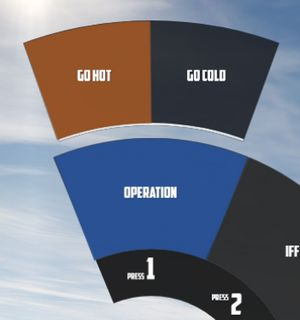
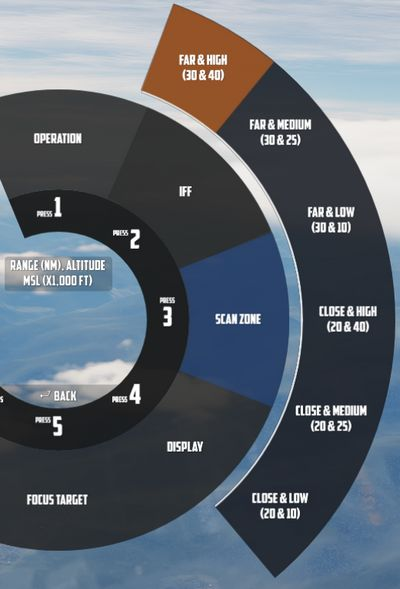
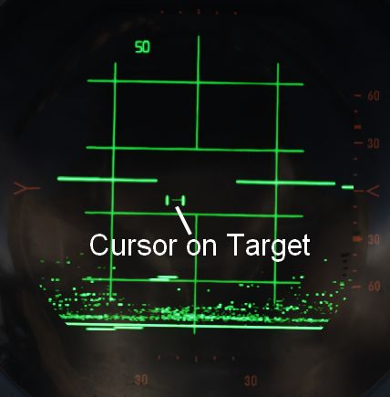
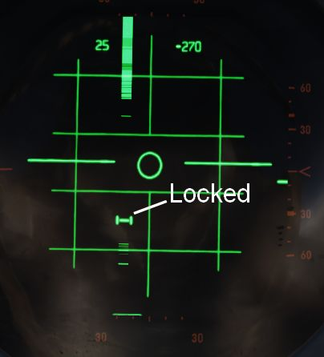
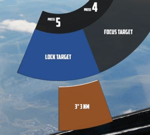
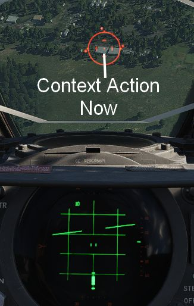
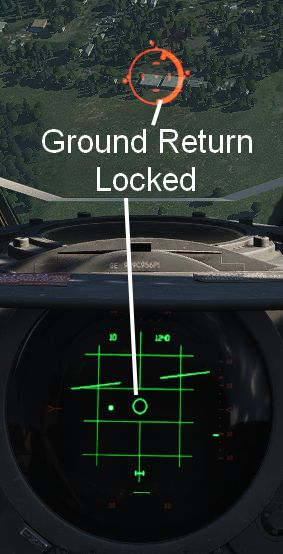
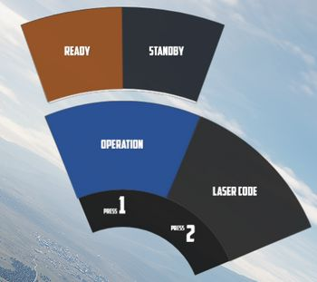
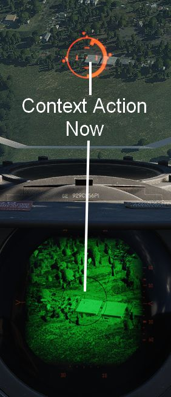
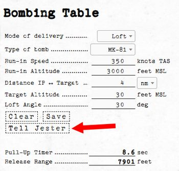

# Combat

Jesters assistance for combat situations is generally divided into options on
the Jester Wheel, whenever not in a high action environment yet, and a smart
**Context Action** for use during situations that require acting quick, such as
during a fight.

The context action (by default <kbd>V</kbd>) allows for intuitive cooperation
and exchange between Pilot and WSO based on the following contexts:

- Pave Spike - TGT FIND selected on the Delivery Mode Knob
- Dive Toss - DT or DL selected on the Delivery Mode Knob
- Dogfight - CAGE mode
- Beyond Visual Range - other

The context action can change semantics if pressed only momentarily or if hold
and released.

## Radar

During flight, Jester will constantly operate the radar and search for contacts.

In certain situations, such as during landing, on the ground or when performing
AAR, the radar will be in Standby mode. This can also be commanded manually by
selecting `Radar > Operation > Go Cold` in the UI.

When using the radar, Jester generally differentiates between three phases:

- Regular Search
- Focused Search
- Lock

The phases are commanded and switched by the pilot using the Context Action.

Additionally, Jester will behave differently during a dogfight, indicated by the
pilot entering CAGE mode.

### Regular Search

This is the default phase Jester will be in. He will automatically point the
antenna at different altitudes and ranges in order to scan the entire space
ahead of the aircraft.

Jester will automatically identify any new contact and call them out to the
pilot.

If desired, the player can request Jester to perform an IFF challenge manually
at any time through the UI (this action can also be bound directly to a key).
Should the situation require, the player can manually set a zone for Jester to
scan outside of his regular pattern through the UI.

He will then scan this zone for a while first before proceeding back to his
regular pattern.

Jester will indicate the highest priority target by moving and keeping the
cursor always on the corresponding radar return.

| Duration | Context Action                             |
| -------- | ------------------------------------------ |
| Short    | Enter **Focused Search** on current target |
| Long     | Select Next Target                         |

### Focused Search

When focused on a contact, Jester will always keep the antenna pointing at him,
as well as commanding the radar into a narrow view.

This mode can be understood as _"Track While Scan"_, where Jester keeps the
radar on a specific contact, while still scanning the surrounding space,
identifying and calling out any new contact spotted.

| Duration | Context Action                         |
| -------- | -------------------------------------- |
| Short    | **Lock** current target                |
| Long     | Drop focus, back to **Regular Search** |

### Lock

During a lock, Jester works the radar to keep the lock as long as possible.

The UI also allows selecting a target to lock manually without using context
action.

| Duration | Context Action                                  |
| -------- | ----------------------------------------------- |
| Short    | Drop lock, back to **Focused Search**           |
| Long     | Drop lock and focus, back to **Regular Search** |

> 💡 To lock and attack a contact as fast as possible while in **Regular
> Search**, double tap the context action to skip the **Focused Search** and
> proceed to **Lock** immediately.

### Dogfight

A within-visual-range situation is entered by the pilot activating CAGE mode.

In this mode, the radar is automatically boresighted forward and Jester will be
able to lock a return.

Further, the pilot can enter CAA mode where the system will automatically lock
any close contact.

| Duration | Context Action                          |
| -------- | --------------------------------------- |
| Short    | Lock contact ahead if it shows a return |
| Long     | Exit CAGE mode                          |

## Dive Toss

During a Dive Toss or Dive Laydown attack, indicated by DT or DL selected on the
Delivery Mode Knob, the **Context Action** can be used to command Jester to lock
the ground return after placing the nose on the target. A subsequent press will
unlock the target again.

This way, ground targets can be attacked effectively during a dive. The pilot
places the reticle on the target, commands Jester to lock the return and then
pulls up while holding down the Bomb Button. Weapons will be released
automatically shortly after.

## Pave Spike

If equipped, Jester will ensure the targeting pod is ready for a 12-VIS dive
attack when required.

This can also be commanded manually by selecting either
`Air To Ground > Pave Spike > Operation > Standby` or
`Air To Ground > Pave Spike > Operation > Ready` in the UI.

Additionally, the UI allows the pilot to change the laser code used by Pave
Spike.

The pilot can command Jester to focus on operating the targeting pod by
selecting TGT FIND on the Delivery Mode Knob.

> 💡 Due to DSCG limitations, operation of the Pave Spike and the radar system
> are mutually exclusive.

### 12-VIS Dive

Pressing the **Context Action** will command Jester to lock the ground target
next to the reticle. A subsequent press will unlock the target again.

This can be used effectively in 12-VIS mode where the pilot points the nose on
the target in a short dive. After locking the target, the pilot can pull out of
the dive and either keep observing the target through the pod, or start an
attack. See
[4.3.3.4. Employment](../stores/air_to_ground/bombs/employment.md#target-find---tgt-find)
for details.

> 🚧 Jester Pave Spike operation will be expanded throughout Early Access. To
> overcome current limitations, the Pilot is provided with temporary binds to
> control the WSOs Antenna Stick. This allows the pilot to use the targeting pod
> more effectively.

## Context Action Overview

| Context              | Duration | Action                                          |
| -------------------- | :------: | ----------------------------------------------- |
| BVR - Regular Search |    •     | Enter **Focused Search** on current target      |
|                      |    ▄     | Select Next Target                              |
| BVR - Focused Search |    •     | **Lock** current target                         |
|                      |    ▄     | Drop focus, back to **Regular Search**          |
| BVR - Lock           |    •     | Drop lock, back to **Focused Search**           |
|                      |    ▄     | Drop lock and focus, back to **Regular Search** |
| Dogfight             |    •     | Lock contact ahead if it shows a return         |
|                      |    ▄     | Exit CAGE mode                                  |
| Dive Toss            |          | Lock/Unlock ground return                       |
| Pave Spike           |          | Lock/Unlock target next to reticle              |

## Bombing Preparation

To prepare a bombing run, both pilot and WSO have to enter several settings
throughout the cockpit.

For Jester, this includes the WRCS panel, such as the **Release Range**,
**Target Altitude** or **Release Advance**, as well as the LABS angles and
timers.

To prepare Jester for a bombing run, use the
[Bombing Computer](../dcs/bombing_computer.md) tool and transfer the solution by
utilizing the **Tell Jester** button.

Once activated, Jester will do his part in preparing the aircraft for the
desired attack.
