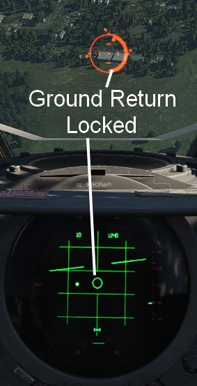

# Bombing

Dropping ordnance on ground targets with Jester consists of two phases.
Initially, Jester has to prepare for the attack by entering corresponding data
into the panels. For most modes, the attack run itself can be executed by the
pilot alone. However, for Dive Toss and Dive Laydown modes, Jester must lock the
ground return using the radar.

## Preparation

To prepare a bombing run, both pilot and WSO have to enter several settings
throughout the cockpit.

For Jester, this includes the WRCS panel, such as the **Release Range**,
**Target Altitude** or **Release Advance**, as well as the LABS angles and
timers.

To prepare Jester for a bombing run, use the
[Bombing Computer](../../dcs/bombing_computer.md) tool and transfer the solution
by utilizing the **Tell Jester** button.

Once activated, Jester will do his part in preparing the aircraft for the
desired attack.

## Dive Toss

During a Dive Toss or Dive Laydown attack, indicated by DT or DL selected on the
Delivery Mode Knob, the **Context Action** can be used to command Jester to lock
the ground return after placing the nose on the target. A subsequent press will
unlock the target again.

This way, ground targets can be attacked effectively during a dive. The pilot
places the reticle on the target, commands Jester to lock the return and then
pulls up while holding down the Bomb Button. Weapons will be released
automatically shortly after.

