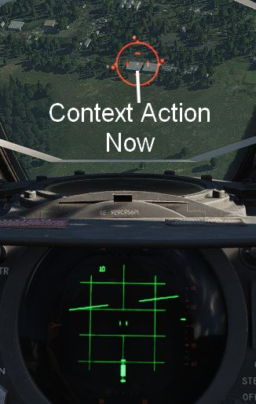

# 投弹

使用 Jester 向地面目标投弹由两个阶段组成。首先，Jester 需要在面板上输入相应的数据，为攻击做好准备。
对于大多数模式，飞行员可单独执行攻击程序。

## 投弹准备

飞行员和 WSO 需要在整个驾驶舱中设置多个开关/旋钮来准备好执行投弹攻击。

Jester 将准备 WRCS 面板相关的设置，如 **投放距离**、**目标高度** 或 **投放提前设置** ，以及 LABS 角
度和计时器。

如需通过 Jester 来执行轰炸，使用 [轰炸计算器](../../dcs/bombing_computer.md) 工具并通过点击 **Tell
Jester** 将解算移交给 Jester。

按下按钮后，Jester 将会准备好攻击模式所需的设置。

## 俯冲改出

在俯冲改出或俯冲铺投攻击中，也就是投放模式旋钮中的 DT 或 DL 档位，**联想动作** 将用来指令 Jester 锁
定准星处的地面回波。再次按下将解除锁定回波。

这样，飞行员就能在俯冲过程中有效攻击地面目标。飞行员将准星对准目标，指令 Jester 锁定回波，然后在按
住投弹按钮的同时拉起。不久后，系统将自动投放武器。

