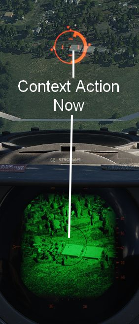

# Pave Spike

如果挂载了瞄准吊舱，Jester 将确保需要进行 12-VIS 俯冲攻击时，瞄准吊舱准备就绪。

玩家还可以通过 UI 中的 `Air To Ground > Pave Spike > Operation > Standby` 或
`Air To Ground > Pave Spike > Operation > Ready` 来手动指令准备好瞄准吊舱。

此外，飞行员还可用通过 UI 更改 Pave Spike 使用的激光编码。

飞行员可以通过将投放模式旋钮转至 TGT FIND 来指令 Jester 专注操作瞄准吊舱。

> 💡 由于 DSCG 限制，不可同时操作 Pave Spike 和雷达系统。

## 12-VIS 俯冲

按下 **联想动作** 将指令 Jester 锁定准星旁边的地面目标。再次按下将解锁。

飞行员在短俯冲中将机头指向目标，即可使用联想动作来高效锁定目标，锁定目标后，飞行员即可改出，然后继
续通过吊舱观察目标或者开始攻击。详见
[4.3.3.4. 武器投放]。

> 🚧 Jester 操作 Pave Spike 将在抢先体验期间扩展。为克服当前的限制，飞行员将获得临时绑定来控制 WSO
> 的天线手控杆来让飞行员更有效地使用瞄准吊舱。
