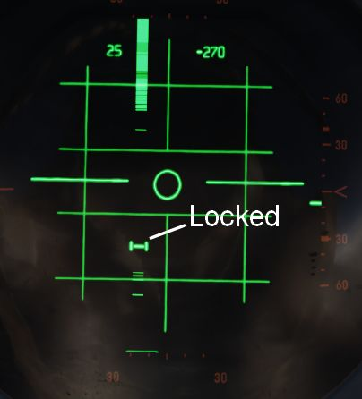

# Radar

During flight, Jester will constantly operate the radar and search for contacts.

In certain situations, such as during landing, on the ground or when performing
AAR, the radar will be in Standby mode. This can also be commanded manually by
selecting `Radar > Operation > Go Cold` in the UI.

When using the radar, Jester generally differentiates between two phases:

- Scan
- Lock

The phases are commanded and switched by the pilot using the Context Action.

Additionally, Jester will behave differently during a dogfight, indicated by the
pilot entering CAGE mode.

## Scan

This is the default phase Jester will be in. He will automatically point the
antenna at different altitudes and ranges in order to scan the entire space
ahead of the aircraft.

Jester will automatically identify any new contact and call them out to the
pilot.

If desired, the player can request Jester to perform an IFF challenge manually
at any time through the UI (this action can also be bound directly to a key).
Should the situation require, the player can manually set a zone for Jester to
scan outside of his regular pattern through the UI.

He will then scan this zone for a while first before proceeding back to his
regular pattern.

Likewise, the display range and scan type (wide or narrow) to be used during
scanning can be selected as well.

### Target Selection

Whenever a bandit becomes a threat (closer than 25 nm), Jester automatically
**selects** the target by moving and keeping the cursor on the corresponding
radar return.

The player can command target selection at any time by using the context
actions. This way, targets outside of the threat-range can be selected as well.

Whenever a target within threat-range is selected, Jester will **focus** them,
stop the regular search pattern, automatically enter Narrow View and point the
antenna at the target in order to maximize tracking quality.

This mode can be understood as _"Track While Scan"_, where Jester keeps the
radar on a specific contact, while still scanning the surrounding space,
identifying and calling out any new contact spotted.

Context actions only allow selection of hostile aircraft. Should the situation
require, other targets can always be focused directly through the UI instead.

Automatic target selection and focus behavior can be deactivated in the UI. This
can be useful if flying through a hostile zone, expecting contacts, while not
wanting to engage them and instead keep an overview and continuing the scan
pattern. For example when having an escort of fighters that will take care of
the bandits instead.

### Context Action

| Duration | Context Action                         |
| -------- | -------------------------------------- |
| •        | Select next target                     |
| ▄        | **Lock** the currently selected target |
| ••       | Reset target selection                 |

Unless only a single bandit shows on the screen, locking via ▄ (long) requires
prior target selection. Either automatically through Jester or by using •
(short). In an ambiguous situation, pressing ▄ (long) will first select the
target with highest priority.

Pressing •• (double) will reset the currently selected target and return Jester
to his standard behavior of automatically selecting the highest threat, if any.
Should one desire to ignore a target within threat range, automatic target focus
has to be deactivated through the UI first. •• (double) can then be pressed to
deselect the target.

## Lock

During a lock, Jester works the radar to keep the lock as long as possible.

The UI also allows selecting a target to lock manually without using context
action.

If a contact should drop while Jester attempts to lock it, he will wait a few
seconds for the radar return to reappear.

| Duration | Context Action                          |
| -------- | --------------------------------------- |
| •, ▄     | Drop lock, but keep target in **focus** |
| ••       | Drop lock and focus                     |

> 💡 Should a lock be faulty and Jester does not notice it (for example odd
> movement of the steering dot, or unexpected closure rate readouts), press ▄ to
> unlock and then ▄ again to attempt to lock the target again.

## Dogfight

A within-visual-range situation is entered by the pilot activating CAGE or
BORESIGHT mode.

CAGE is entered by pressing the CAGE Button on the throttle, BORESIGHT can be
selected from the Jester Wheel.

In this mode, the radar is automatically boresighted forward and Jester will be
able to lock a return.

Further, the pilot can enter CAA mode where the system will automatically lock
any close contact.

| Duration | Context Action               |
| -------- | ---------------------------- |
| •        | Select Next Target Aspect    |
| ▄        | Lock or Unlock contact ahead |
| ••       | Exit CAGE or BORESIGHT mode  |

To lock a target in CAGE mode, press ▄ (long) once ready. Jester will now
automatically lock the first target return he can identify. If no target could
be found within a few seconds, Jester will abort the process and ▄ has to be
used again.

> 💡 Targets have to be within 5 degrees of the boresight or a lock attempt
> would result in a bad lock. When Jester does not lock the return yet, it is
> because he is waiting for the pilot to put it within that zone first.

### Target Aspect

To enable no-lock "flood" shots with the Sparrow, the pilot can tell Jester the
targets aspect.

With the correct setting selected, a Sparrow can be launched and should be able
to track the target without first obtaining a radar lock.

The options can only be used if either in BORESIGHT or CAGE mode, using Context
Action • (short) will toggle between all aspect settings in order:

- NOSE (default)
- FORWARD
- AFT
- TAIL
- WIDE

The default option is NOSE, to enable fast reaction to a threat coming straight
at the Phantom.

> 💡 Due to the difficulty of selecting the correct aspect, as well as the
> target moving and hence changing its aspect after launch, such attacks
> generally provide a rather low hit probability. However, it can be the only
> option in certain situations, such as very low altitude fights.
