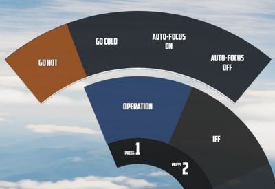
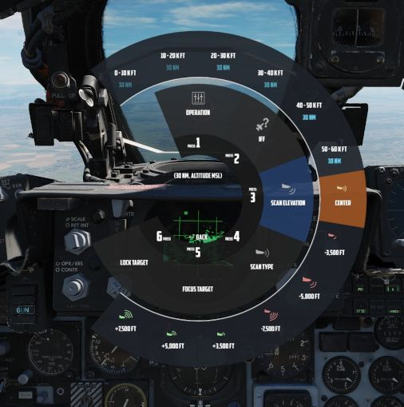

# 雷达

在飞行过程中，Jester 将不断操作雷达并搜索目标。

在某些情况下，例如在着陆、地面或执行 AAR 时，雷达将处于待机模式。玩家也可以通过在 UI 中选择
`Radar > Operation > Go Cold` 来手动指令进入待机。

使用雷达时，Jester 通常区分两个阶段：

- 扫描
- 锁定

由飞行员使用联想动作来指令和切换不同阶段。

此外，Jester 在格斗中的行为会有所不同，飞行员进入 CAGE 模式时将切换行为。

## 扫描

常规搜索为 Jester 默认阶段。他将自动指向不同的高度和距离来对飞机前方的整个空间进行扫描。

Jester 将自动识别任何新的接触并将其报告给飞行员。

如果需要，玩家可以随时通过 UI 手动请求 Jester 执行 IFF 问询（这个动作也可以直接绑定到按键上）。如果
情况需要，玩家可以通过 UI 手动设置一个区域让 Jester 扫描常规搜索外的区域。

设置好后，Jester 将先扫描该区域一段时间，之后再回到常规搜索。

同样，玩家还可以选择扫描时使用的显示距离和扫描类型（宽或窄）。

### 目标选择

当敌机成为一个威胁时（距离少于 25 海里），Jester 将自动移动并将光标保持至对应雷达回波上来 **选择**
目标。

玩家可随时使用联想动作来指令进行目标选择。这样一来，处在威胁距离之外的目标也能被选中。

只要选定进入威胁距离内的目标，Jester 就将会 **聚焦** 它们，停止使用常规搜索，自动进入窄视场并将天线
指向目标来最大化跟踪质量。

可以将这种模式理解为 _“边扫描边跟踪”_ ，其中 Jester 将雷达保持在特定目标上，同时仍然扫描周围空间，
识别并标注任何新发现的接触。

联想动作只允许选择敌机。如有需要，可以直接通过 UI 聚焦到其它目标。

玩家可以在 UI 中停用自动目标选择和聚焦行为。如果在敌对空域内飞行，预计会接触到目标，但想保持态势并
继续栅状扫描而非前去攻击，玩家可以选择停用该功能。例如，在有战斗机护航的情况下，护航机可以代替本机
对付敌机。

### 联想动作

| 持续时间 | 联想动作                |
| -------- | ----------------------- |
| •        | 选择下一个目标          |
| ▄        | **锁定** 当前选择的目标 |
| ••       | 复位目标选择            |

除非屏幕上仅显示了单架敌机，通过 ▄ (长按) 锁定需要先进行目标选择。玩家将通过 Jester 自动选择或使用
• (短按) 来选择目标，任选其一。在模糊态势下，按下 ▄ (长按) 将选择最高优先级的目标。

按下 •• (双击) 将复位当前选择的目标，并且 Jester 将返回到自动选择最高优先级目标（如果存在）的正常行
为。玩家如需忽略一个位于威胁距离内的目标，则必须先通过 UI 停用自动目标聚焦，接着点击 •• (双击) 来取
消选择目标。

## 锁定

在锁定时，Jester 将操作雷达来尽可能保持锁定。

玩家还可以使用 UI 来在不使用联想动作的情况下选择锁定一个目标。

如果 Jester 在尝试锁定一个接触时丢失接触，Jester 将等待几秒让雷达回波重新出现在屏幕上。

| 持续时间 | 联想动作                        |
| -------- | ------------------------------- |
| •, ▄     | 解除锁定，但保持**聚焦** 该目标 |
| ••       | 解除锁定和聚焦                  |

> 💡 如果锁定失败并且 Jester 没有注意到这点的话（例如瞄准点诡异移动，或非预期接近率读数），按下 ▄
> 来解锁并再次按下 ▄ 来尝试再次锁定目标。

## 格斗

当飞行员激活 CAGE 模式时，Jester 将进入视距内态势。

在此模式下，雷达会自动瞄准前方，Jester 将能够锁定回波。

此外，飞行员可以进入 CAA 模式，系统将自动锁定任何近距离接触。

| 持续时间 | 联想动作                 |
| -------- | ------------------------ |
| •, ▄     | 锁定或解除锁定前方的接触 |
| ••       | 退出 CAGE 模式           |

如需在 CAGE 模式锁定一个目标，准备好后按下 • (短按) 或 ▄ (长按)，Jester 将自动锁定能够识别到的首个
目标回波。如果在几秒内没有找到目标，Jester 将中断进程并且 • 或 ▄ 能够再次使用。

> 💡 目标必须处在瞄准轴 5 度内否则将为无效锁定。Jester 还未锁定目标是因为他在等待飞行员先将目标置于
> 该区域内。
