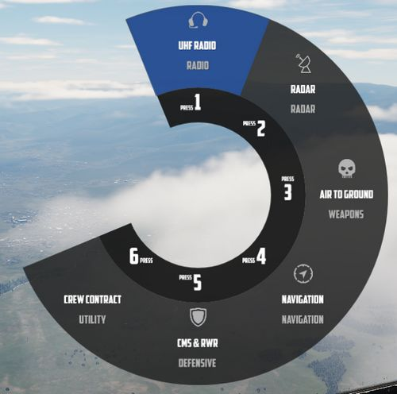
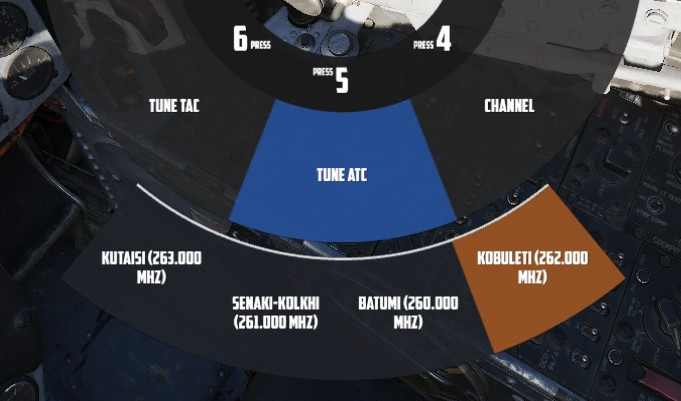
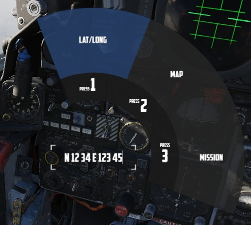
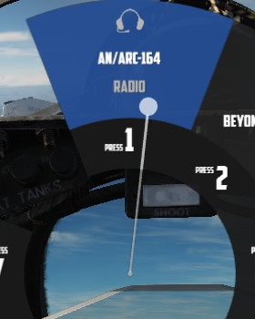
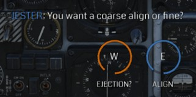
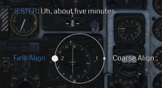

# Interface

Jesters user interface allows for easy communication and access to various
settings mid-flight, conveniently even during high stress situations.

## Wheel

The main interface to interact with Jester consists of a circular menu with
several sub-menus.

Confirming an option, such as the highlighted _UHF Radio_, will enter its
sub-menu, giving access to more related options.

In some cases, options are also presented on an outer menu.

The UI also supports direct text-entry when applicable, for example to enter the
coordinates of a new waypoint. For this, full keyboard control is allowed.

> 💡 While focused on a text-field, input is disabled to DCS.

To confirm and send the data, select the option (LAT/LONG in this case) again.

### Wheel Controls

The Jester Wheel can be opened by pressing <kbd>A</kbd> short and closed by pressing <kbd>
A</kbd> long.

The entire UI is accessible via mouse by left-clicking options or clicking on
the center area of circle to navigate back.

Options can also be bound directly to keyboard or other input devices. The
default hotkeys to access the options are <kbd>LCTRL</kbd> + <kbd>1</kbd>
through <kbd>LCTRL</kbd> + <kbd>8</kbd>.

Options on the outer ring are selectable via:

- <kbd>Q</kbd> - move cursor CCW
- <kbd>W</kbd> - confirm selection under cursor
- <kbd>E</kbd> - move cursor CW

Additionally, the cursor can also be moved freely either via an assignable axis
for a mini-stick, or via head-tracking. See
[9.2 Special Options](../dcs/special_options.md#jester-ui-allow-head-tracking)
for configuring head-tracking.

When moving the cursor without the mouse, pressing <kbd>A</kbd> **short** will
confirm the selection under the cursor, while <kbd>A</kbd> **long** can then be
used to close the UI.

> 💡 Most individual actions also offer a direct bind, if desired. See
> [9.1. Controls](../dcs/controls.md#jester--chief-commands) for details.

## Dialog

Jester can pro-actively ask the pilot questions. In this case, a menu with
actions pops up at the bottom of the screen.

Most actions are temporary and expire if not engaged with, in which case Jester
will either ignore the question or will assume a reasonable response.

It is possible for up to 3 actions to be available at the same time, the pilot
can then select which question to engage with.

Once selected, multiple responses are available. Some can also lead to follow-up
questions.

### Dialog Controls

The entire dialog UI is accessible via mouse by left-clicking options.

To engage in a dialog, it is also possible to use either of <kbd>Q</kbd>,
<kbd>W</kbd> or <kbd>E</kbd>, respectively.

Responses can also be bound directly to keyboard or other input devices. The
default hotkeys to access the options are <kbd>LCTRL</kbd> + <kbd>1</kbd>
through <kbd>LCTRL</kbd> + <kbd>4</kbd>.

Additionally, the cursor can also be moved freely either via an assignable axis
for a mini-stick, or via head-tracking. See
[9.2 Special Options](../dcs/special_options.md#jester-ui-allow-head-tracking)
for configuring head-tracking.

When moving the cursor without the mouse, pressing <kbd>A</kbd> will confirm the
selection under the cursor.
