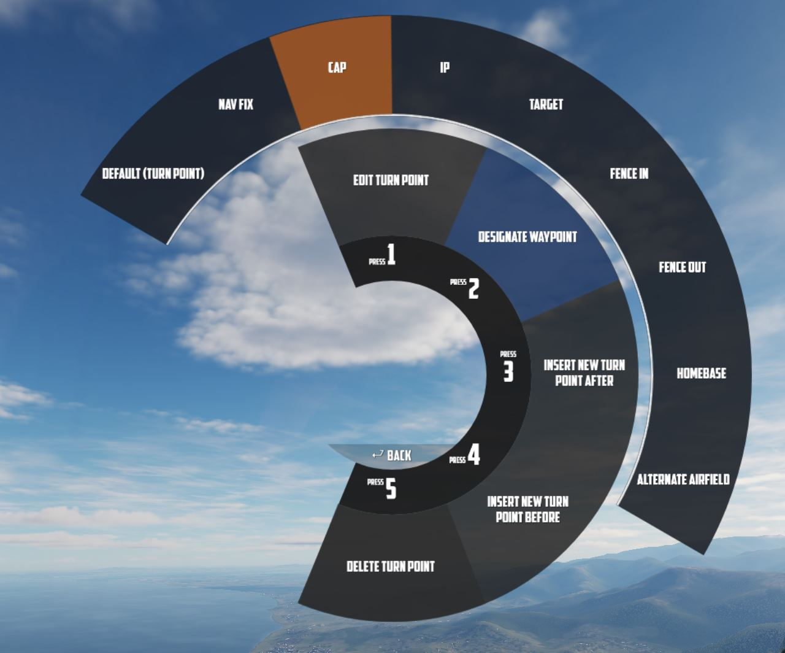
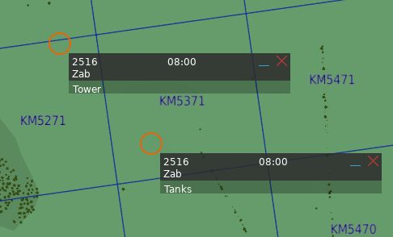
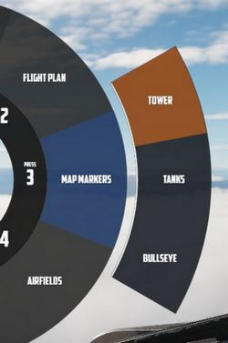
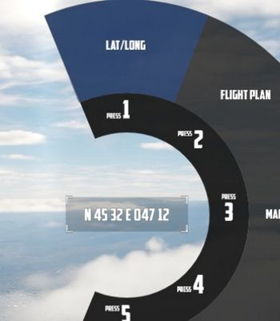
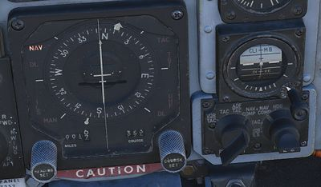
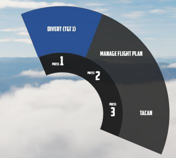
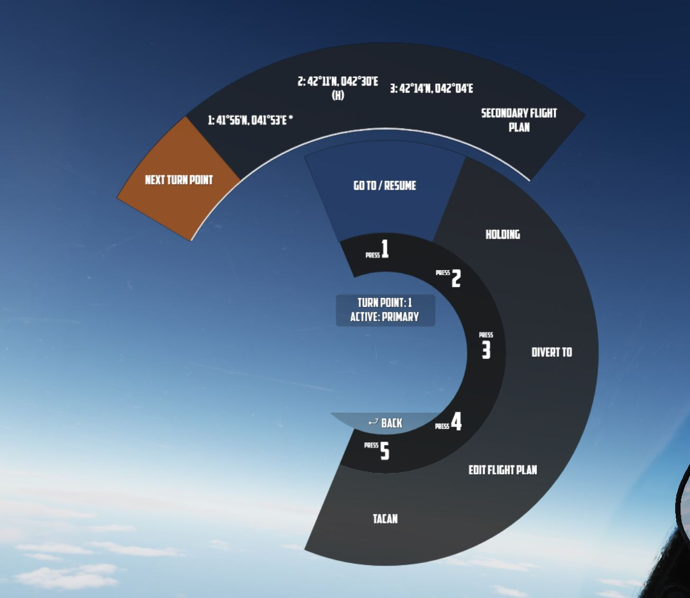
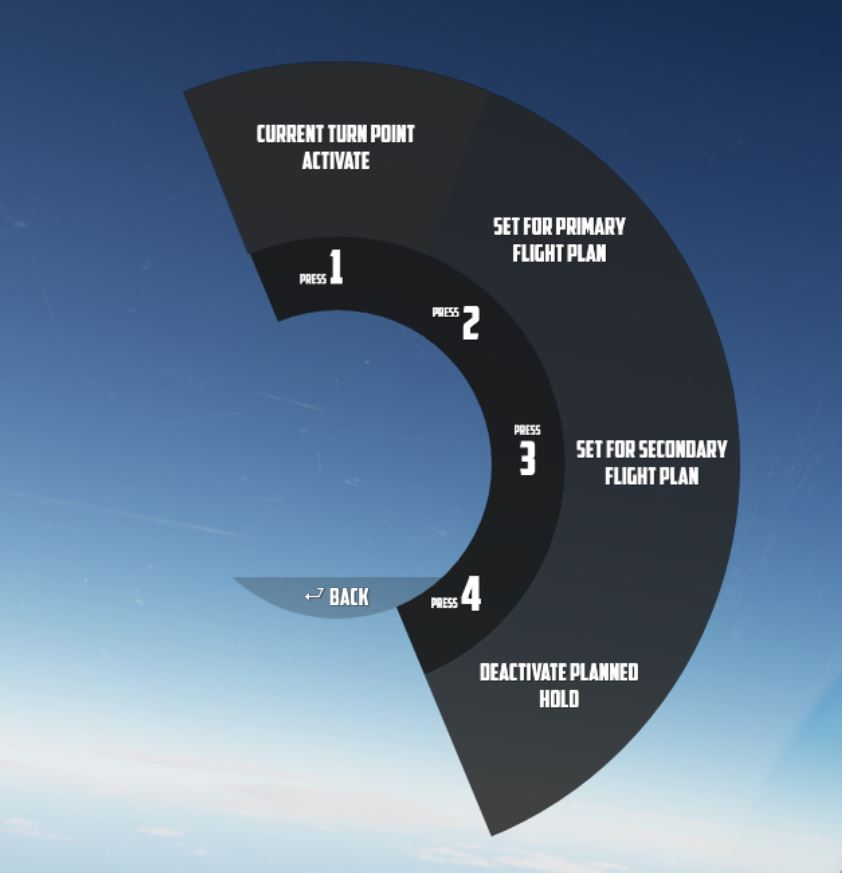
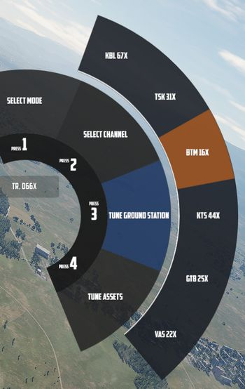
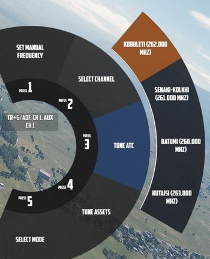

# Navigation

Navigation with Jester revolves around managing turn points for two flight plans:
the Primary Flight Plan and the Secondary Flight Plan. Both can be edited and followed
by Jester in the same manner, although Primary Flight Plan is considered the main
one and the Secondary Flight Plan serves as a backup.

## Flight Plan

A flight plan consists of multiple turn points. They can be inserted, deleted or
edited by the player through the UI, map or mission editor.

If the mission has assigned the aircraft a series of waypoints through the
mission editor, this will be available by default as the Primary Flight Plan.

Each turn point in the flight plan can be designated as one of several special
types. These designations will influence Jester's actions and the phrases he uses
as you approach the waypoint. The types are:

- **Default (Turn Point)** This is the standard waypoint type. Jester will
  automatically switch to the next waypoint when the aircraft is within 2 nautical
  miles (NM) of the turn point, as indicated by his BDHI.
- **Nav Fix (VIP - Visual Identification Point)** Jester will perform an INS
  (Inertial Navigation System) position update when flying over this point. He will
  report the distance to the VIP 10NM and 5NM in advance. Before reaching the VIP,
  Jester will input the necessary coordinates into the Navigation Computer, set the
  Navigation Computer Position Update Switch to FIX, and then execute the update when
  flying over the visual reference point. It is important to note that you must fly over
  the visual reference, not the INS-indicated point. Jester will adjust the INS coordinates
  at the VIP, and the success of the fix depends on how accurately the visual flyby matches
  the reference point. Afterward, Jester will report whether the update was successful
  or if the aircraft was too far from the point (in which case the flyby must be repeated).
  Upon a successful fix, Jester will switch to the next waypoint.
- **IP (Initial Point)** Jester will report the distance to the IP
  (15NM, 10NM, 5NM, and 2NM in advance) and provide a reminder when the aircraft is within 2NM.
  Once past the IP, he will switch to the next waypoint.
- **Target** Similar to the IP, but with different phrases, suited target area.
  Jester will update you as you approach (10NM, 5NM, and 2NM in advance),
  and switch to the next waypoint once past the target.
- **Fence In** and **Fence Out** These waypoints function similarly to the IP and Target types,
  but with additional tasks. Later, a checklist for operations at these points will be added.  
- **Homebase** and **Alternate** These are designated landing points. Jester will
  not automaticallyswitch to the next waypoint at these points,
  and he will report as the aircraft approaches Homebese.
- **CAP (Combat Air Patrol)** The first waypoint designated as CAP will be saved as CAP1,
  and the second will be saved as CAP2, regardless of their positions in the flight plan.
  Jester will ask how long you intend to remain on station at CAP1. He will then cycle
  between CAP1 and CAP2 until the designated CAP time expires, after which he will switch
  to the next waypoint following CAP2 in the flight plan.

### Map Marker

Using the <kbd>F10</kbd> map view in DCS, players can create named markers on
the map simply by double clicking the desired position after selecting **Mark
Label** at the top row in the UI.

Through the UI, these map markers can then be imported as turn points to the
flight plan.

### Tune Asset

The UI offers a list of nearby assets, such as ships, tankers or ground stations.

Their current position can be imported as turn point directly.

> 💡 For moving assets like tankers, their actual position might vary from the
> planned coordinates. Use TACAN or ADF for more precise navigation.

### Tune Airfield

Similar to tuning for assets, the UI provides a list of nearby airfields to
navigate to.

### Enter Coordinates

One way to add a turn point is by entering the corresponding LAT/LON through the
UI.

The format is `H DD MM H DDD MM`,

- where `H` represents the hemisphere (`N` or `S` for latitude and `E` or `W`
  for longitude);
- `D` signifies Degrees (`00` to `89` for latitude and `000` to `179` for
  longitude);
- and `M` stands for Minutes (`00` to `59`).

A valid example could be `N 45 32 E 047 12` or `S 05 55 W 105 00`.

> 💡 Spaces are optional, `N4532E04712` is also valid.

## Operation

Jester navigates by utilizing a technique called **leapfrogging**. The aircraft
only provides a single slot to memorize a waypoint (called **TGT 2**).

### Planned Route

When leapfrogging, **TGT 2** always indicates the next turn point of the current
active flight plan. As the aircraft approaches this turn point (±2 nautical
miles), Jester will automatically update TGT 2 to the next turn point in the
sequence.

This enables the pilot to follow the entire route of the flight plan by
selecting NAV COMP on the Navigation Function Selector Panel and following the
corresponding indication on the HSI.

### Divert

Besides following the flight plan, Jester is capable of diverting to a different
unplanned turn point using **TGT 1**.

Through the UI, players can switch between the diversion (TGT1) and flight plan
(TGT2) at any time.

### Pause & Resume Route

An active flight plan is indicated by the UI using an asterisk `*` next to the
current turn point.

Automatic turn point switching can be temporarily disabled per turn point using
the **Holding** option. Turn points designated for holding are marked
with a `h`.

When a flight plan has been paused, for example, because the pilot diverted to a
different point (using TGT 1), it can be reactivated through the UI again by
using the **Go To/Resume** option.

This also offers the possibility to skip turn points by jumping directly to any
turn point in its sequence, as well as returning to previous points or resuming
from a point designated for holding.

## TACAN

The TACAN equipment can be operated by both crew members independently and then
swapped between Pilot and WSO by using the **Command Button** on the panel.

Further, Jester is able to tune directly to any TACAN capable asset or ground
station.

This also allows the pilot to set up Jesters TACAN panel with a secondary setup
to then switch between both with a single click on the Command Button.

## UHF

The UHF radio is duplicated between both crew members and can be operated
independently. Using the **Command Button** allows the pilot to swap control
between their and Jesters setup. This enables the pilot to setup two
configurations and then swap between them fast with a single button press.

Jester is able to tune the radio directly to any nearby asset or ATC to enable
and open a communication channel conveniently and quick. Via ADF, this can also
be used for navigation.

