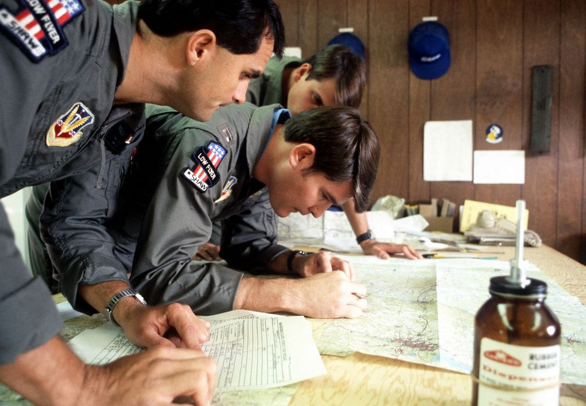
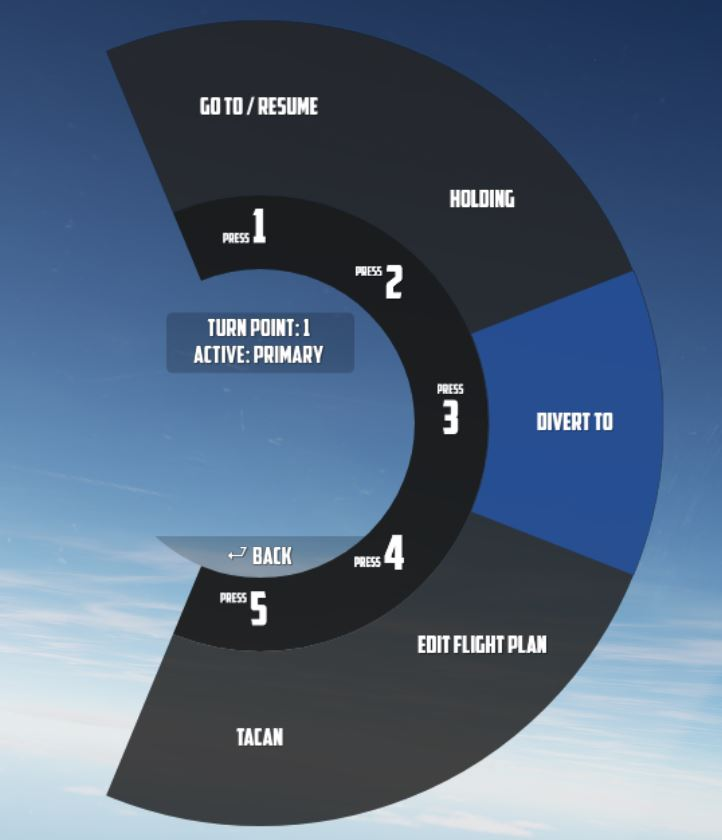

# 导航

Jester 的导航功能主要围绕管理两个飞行计划中的转向点：主飞行计划和次要飞行计划。虽然将主要使用主飞行
计划，次要飞行计划作为备用，但两者都可以通过 Jester 以相同的方式进行编辑和跟随。

## 飞行计划

一个飞行计划由数个转向点组成。玩家可以通过 UI、地图或任务编辑器插入、删除或编辑转向点。

如果作者通过任务编辑器为飞机分配了一系列航路点，这些航路点将默认作为主要飞行计划。

飞行计划中的各个航路点都可以指定为多个特殊类型中的其中一个类型。指定的类型将影响 JESTER 的动作以及
他在接近航路点时使用的对话短语。这些类型包括：

- **转向点（默认）**：转向点为标准航路点类型。当飞机距离转向点 2 海里（NM）内时（BDHI 显示的）
  ，Jester 将自动切换到下一个航路点。
- **导航更新（VIP - 目视识别点）**：Jester 在飞越该点时将执行 INS（惯性导航系统）位置更新。他将提前
  在距离 10 海里和 5 海里时报告 VIP 的距离。在到达 VIP 之前，Jester 会将更新必要的坐标输入至导航计
  算机中、将导航计算机位置更新开关设置到 “FIX” 档位然后在飞越目视参考点时执行更新。需要注意的是，飞
  行员必须飞越目视参考点，而非 INS 指示点。Jester 将在 VIP 上空调整 INS 坐标，更新是否成功取决于目
  视飞越参考点的接近程度。飞越之后，Jester 会报告更新成功，或者飞机离参考点太远（在这种情况下，必须
  重新飞越）报告失败。成功更新后，Jester 将切换到下一个航路点。
- **起始点（IP）**：Jester 会提前报告 IP 的距离（15 海里、10 海里、5 海里和 2 海里），并在飞机距离
  2 海里内时进行提醒。一旦飞越 IP，他就将切换到下一个航路点。
- **目标（TGT）**： 与 IP 相似，但短语不同，适合目标区域。Jester 会在飞机靠近该点时向飞行员报告新信
  息（提前 10 海里、5 海里和 2 海里），并在飞越目标后切换到下一航路点。
- **进入战区（F-IN）** 和 **离开战区（F-OUT）**：这些航路点的功能与 IP 和目标类型相似，但有额外的任
  务。
- **基地（HB）** 和 **备降（ALT）**：HB 和 ALT 类型为指定的着陆点。到达这些点后，Jester 不会自动切
  换到下一航路点以及他会在飞机接近基地时报告。
- **空中战斗巡逻（CAP）**：不论指定航路点在飞行计划中所处的位置，第一个指定为 CAP 的航路点将被保存
  为 _CAP1_，第二个为 _CAP2_。Jester 会询问飞行员打算在 _CAP1_ 停留多长时间。回答过后他将在 _CAP1_
  和 _CAP2_ 之间循环，直至窗口时间结束，之后他将切换到飞行计划中 _CAP2_ 后的下一航路点。飞行计划中
  可以有多对 _CAP1_-_CAP2_ 。

> 🚧 对于 _进入战区_ 和 \_离开战区 点，Jester 后续还将指导飞行员完成特殊检查单。

### 地图标记

玩家可以在 <kbd>F10</kbd> 预警机视角中，通过在 UI 顶部菜单栏选择 **标记标签** 并在所需位置点击鼠标
左键来创建标记。

接着，玩家可以通过 UI 将这些地图标记作为转向点导入至飞行计划中。

### 通信调谐

UI 可为玩家提供附近资产列表，如舰船、加油机或地面台。

资产当前的位置可以直接作为转向点导入至飞行计划中。

> 💡 对于像加油机这样的移动资产，它们的实际位置可能与计划坐标有所不同。玩家需要使用 TACAN 或 ADF 进
> 行更精确的导航。

### 塔台调谐

和调谐到附近资产相似，UI 将提供导航至附近机场列表。

### 坐标输入

玩家可以通过 UI 输入对应的 LAT/LON 来添加一个转向点。

输入格式为 `H DD MM H DDD MM`，

- 其中 `H` 代表半球 (纬度为 `N` 或 `S` 以及经度 `E` 或 `W` ); - `D` 表示度 (纬度 `00` 到 `89` 以及
  经度 `000` 到 `179` ); - 以及 `M` 表示分 (`00` 到 `59`)。

比如，有效坐标 `N 45 32 E 047 12` 或 `S 05 55 W 105 00`。

> 💡 空格为可选项，`N4532E04712` 同样为有效坐标。

## 操作

Jester 将通过一种名为 **跃迁** 的技术来进行导航。飞机仅能提供一个槽位来存储一个航路点（称为 **TGT
2**）。

### 计划航路

在跳跃式导航中， **TGT 2** 始终指示当前飞行计划的下一个转向点。当飞机接近下一转向点（±2 海里）时
，Jester 将自动更新 TGT 2 到序列中的下一个转向点。

这使得飞行员能够通过在导航功能选择面板上选择 NAV COMP 档位并跟随 HSI 上对应的指示，来按照飞行计划的
航路进行飞行。

### 改航

除开跟随飞行计划，Jester 还能使用 **TGT 1** 改航至非计划内的转向点。

玩家可以通过 UI 随时在使用改航（TGT 1）和飞行计划（TGT 2）之间切换。

### 暂停 & 恢复航路

UI 中的当前转向点旁边显示星号 `*` 表示飞行计划已激活。

玩家可以使用 **Holding** 选项来暂时禁用各个转向点的自动转向点切换功能。标记为挂起的转向点将标有 `h`
字样。

已暂停的飞行计划，例如因为飞行员改航到不同点时（使用 TGT 1），玩家可以通过 UI 中的 **Go To/Resume**
选项再次重新激活飞行计划。

玩家可以通过暂停 & 恢复选项直接跳转至序列中的任意一个转向点来跳过转向点，以及返回先前的转向点或从指
定为挂起的转向点继续飞行。

## TACAN

两名机组成员都可以单独控制 TACAN 设备，机组可使用 **指令按钮** 在飞行员和 WSO 之间切换控制权。

此外，Jester 能够直接调谐到任何具备 TACAN 能力的资产或地面台。

飞行员还可以通过 Jester 来设置次要塔康台，接着只需点击指令按钮来在两个塔康台之间切换。

## UHF

两个驾驶舱中的 UHF 电台相同并且可单独进行操作。使用 **指令按钮** 来在飞行员和 Jester 电台设置之间切
换。飞行员可以通过 Jester 来设置两种电台配置，并通过 **指令按钮** 来不同配置之间快速切换。

Jester 能够直接将无线电台调谐到任何附近的资产或 ATC，以便方便快捷地启用并打开通信频道。飞行员还可以
通过调谐至 ADF 进行导航。

