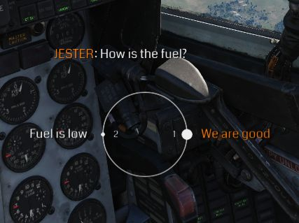
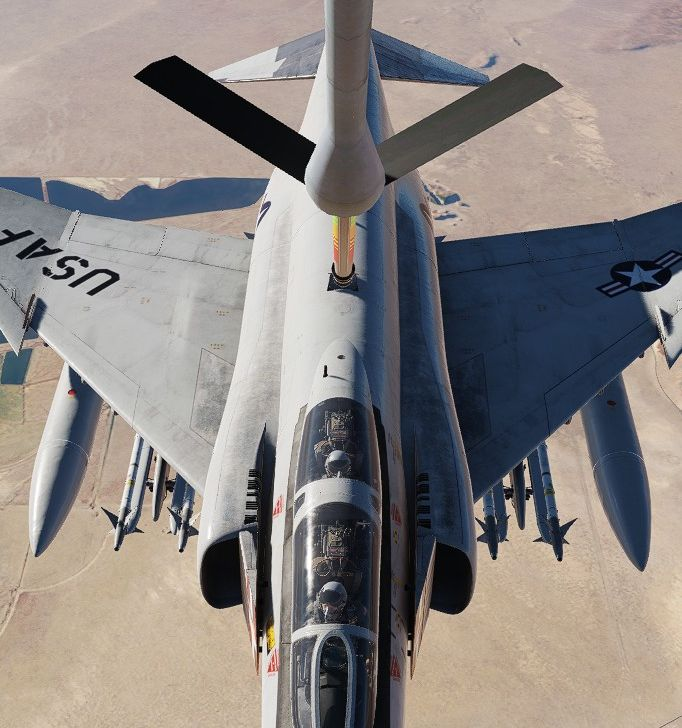
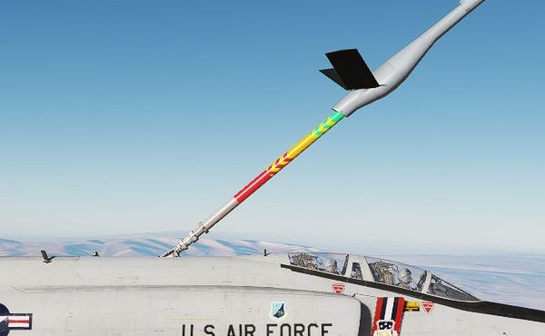

# 其它

在整个飞行过程中，Jester 将在各种情况下为飞行员提供帮助。

他会在格斗中标注敌机，并给飞行员提供转向提示。当遭到导弹攻击时，Jester 可能会告诉飞行员应该朝哪个方
向规避，让他意识到任何发现到的友机飞行活动，或者仅仅是在 AVTR 磁带录制满时提醒。

虽然 Jester 的驾驶舱中缺少油量表，但 Jester 会观察时钟和飞行员的飞行风格来在飞行员忘记关闭放油开关
时提醒他检查燃油量或消耗情况。

Jester 一定程度上能够评估和报告战损等更多情况。

## 起动

在飞行员执行冷启动的同时，Jester 也会自动设置好飞行所需的开关。

最值得注意的包括 INS 对准。在起动期间，Jester 会询问飞行员是否准备好对准以及选择哪种对准选项。

只有在飞行员确保电源保持稳定并且在对准程序完成之前飞机不必进行移动时，Jester 才会开始对准。

> 💡 如果飞行员真的必须开始移动，Jester 能够中断对准。在这种情况下，预计 INS 的性能会有所降低。

## 起降协助

在起飞时，Jester 会报告关键空速，指示飞行员何时开始抬轮。

默认情况下，在着陆时 Jester 将为玩家提供高度标注协助，就像在民航着陆时的高度警告一样。通过标注，飞
行员可以更好地估计当前位置，考虑到“鬼怪”受限的前向视野时更是如此。

> 💡 玩家可以禁用该选项，详见 [9.2. 特殊选项](../dcs/special_options.md#jester-landing-callouts)。

## 空中受油

Jester 可在 AAR 期间为飞行员提供转向辅助。

在初始阶段，Jester 将引导飞行员飞向连接硬管的正确位置，例如通过说

> "_向前移动 5 英尺_"

连接硬管后，Jester 将抬头并专注于硬管上的色彩标记。当飞行员向任一方向偏移过多时，硬管将显示黄色或红
色标记，此时 Jester 会进行提示。

位于中间处的完美位置标记被称为 _甜甜圈_ 。

执行 AAR 程序的详细信息请阅读
[3.2.2. 空中受油系统](../systems/engines_and_fuel_systems/fuel_system.md#air-refueling-system) 部分
。
