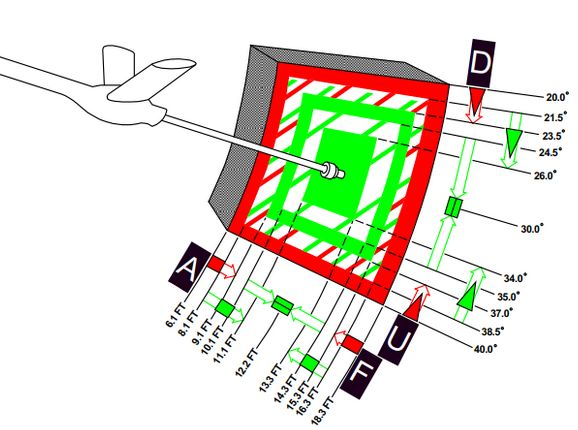
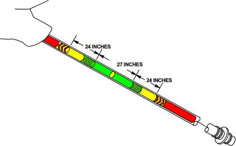

# Other

During the entire flight, Jester will assist the pilot in all situations.

He will call out bandits during a dogfight and give the pilot steering tips.
Jester might tell the pilot in which direction to evade when attacked by a
missile, make him aware of any friendly traffic spotted or also simply when the
AVTR cassette is full.

While lacking a fuel gauge in his cockpit, he will observe the clock and the
pilots flying style to remind him about checking the fuel level or consumption
when forgetting to leave the Fuel Dump switch activated.

Jester is able to assess and report battle damage to a certain degree and much
more.

## Startup

Whenever the pilot performs a cold start of the aircraft, Jester will
automatically get his cockpit ready for flight as well.

Most notably, this includes the INS alignment. During startup, Jester will ask
the pilot if he is ready for alignment and which alignment option to choose.

Alignment should only be started once the pilot is sure that power will remain
stable and the aircraft will not have to be moved until the procedure is
finished.

> 💡 Jester is able to abort an alignment if the pilot really has to start
> moving already. Expect degraded INS performance in this case.

## Takeoff and Landing Assistance

When taking off, Jester will report key values for the airspeed, indicating to
the pilot when to initiate the roll.

By default, Jester will assist the player during landing by giving altitude
callouts, similar as seen in civilian aviation. This way, the pilot can better
estimate the current position, especially given the reduced forward visibility
in the Phantom.

> 💡 This option can be disabled, see
> [9.2. Special Options](../dcs/special_options.md#jester-landing-callouts).

## Aerial Refueling

Jester provides steering assistance to the pilot during AAR.

In the initial phase, he will guide the pilot towards the right spot for the
tanker to connect the boom, for example by saying

> "_Move 5 feet forward._"

Once connected, he will look up and focus on the booms colored marks. Jester
calls out whenever the pilot is drifting too much in either direction, indicated
by the boom showing the yellow or red marks.

The perfect mark in the middle is called the _donut_.

