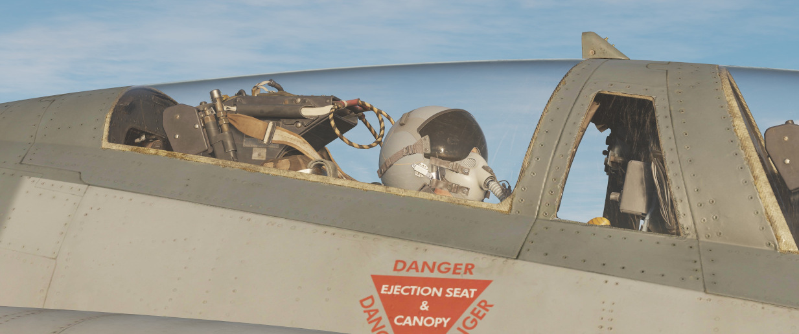

# Jester

_"伙计们，你们不仅能得到一名武器系统官，你还会有一位行政官、一位飞行规划师、一位看门狗，他还会携带
全套地图和酒水。"_

驾驶“鬼怪”II 本就是一项挑战——独自飞行更是如此。

Jester 是玩家单人飞行时的 AI 伙伴，他将扮演 WSO ，这样玩家就可以专注于驾驶飞机和使用武器。

他的主要职责为:

- 在起飞、空中受油和着陆期间提供协助
- 辅助进行导航
- 帮助操纵对抗措施
- 操作雷达
- 控制瞄准吊舱
- 发现其它飞机和导弹

以及更多...
