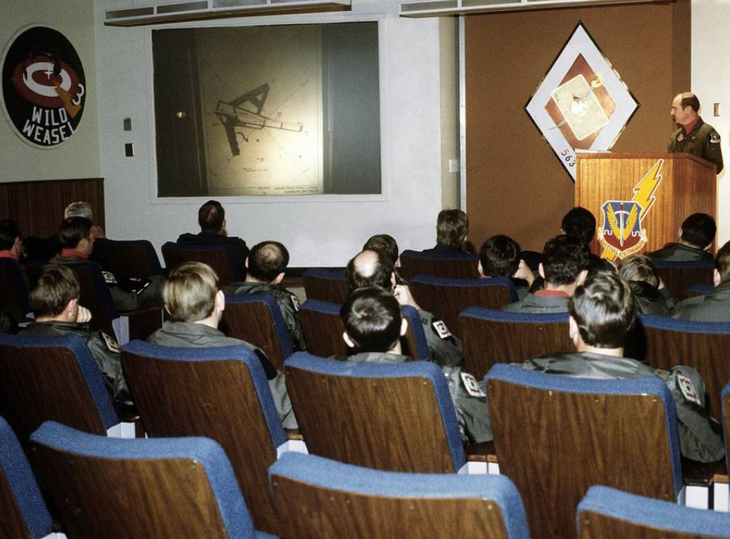

# Interesting Links

*Pilots of F-4 Phantom II aircraft, 35th Tactical Fighter Wing,
listen to a briefing on flight plans during exercise Team Spirit (Coronet Spray)*

## *Heatblur* deep dive videos

[Episode I - Introduction](https://www.youtube.com/watch?v=1nHCKO9Hb-M)

[Episode II - Flight Model](https://www.youtube.com/watch?v=x_ndze3imJE)

[Episode III - NAVIGATION](https://www.youtube.com/watch?v=Zaml5h49iQg)

[Episode IV - RADAR Pt. 1 - Basics and Theory](https://www.youtube.com/watch?v=s2YY2gQ76cw)

## Historic documentaries and training videos

[The Fabulous Phantom](https://www.youtube.com/watch?v=BgWPyiseBu8)

[The Record-Breaking Phantom II](https://www.youtube.com/watch?v=1RO_0cH3OUQ)

[F-4 Flight Characteristics](https://www.youtube.com/watch?v=iZiduQboyow)

[Ambassadors in Blue](https://www.youtube.com/watch?v=X_JNL1egQKI)

<!-- ## Other

[Cal Worthington F4s](https://www.youtube.com/watch?v=pg8-mx4KGK8) -->
