# Pilot Cockpit Overview

## Layout

| Section | Name                                             |
| ------- | ------------------------------------------------ |
| 1.      | Gunsight/Radar Repeater Group                    |
| 2.      | Overhead Auxiliary Indicators                    |
| 3.      | Multiple Weapons Controls/AWRS/Stores Management |
| 4.      | Flight Director Group                            |
| 5.      | Right Main Panel                                 |
| 6.      | Left Subpanel                                    |
| 7.      | Left Console Area                                |
| 8.      | Pedestal Group                                   |
| 9.      | Right Subpanel                                   |
| 10.     | Right Console Area                               |

## Gunsight/Radar Repeater Group

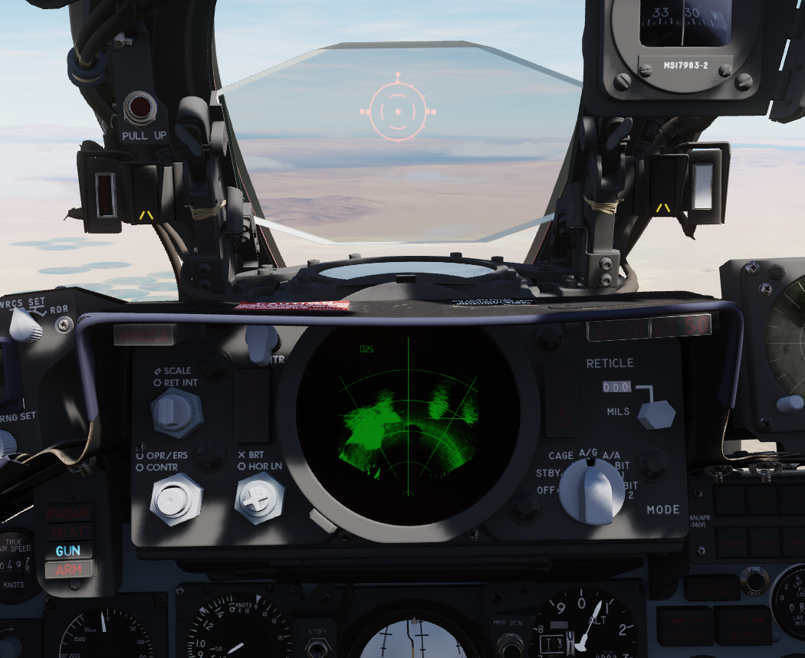

### Reticle Intensity/Scale Knob

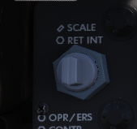

| Name    | Description                                                  |
| ------- | ------------------------------------------------------------ |
| RET INT | Controls the brightness of the reticle.                      |
| SCALE   | Controls the scale light intensity of the front radar scope. |

### Sight Shutter Lever

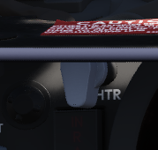

Changes the optical sight light source to prevent damage to the optics from high
sunlight.

### Reticle Depression Knob

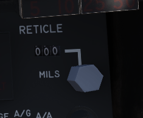

Controls manual depression in 1 mil increments.

### Sight Mode Knob

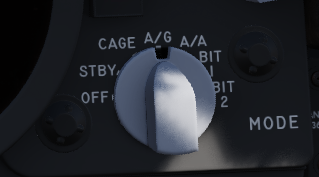

Selects the mode of operation for the gunsight.

| Name  | Description                                                                                             |
| ----- | ------------------------------------------------------------------------------------------------------- |
| OFF   | Turns the system off.                                                                                   |
| STBY  | Warms up the system. Reticle remains off.                                                               |
| CAGE  | Reticle is displayed and caged at the radar boresight line (RBL).                                       |
| A/G   | Selects air to ground mode. Manual set depression is referenced from the fuselage reference line (FRL). |
| A/A   | Selects air to air lead computing mode. Position is set by the gyro, range, and CADC, and can be caged. |
| BIT 1 | System self test mode 1.                                                                                |
| BIT 2 | System self test mode 2.                                                                                |

### OPR ERS/Contrast Knob

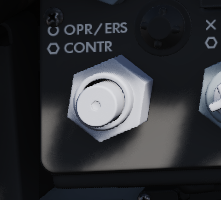

Two function (pushbutton inside of knob) control of the front scope display.

| Name    | Description                                                                            |
| ------- | -------------------------------------------------------------------------------------- |
| OPR/ERS | Button activates or erases display in aircraft with DVST. No function with DSCG scope. |
| CONTR   | Controls the displayed video/background contrast on the front scope.                   |

### Brightness Knob/Horizon Line Knob

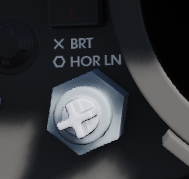

Dual knob control of the front scope display settings.

| Name   | Description                                                           |
| ------ | --------------------------------------------------------------------- |
| BRT    | Controls relative brightness of the front scope display.              |
| HOR LN | Adjusts relative horizon line shown on radar scopes in both cockpits. |

### INT Tab

The INT tab rotates around the display to alter the relative darkness of the
radar display, permitting the pilot to adjust the scope relative to ambient
light.

### Red Tab

The red tab is rotated to provide a red scope display for night flying.

### In Range Light

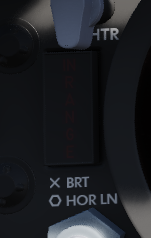

The IN RANGE light illuminates to alert the pilot that the current locked target
is within range parameters.

### Hold Altitude Light

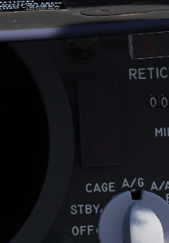

The HOLD ALT light illuminates as an instruction to the pilot from the fire
control system to maintain current altitude to assist in a snap-up intercept
situation against a target above the fighter. The predicates are:

- A range greater than the weapon can make,
- Altitude in excess than 32,000 feet, and
- The locked taret is greater than 8,000 feet above the fighter.

When the HOLD ALT light is on, the fighter should be flown to center the
steering dot relative to azimuth of the ASE circle. When the HOLD ALT light
turns off, the fighter should then snap up in pitch to fully center the steering
dot in the ASE circle.

### Range Lights

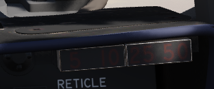

The Range Lights illuminate relative to range settings selected by the WSO.
Range is provided on the upper right corner of the DSCG scope.

### Wheels Light

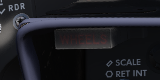

The WHEELS lamp illuminates when the aircraft slows below flaps blow-up speed
(roughly 230 knots, dependent on altitude) with the gear still raised.

## Overhead Auxiliary Indicators

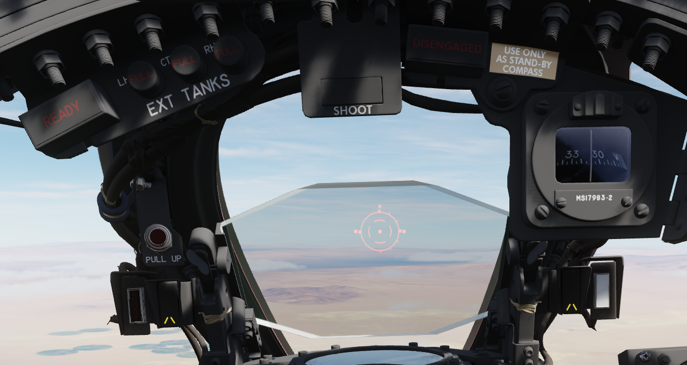

### SHOOT Lights

Illuminates when missile firing parameters are met. Do not illuminate when in VI
or A-G modes.

### Air Refueling Lights

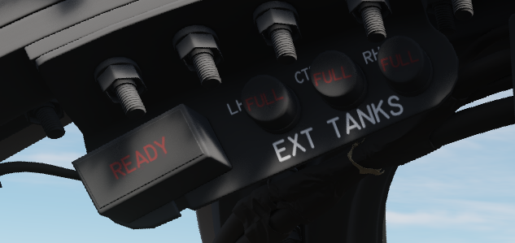

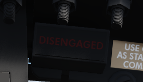

Provide status of the Air Refueling System while in use.

| Name       | Description                                                                                                      |
| ---------- | ---------------------------------------------------------------------------------------------------------------- |
| READY      | Illuminates when air refuel receptacle is fully extended. Turns off when boom is locked or receptacle retracted. |
| DISENGAGED | Illuminates when boom disengages during cycle, and remains lit until refueling system is reset.                  |
| L.H. FULL  | Indicates left hand external tank is full (also while refueling on ground).                                      |
| CTR. FULL  | Indicates centerline external tank is full (also while refueling on ground).                                     |
| R.H. FULL  | Indicates right hand external tank is full (also while refueling on ground).                                     |

### Labs Pull Up Light

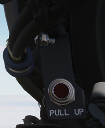

Illuminates and disengages during Loft and LABS bombing runs to provide timing
sequence information to the pilot.

### Standby Magnetic Compass

A standard magnetic compass for backup navigation assistance should the primary
flight director systems fail.

### Angle of Attack Indexer Lights

Provides quick confirmation of current aircraft AoA state based on illuminated
position and color.

### Range Indicator

This panel provides the pilot with a readout of the slant range measured by the
Pave Spike Targeting Pod (x100 ft).

When the Test-Button is pressed, the display shows 888, the knob underneath it
controls the brightness of the readout.

The Mode-Knob allows the pilot to select one of two weapon delivery modes
available with the pod:

- WRCS - Automatic Delivery
- ROR - Release on Range

In the SET position, the display shows the desired release range used in the ROR
mode. The knob below the readout can be used to adjust this range.

## Multiple Weapons Controls/AWRS/Stores Management

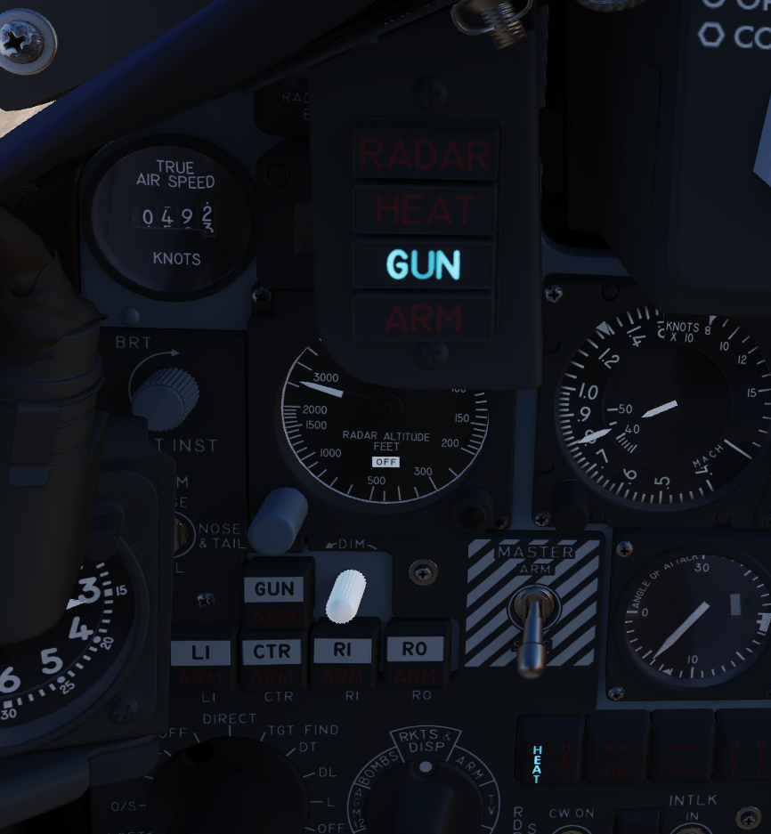

### Head Up Display Indicators

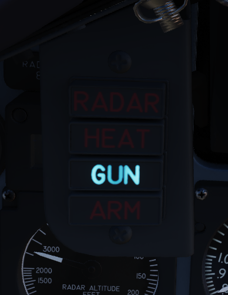

The Head Up Display indicator panel provides weapon status for the Master Arm
control as well as the current selected air to air weapon based on the position
of the Guns/Missile switch on the left throttle handle.

| Name  | Description                                                     |
| ----- | --------------------------------------------------------------- |
| RADAR | Illuminates when a radar-guided air to air missile is selected. |
| HEAT  | Illuminates when an IR-guided air to air missile is selected.   |
| GUN   | Illuminates when the nose gun is selected.                      |
| ARM   | Illuminates when the Master Arm switch is selected to ARM.      |

### UHF Remote Channel Indicator

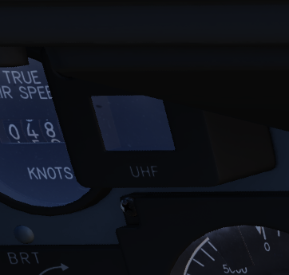

Provides the current selected channel value when the radio is set to PRESET.
Otherwise, the indicator displays M if the radio is set to Manual, G when the
COMM function is set as GUARD/ADF, or A when the A-3-2-T switch is in A.

### True Airspeed Indicator

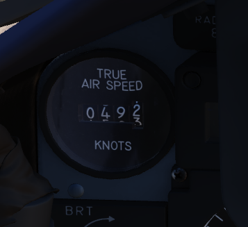

Provides the aircraft's true Airspeed in knots, and is calibrated from 150 to
1500 knots; airspeeds below this range are thus not reliable. At high rates of
airspeed change, there may be a lag of up to

### Flight Instrument Brightness Knob

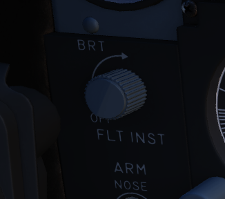

Controls brightness of the flight instrument cluster.

Rotating clockwise will increase brightness of all flight instrument lights,
while at the same time dim the HSI mode and warning and caution lights, except
FIRE and OVERHEAT.

Flight instrument lights can additionally be controlled individually with knobs
on the Flight Instrument Lights Intensity Panel, located on the right wall.

### Nose/Tail Arming Switch

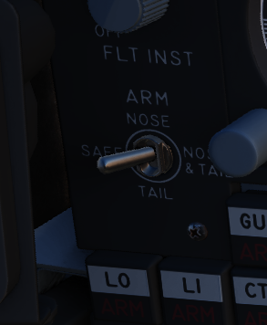

Controls the arming solenoids of the MER and TER racks, selecting what MER/TER
position(s) arming lanyards are pulled from released bomb fuzes upon separation,
thus making them live. This function also controls selective low/high drag
capability for retarded bombs.

| Name      | Description                                                                       |
| --------- | --------------------------------------------------------------------------------- |
| SAFE      | No arming solenoids activate; bombs release without fuzing enabled.               |
| NOSE      | Forward and center position solenoids activate to hold arming lanyards.           |
| TAIL      | Aft position solenoids activate to hold arming lanyards.                          |
| NOSE/TAIL | Forward, center, and aft position solenoids all activate to hold arming lanyards. |

### Station Select Buttons

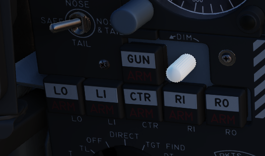

The Station Select Buttons are used to activate air to ground munition stations
and the nose gun. Upon selection of a station, the upper half denoting the
position will illuminate green to confirm the station is active. The lower half
will illuminate amber once the necessary mode is selected, the weapon is
compatible with the weapon select knob option, the Master Arm is in the ARM
position, and any necessary warm up period for the selected weapon type is
completed. L and R positions are left and right, respectively, with O denoting
outboard and I denoting inboard stations. The centerline weapon position is CL,
and the nose gun is armed with the GUN station selector button.

A dimmer knob is also provided to raise or lower the lighting of the station
select buttons relative to current cockpit conditions. If the Flight Instrument
Brightness Knob above it is set to the full CCW position, it overrides the
dimmer knob and Station Select Buttons are always illuminated at full
brightness.

### Master Arm Switch

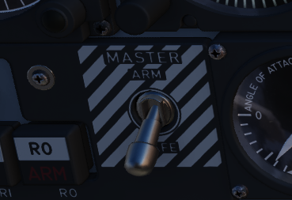

Provides master arming function for all aircraft weapons.

### Delivery Mode Knob

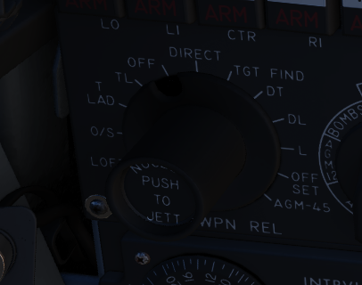

The Delivery Mode Knob sets the fire control system to the desired air to ground
weapon release type. Split into two halves, the left side of the dial references
ARBCS (Altitude Reference and Bombing Computer Set) delivery modes, while the
right side provides automated release functions using the WRCS (Weapon Release
Computer Set) with possible tie-in to the navigation computer, depending on
mode. At the 11 and 12 o'clock positions are the OFF position, which is utilized
for air to air weapons (including the gun) and DIRECT, which is used for
video-directed weapons such as the AGM-65. The full series of positions is as
follows, clockwise from the left:

| Name     | Description                            |
| -------- | -------------------------------------- |
| INST O/S | Instantaneous Over the Shoulder        |
| LOFT     | Loft                                   |
| O/S      | (Timed) Over the Shoulder              |
| T LAD    | Timed LADD (Low Angle Drogue Delivery) |
| TL       | Timed Level                            |
| OFF      | Off (Air to Air)                       |
| DIRECT   | Manual Direct                          |
| TGT FIND | Target Find (Nav mode only)            |
| DT       | Dive Toss                              |
| DL       | Dive Laydown                           |
| L        | Laydown                                |
| OFF SET  | Offset Bomb                            |
| AGM-45   | AGM-45                                 |

### Weapon Selector Knob

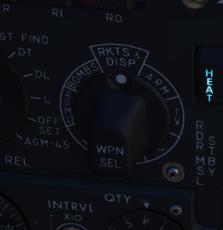

Selected for the type of weapon currently required, providing release signals to
the AWRU (Aircraft Weapons Release Unit). ARM and TV positions inhibit air to
air weapon firing unless a CAGE signal is active. ARM and TV positions do not
affect tuning status of radar guided weapons. Positions are as follows:

| Name        | Description                                                                      |
| ----------- | -------------------------------------------------------------------------------- |
| AGM-12      | Not used.                                                                        |
| BOMBS       | Bombs (all types).                                                               |
| RKTS & DISP | Rockets and dispensers.                                                          |
| ARM         | Anti-Radiation Missile (AGM-45).                                                 |
| TV          | Electro-optical weapons (AGM-65).                                                |
| C           | Not used; may be utilized as an OFF position.                                    |
| B           | Like AIR TO AIR switch in rear cockpit, cancels CAGE requirement.                |
| A           | Simultaneous release mode for CBU, rockets, or dispensers; bombs do not release. |

### Aircraft Weapons Release Unit

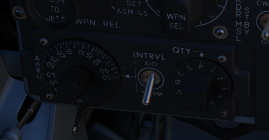

Provides timed interval release scheduling of single or multiple bombs or
rockets and dispensed munitions based on the selections made between the
interval knob, the QTY (quantity) knob and the INTRVL switch.

The interval knob provides release pulse sequences between 0.05 second and 1
second.

The INTRVL switch provides the option of a 10x multiplier of the set value of
the interval knob. In the NORM position, the interval knob value is the trigger
timer. The quantity knob functions as follows:

Selecting "1" places the AWRU into single manual bombing mode; one push of the
bomb release button releases one bomb.

Selecting a value from "2" to "18" sets the AWRU into single ripple mode; in
this mode, the AWRU will release bombs according to the programmed interval
until the set number of rounds is dropped, or the bomb button is released. Upon
release, the count is reset, and a subsequent press and hold will drop the
programmed number of bombs.

Selecting "C" sets the AWRU into single continuous mode; pressing the bomb
release button drops rounds according to the programmed interval until the bomb
button is released, or all munitions from the selected pylons are expended.

The "P" setting is for pairs manual mode. With at least two stations selected,
each push of the bomb button will release two bombs; like single manual mode,
this does not include an interval function.

Lastly, the "S" setting, for salvo, releases bombs in accordance to the chosen
interval from all selected stations simultaneously, until the bomb button is
released. Ergo, if four stations are selected with a 2 second interval (0.2 on
the interval dial, X10 INTRVL switch setting), four bombs will be released every
two seconds the pickle button is held down.

### Missile Status Lights

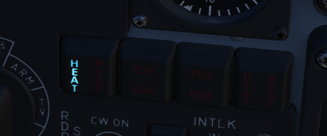

The Missile Status Light window provides confirmation of currently installed and
configured air to air missiles.

The RDR lights illuminate once AIM-7 missiles are properly tuned with the fire
control system; any station that does not carry a Sparrow, does not correctly
sync up during tuning, or is launched, will turn off.

The HEAT lights illuminate one at a time, rather than all up upon circuit
configuration. The light of the currently selected station will illuminate
beginning at the raising of the gear handle, and remain in that position until
the weapon is either cycled using the throttle's Gun/Missile Switch reject
option, or is launched.

### Radar Missile Power Switch

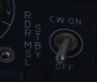

The Radar Missile Power Switch provides power to the CW tuning drive and
monitoring functionality.

When switched out of the OFF position, power is applied to the circuit 30
seconds after this selection.

The STBY position maintains warmup power to the missiles and CW tuning drive
once the missiles have been tuned.

The CW ON position allows for constant tuning and missile state monitoring with
the radar mode not in TV.

Tuning can be performed on the ground with the radar in TEST mode to preclude
emissions endangering ground crew.

### Centerline Tank Aboard Light

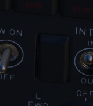

Illuminates when a stores condition exists that precludes ejection and launch of
an AIM-7 missile installed in one of the two forward positions.

### Interlock Switch

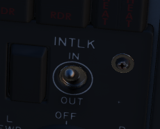

A two position switch that determines whether the fire control system launch
parameter interlocks can prevent an AIM-7 from being launched when the trigger
is pulled.

| Name | Description                                                                       |
| ---- | --------------------------------------------------------------------------------- |
| IN   | Interlocks engaged; range limits, ASE limits, or radar not in VI inhibits launch. |
| OUT  | Interlocks disengaged; AIM-7 will fire when trigger is pulled.                    |

### Selective Jettison Control

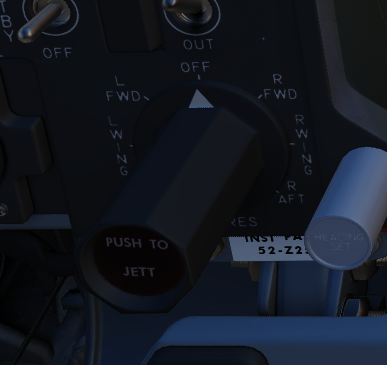

The Selective Jettison Control knob provides the pilot direct access to dump
stores in an emergency on a position by position basis, or immediate release of
all single carried air to ground, MER/TER stored, or LAU-88 launcher-mounted
round at once.

| Name     | Description                                                                       |
| -------- | --------------------------------------------------------------------------------- |
| OFF      | Safes PUSH TO JETT button on the Selective Jettison Control Panel.                |
| STORES   | Releases all MER/TER, single carried, or LAU-88 mounted rounds upon PUSH TO JETT. |
| L/R FWD  | Jettisons AIM-7 from respective position on PUSH TO JETT. Inhibited if CL TK ON.  |
| L/R AFT  | Jettisons AIM-7 from respective position on PUSH TO JETT.                         |
| L/R WING | In conjunction with TV or ARM, jettisons single AGM-65 from wing on PUSH TO JETT. |

### Recorder Lamp

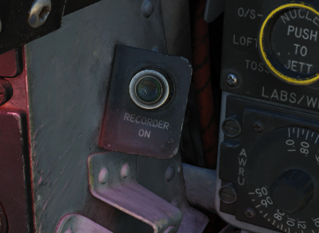

This dimmable lamp is lit to indicate operation of the
Airborne-Video-Tape-Recorder (AVTR).

The AVTR system is controlled by the WSO and records the intercom sound, as well
as the rear radar screen.

## Flight Director Group

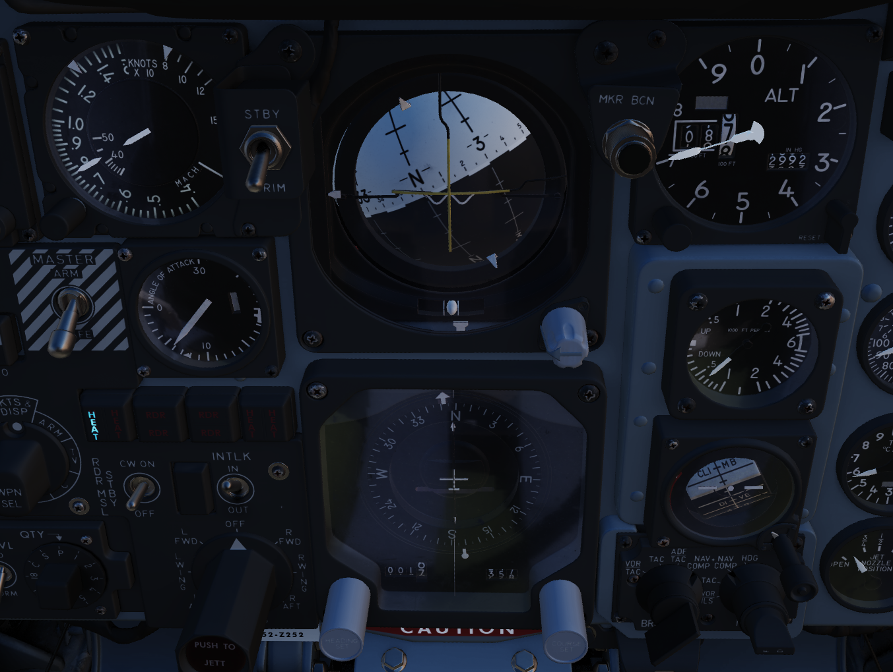

### Radar Altimeter

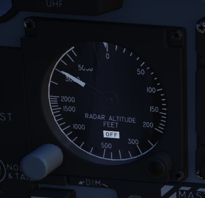

Terrain relative accurate height information up to 5000 ft, functions to 30
degrees of bank angle or 35 degrees of pitch. Clockwise rotation of the function
control switch on the lower right of the indicator powers the device; continued
rotation sets the low altitude warning pointer to the desired height. Below the
set altitude, the warning light activates. A self-test, initiated by pressing
the function control switch, shows 35

### Airspeed and Mach Indicator

The combination airspeed and mach number indicator shows airspeed readings below
200 knots, and include Mach numbers at high speed. The indicator uses a single
pointer over a fixed airspeed scale, marked from 80 to 850 knots, with a moving
Mach scale presenting from Mach 0.4 to 2.5. A pair of movable reference markers
is available with the knob on the face of the gauge, with speed reference
available between 80 and 195 knots, and the Mach index pointer being able to be
set between the 225 knot and 850 knot regions relative to the airspeed gauge.

Note: Moving these reference markers outside of the respective aforementioned
regions can damage them.

### Angle of Attack Indicator

Drawing relative wind information from the landing-gear adjacent AoA probe, the
AoA indicator offers conditional reference for cruise (7.9 units), approach
(19.2 units), and stall (30.00). Because of the AoA probe to the nose gear door
and subsequent airflow disturbance when the gear is lowered, actual aircraft AoA
is approxiamtely 1 unit higher than indicated, and ON SPEED AoA is roughly 5
knots slower than the given value.

When indicator power is offline due to electrical system configuration or
damage, an OFF flag will appear in the window on the face of the gauge. Function
of the indexer lights and stall warning vibrator is driven by switches in the
indicator.

### Reference System Selector Switch

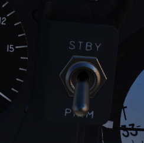

Toggles between the inertial navigation set and AN/AJB-7 displacement gyroscope
for attitude information. When set to PRIM, the inertial navigation set provides
azimuth and attitude data to the ADI; when on STBY, AN/AJB-7 supplies this
information. Azimuth data also feeds into the HSI and BDHI (rear cockpit).
Additionally, attitude details are sent to the fire control system.

Note: Inertial information requires the inertial navigator control panel's
switch to be on NAV.

When transitioning between STBY and PRIM, immediate attitude information may
show unusual gyrations on the attitude director indicator due to initial
erection. Rapid turns (above 15° per minute) may temporarily disrupt accurate
heading information, requiring straight and level flight for about 20 seconds
for manual compass system synchronization (SYNC position)

### Attitude Director Indicator

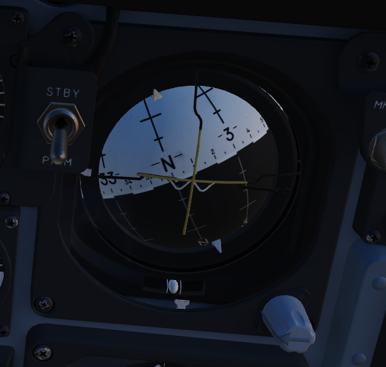

Includes an attitude sphere, turn indicator, steering bars, miniature aircraft,
glideslope pointer, flags, and pitch trim knob. It displays pitch, bank, and
heading from the selected reference system and allows pitch adjustment via the
trim knob. The turn indicator relies on a gyro from the AN/AJB-7 system. The
steering bars offer Flight Director guidance for heading interception,
navigation, and ILS approaches. The glideslope pointer provides vertical
guidance information during an ILS approach.

### Horizontal Situation Indicator

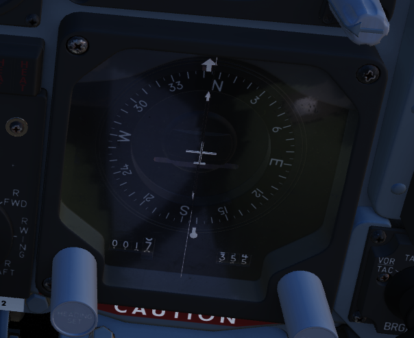

Consists of a rotating compass card, single and double bar bearing pointers
numbered 1 and 2 respectively, a range indicator, and a range warning flag.
Presents a top-down view of the currently programmed navigation. The Heading Set
knob is availble to input desired magnetic heading, and the Course Set knob is
used to enter VOR radial or inbound localizer course for accurate deviation
display.

### Altimeter

A counter-pointer style altitmeter, with thousandths in the counter window and
100 foot increments around the face. The altimeter has an absolute range of
80,000 feet. The altimeter includes a barometric scale for setting local
pressure with the knob on the indicator. Works in either electric (normal
operation mode) or pneumatic (STBY) mode, switchable via a springloaded three
position switch labelled RESET and STBY.

### Vertical Velocity Indicator

Provides rate of climb or descent via the static pressure system referenced in
thousands of feet per minute.

### Standby Attitude Indicator

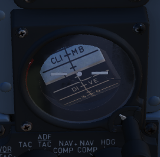

The SAI functions independent of the Flight Director Group, providing reasonably
accurate readings (within six degrees) for 9 minutes if power to the system is
lost and the OFF flag is in view. Pitch markings are indicated every 5 degrees,
while roll markings are in gradations of 10 degrees. Roll is illustrated through
360 degrees, while pitch is limited by stops at 92 degrees in climb and 78
degrees in dive to prevent gimbal lock.

### Navigation Function Selector Panel

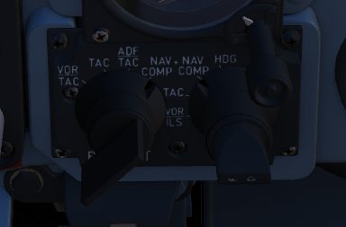

Controls display presentation on the ADI and HDI based on the selected values on
the two knobs; to the left is the Bearing/Distance Knob, and to the right the
Mode Selector Knob. The Bearing/Distance Knob determines the source of
navigation information for the HSI and ADI. The Mode Selector Knob provides
control over the presentation of various displayed information on the HSI and
ADI. The Mode Selector Knob includes an inset switch marked FD, for Flight
Director. This switch engages or deactivates the pitch and bank steering bars on
the ADI; the OFF position has the switch aligned vertically.

#### Bearing/Distance Knob

| Name     | Description                                                                       |
| -------- | --------------------------------------------------------------------------------- |
| VOR/TAC  | Magnetic and relative bearing to VOR station and TACAN range displayed on HSI.    |
| TAC      | Magnetic and relative bearing and range to TACAN station displayed on the HSI.    |
| ADF/TAC  | Magnetic and relative bearing to ADF station and TACAN range displayed on HSI.    |
| NAV COMP | Magnetic and relative bearing and range provided from navigation computer on HSI. |

#### Mode Selector Knob Display Functions

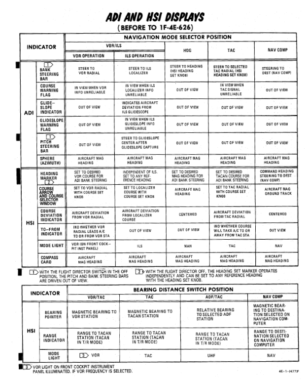

## Right Main Panel

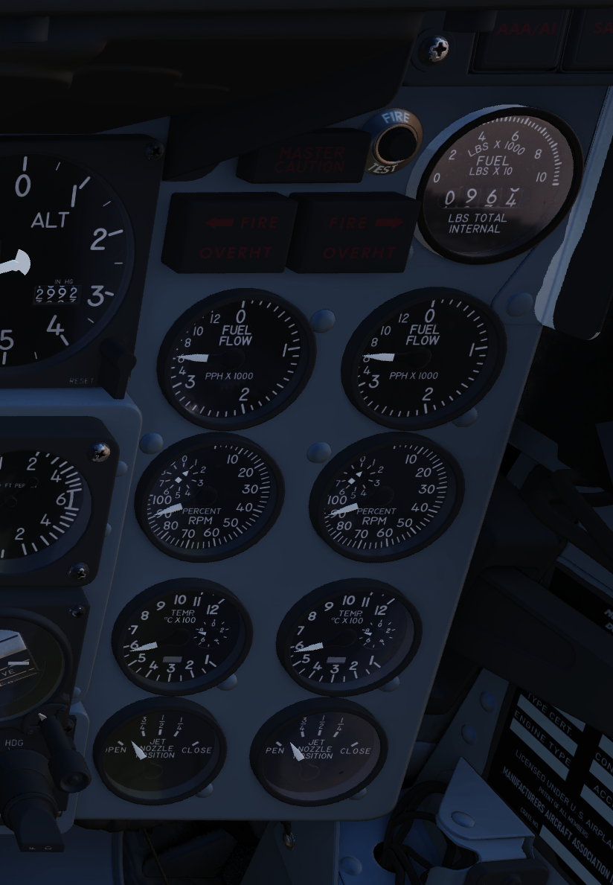

### RWR Azimuth Indicator

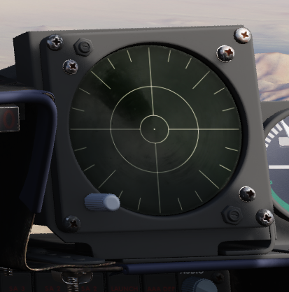

### Azimuth-Elevation Indicator

The Azimuth-Elevation Indicator, or also Line-Of-Sight Indicator, is the main
instrument for the pilot to assess the current attitude of the Pave Spike
Targeting Pod in order to keep the line of sight within the operational limits.

The needle shows the pods roll position from -160° (CW) to +110° (CCW).

Three flags indicate the elevation:

- green: -120° to -155°
- yellow: -155° to -160°
- red: -160° or beyond

If the needle is kept within the green labelled range and neither the yellow or
red flag are shown, the view will not be obstructed by the pod or the aircraft.

### Master Caution Light

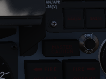

The Master Caution light illuminates to provide the pilot warning of a condition
requiring attention, directing them to look at the telelight panel for
additional information. The Master Caution lamp is reset by correcting the
condition, or pressing the Master Caution Reset button on the generator control
panel.

### Fire Test Button

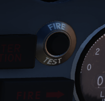

When pressed, this button tests for functionality of the FIRE and OVRHT lamps.
Under normal conditions, all four lights should light up as long as the button
is pressed down. If a lamp does not light up, it is likely broken and cannot be
trusted on indicating a fire condition anymore.

The button can also be used in conjunction with the Warning Lights Test switch
to confirm detection and continuity performance of the fire and overheat warning
systems.

Holding the Warning Lights Test switch in the WARN TEST position, then
simultaneously pressing and releasing the Fire Test Button performs the test.
Proper system function is confirmed with the four FIRE and OVRHT lamps off while
the Fire Test Button is pressed, then illuminating when it is released.

### Fire/Overheat Warning Lamps

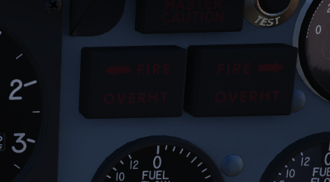

The Fire and Overheat Warning Lamps, one for each engine, are a pair of
two-position indicators that illuminate when a fire condition is detected in the
engine compartment (FIRE), or an overheat condition is detected in the exhaust
nozzle section (OVRHT).

### Fuel Quantity Indicator

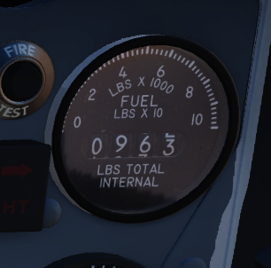

The Fuel Quantity Indicator provides two different indications of total usable
internal fuel to confirm proper transfer function between the seven internal
fuel cells, as well as any external loaded tanks. The upper hemisphere's sector
display presents fuel quantity detected in fuselage cells 1 through 6, excluding
the aft-most cell 7, as well as the internal wing tanks. The sector display
presents 200 lb increments from 0 to 3000 pounds, and 500 pound increments for
the rest of the gauge. The lower tape counter readout includes all internal
fuel, including cell 7 and the internal wing tanks, and is presented in 100 lb
increments.

### Fuel Flow Gauges

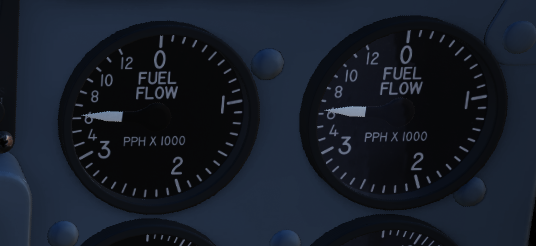

A pair of fuel flow indicators is provided, one for each engine, presenting
pounds per hour rate from 0 to 12, in 1000 lb increments. Flow indications are
for basic, non-afterburning thrust. In afterburner, the flow rate is roughly
four times the displayed flow rate.

### Tachometers

A percentage-noting Tachometer is provided for each engine, including an inset
wheel for accurate display of single digits.

### Exhaust Gas Temperature Gauges

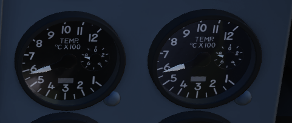

Exhuast Gas Temperature gauges are provided for each engine. The gauges have two
needles- a large needle providing increments of 0 to 12 in multiples of 100
degrees centigrade, and a smaller needle presenting increments of 0-10 in
multiples of 10 degrees centigrade. Temperatures are measured at the exit of the
turbine unit.

### Dual Exhaust Nozzle Position Indicators

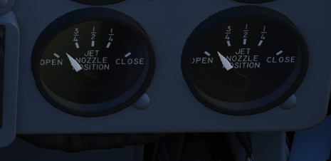

A combined Nozzle Position Indicator is provided with two needles, one for each
engine on their respective side, to confirm balanced nozzle position and
scheduling relative to throttle position. The gauge provides four zones relative
to the nozzles being in their fully open configuration, or their maximum closed
configuration at the bottom. At idle, the indication will be roughly 7/8ths
open, and schedules down as throttle is increased. Position in the afterburner
region will moderate to maintain safe EGT levels.

## Left Subpanel

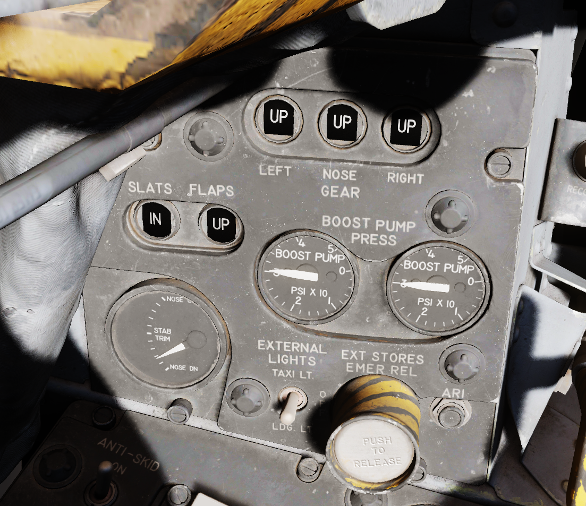

### 8-Day Clock

A clock is provided for the pilot, including a stopwatch function.

### Emergency Canopy Jettison Handle

Used for emergency ground extraction, the Emergency Canopy Jettison Handle
releases a compressed oxygen cylinder to open both canopies immediately,
shearing them off at their pivots.

### Landing Gear Handle

Actuates the landing gear; raised for gear up, down for gear down.

Pulling the handle out will actuate the Emergency Mode and release the gear by
using a pair of compressed air bottles.

### Landing Gear Position Indicators

The Landing Gear Position Indicators provide visual confirmation of current gear
state, displaying UP when retracted, showing a barber pole while in transition,
or the illustration of a wheel in the respective window when fully down and
locked.

### Slats/Flaps Indicators

Visual indication of the Slat and Flap systems are provided through two window
indicators. Slats will be displayed as IN (retracted) or OUT (extended). Flaps
will display as UP (retracted) or DN (down), and will show a barber pole while
in transition.

### Boost Pump Pressure Indicators

A pair of indicators provide confirmation of fuel boost pump operation.
Indicators are calibrated 0 to 5, which must be multiplied by 10 to read in
current PSI.

### Stabilator Trim Indicator

Provides current stabilator trim setting in units (trim switch actuations) of
trim.

### Landing/Taxi Lights Switch

Control the external Landing and Taxi lamps. Left main gear must be down and
locked for the switch to function.

### External Stores Emergency Release

Also called the "panic button", the External Stores Emergency Release will
immediately perform separation of all jettisonable stores, without air to air
weapons or special weapons. The actuation of the button will show a yellow ring
around the button position, which is the indicator for the pilot that it has
been used.

### Aileron Rudder Interconnect (AIR) Circuit Breaker

When pulled in conjunction with the Yaw ARI Stab Aug Switch disengaged, Yaw ARI
will be fully removed. With the Yaw ARI Stab Aug Switch engaged, 5 degrees of
ARI authority will be maintained.

### Emergency Brake Handle

Pulling this handle activates the Emergency Hydraulic Brake System, which dumps
the remainder of the hydraulic accumulator into the brake system for a limited
number of brake actuations. Differential braking will work, however the number
of available actuations is limited.

## Left Console Area

### Left Utility Panel

#### Anti-Skid

#### Canopy/Low Altitude Warning Volume

Sets audio level for canopy open and low altitude voice warnings.

This system is not installed on this variant of the F-4E.

### Oxygen Control Panel

#### Flow Indicator

Alternates between black and white with each aircrew member breath to indicate
oxygen flow.

#### Emergency Flow Control Switch

Three position switch which selects EMERGENCY pressure (100% flow with positive
pressure), NORMAL (stanadard air/oxygen mix), or TEST MASK (positive pressure
for mask sealing check).

#### Diluter Lever

Two position switch that cycles between NORMAL oxygen value or 100% OYXGEN
level.

#### Oxygen Quantity Test Button

Tests oxygen low pressure warning system. Pressing the button cycles the needles
from current oxygen level to zero, which triggers OXYGEN LOW telelight panel
warning as needle passes through 1 liter. Releasing the button returns the
needle to current system level and clears OXYGEN LOW warning.

#### Oxygen Pressure Gauge

Indicates system pressure from 0 to 500 psi.

#### Supply Lever

Two position switch (ON and OFF) activating flow of oxygen to the aircrew
member.

### Forward Hand Control

Small joystick used to finalize the positioning of a target in the seeker gate
of an AGM prior to launch.

### Outboard Engine Control Panel

#### Engine Anti-Icing Switch

Two position switch (DE-ICE and NORMAL) controlling de-icing function. When in
DE-ICE, the anti-icing air flow is enabled. In NORMAL, no anti-icing is
provided.

#### Communications Antenna Select Switch

Two position switch commanding which antenna is being utilized for voice
communication- UPR (upper) or LWR (lower).

#### LCOSS Switch

Selects which computer system is installed on this aircraft.

- ARS-107
- ASG-26

The switch is a leftover and not connected.

#### DVST Switch

Selects which radar system is installed on this aircraft.

- APS-107
- APQ-120

The switch is a leftover and not connected.

### Inboard Engine Control Panel

The Inboard Engine Control Panel carries the following controls:

#### Target Contrast Switch

Used to select the appropriate contrast conditions for seeker acquisition with
the AGM-65A and B.

| Name    | Description                                                               |
| ------- | ------------------------------------------------------------------------- |
| WHT/BLK | Programs the missile seeker to track a light target on a dark background. |
| AUTO    | Programs the missile to use its automatic tracking mode.                  |
| BLK/WHT | Programs the missile seeker to track a dark target on a light background. |

#### Engine Start Switch

Three position switch with automatic return to center used to start the
respective engine using the cartridge (if loaded), left or right.

#### CADC Static Pressure Compensator Correction Switch

Three position switch, momentary in the RESET CORR position, used to correct or
disengage the Static Pressure Compensation of the altimeter, thus eliminating,
or invoking, altimeter lag from rapid altitude changes.

| Name       | Description                                                                                       |
| ---------- | ------------------------------------------------------------------------------------------------- |
| RESET CORR | Actuated after engine startup, then in flight if a SPC warning is caused by transient conditions. |
| NORM       | Regular operating position of switch upon release of RESET CORR or actuation out of CORR OFF.     |
| CORR OFF   | Manually disengages SPC altitude lag compensation.                                                |

#### Engine Master Switches

A pair of two position lever lock switches, separated by a guard to alleviate
erroneous command of the wrong switch, connects electrical power to the engine
boost and transfer pumps for the respective engine when placed in the ON
(forward) position. The connection to electrical power is external if the
aircraft is connected to a ground crew provided generator, or the aircraft's
battery if no external power available. Switching them to OFF (aft) position
will engage the fuel shutoff valves so long as the aircraft is not solely
running on the internal electrical bus; otherwise, the valves will remain open,
unless the engine throttle is placed into the cutoff position.

#### Rudder Trim Switch

Used to apply rudder trim adjustment when pressed to the respective side, left
or right.

### Throttles

### SAI Panel

The panel provides a circuit breaker and a knob to control the brightness for
the Standby Attitude Indicator.

### Eject Light/Switch

Pressed by the pilot in an emergency condition requiring ejection from the
aircraft, which illuminates the EJECT lamp in the rear cockpit warning the WSO
to prepare for immediate ejection.

Also lights up when the WSO presses their respective Eject Light to warn the
Pilot for ejection.

### Slats/Flaps Control Panel

A three position switch (NORM, OUT, OUT AND DOWN) to the rear of the panel
provides normal operation functions of the Slats/Flaps System. These functions
are relative to landing gear position, and are noted as follows:

- Nose Gear UP

| Name         | Description                                                               |
| ------------ | ------------------------------------------------------------------------- |
| NORM         | Flaps up, slats operate as function of AOA.                               |
| OUT          | Slats extend.                                                             |
| OUT AND DOWN | Slats and flaps extend (wheels light flashing until landing gear is down. |

- Nose Gear DOWN

| Name         | Description                                 |
| ------------ | ------------------------------------------- |
| NORM         | Flaps up, slats operate as function of AOA. |
| OUT          | Slats and flaps extend.                     |
| OUT AND DOWN | Slats and flaps extend.                     |

### Emergency Slats/Flaps Handle

Also included is the Emergency Slats/Flaps Extension handle, marked in yellow
and black, at the top of the panel. This is handle is pulled to force high
pressure air into the slats/flaps actuation system, causing them to deploy in
event of control system failure.

### Canopy Control Switch

Used to open (aft) or close (forward) the pilot canopy.

### Extra Picture Switch

Provision to operate the KB-18 gun camera without the release of weapons, the
Extra Picture switch starts the camera at the selected rate.

### Gun Camera Switch

Activates the gun camera, which will run until the switch is placed to off, or
actuation of bomb button or trigger position 2 once the pre-programmed overrun
time is completed.

### Fuel Control Panel

#### Internal Wing Dump Switch

Two position switch which, when placed in DUMP, closes off the wing fuel cells
from transfer into the fuselage fuel cells and dumps fuel from the valves at the
wing fold trailing edge. Placing the switch back to the NORM position closes the
dump vales and reconnects the wing cells for transfer to the fuselage.

The entire fuel is dumped in roughly 15 minutes.

#### Internal Wing Transfer Switch

A two-position switch which controls flow of wing cell stored fuel to the
fuselage fuel tanks; NORMAL permits transfer, whereas STOP TRANS ceases flow
from the wings to the fuselage feed tanks.

Transfer only occurs without weight on wheels and if the internal tanks have
reached a certain fuel level already.

#### Refueling Select Switch

Determines which tanks will be refuelled during an air to air refueling cycle:
internal (INT ONLY) or all tanks (ALL).

#### External Transfer Switch

A three position toggle determining which externally mounted tanks are currently
transferring fuel to the fuselage tanks: CENTER (centerline tank), OFF (none),
or OUTBD (outboard wing tanks).

Transfer only occurs without weight on wheels and if the internal tanks have
reached a certain fuel level already.

It is not possible to transfer from the wing tanks and external tanks at the
same time. If both are selected, the external tanks will take priority.

#### Air Refueling Switch

Two position toggle switch used for extending (EXTEND) and retracting (RETRACT)
the air to air refueling door. Placing the switch into EXTEND illuminates the
air to air refueling recepticle lamp to assist the tanker boom operator.

If, during AAR, the boom disconnects and the DISENGAGED light illuminates, this
switch has to be flipped to RETRACT and back to EXTEND to reset the system and
allow the boom to connect again.

#### Boost Pump Check Switches

A pair of two position spring loaded switches are provided to confirm function
of the fuel boost pumps. Can only be checked with the engine master switches
OFF. Holding either switch will energize the respective boost pump, thus showing
a positive pressure value on the fuel pressure indicator.

### VOR/ILS Control Panel

#### Nav Vol Knob

Controls the volume of the VOR/ILS audio system that indicates a positive return
by repeating the morse code of the selected station.

Must be moved out of the full CCW position to provide power to the VOR/ILS
system.

#### MB Vol Knob

Controls the volume of the tone played when flying over a marker-beacon
transmitter, for example on the final approach during landing.

#### Frequency Knobs

A set of two knobs for tuning the VOR/ILS frequency. The outer knob controls the
first three digits, while the inner knob sets the two decimal digits.

Valid frequencies range from 108.00 to 117.95 MHz.

#### VOR/MKR Test

A button to initiate a built-in test of the VOR system.

### Drag Chute Handle

Applied to reduce landing rollout, or as an aid in spin recovery, the drag chute
handle is pulled back to deploy the chute, and, once deployed, a button on the
handle is pressed while pulling the handle back further to jettison the chute.
Once jettisoned, the handle is released back into its normal position.

### AFCS Control Panel

#### Stability Augmentation Channel Switches (Yaw/Roll/Pitch)

Three two-position swiches enable individual channels of stability augmentation
for Yaw, Roll, and Pitch. ENAGE (forward) sets the respective chanel stability
augmentation on.

#### AFCS Mode Switch

Enables AFCS flight mode, which can maintain and hold maneuvers and attidues at
up to +/- 70 degrees of pitch, 70 degrees of bank, and in all 360 degrees of
azimuth. Deactivated by selecting the switch aft, or with a rapid control input.

#### Altitude Hold Switch

Selecting ENGAGE activates the altitude hold function of the AFCS. When entered
in a pitch and bank level condition, will maintain altitude (ASL) stabilized
flight at the current heading.

### Boarding Steps Indicator

Used to visually confirm the integrated boarding ladder has been stowed. With
the white post extended up, ladder is stowed, whereas ladder is deployed if post
is down and flush with panel recess.

### Intercom System Control Panel

#### Pilot ICS Volume Control Knob

Turned clockwise to increase audio between cockpits, and counterclockwise to
decrease audio between cockpits on the intercom.

#### Pilot ICS Function Selector Switch

| Name           | Description                                                                        |
| -------------- | ---------------------------------------------------------------------------------- |
| COLD MIC       | Mic switch on throttle must be held to activate intercom.                          |
| HOT MIC        | Voice automatically transmitted on intercom.                                       |
| RADIO OVERRIDE | Intercom overrides incoming radio calls; does not override aircraft warning audio. |

#### Pilot ICS Amplifier Select Knob

Determines current amplifier for intercom function.

| Name | Description                                                                  |
| ---- | ---------------------------------------------------------------------------- |
| B/U  | Backup headset amplifier provides audio.                                     |
| NORM | Primary headset amplifier provides audio.                                    |
| EMER | The opposite cockpit's audio is heard at its set volume using its amplifier. |

### AN/ALE-40 Programmer

#### Chaff Burst Count

Selects the number of chaff burst commands per salvo; values of 1, 2, 3, 4, 6,
or 8

#### Chaff Burst Interval

Selects the time interval of .1, .2, .3, or .4 seconds between each chaff burst
command.

#### Chaff Salvo Count

Selects the number of salvos per dispense command, values of 1, 2, 4, 8, or
C(ontinuous).

#### Chaff Salvo Interval

Selects time interval between each salvo. Values of 1, 2, 3, 4, 5, 8, or a
R(andom) number of seconds.

#### Flare Burst Count

Selects the quantity of flare burst commands per salvo. Values of 1, 2, 4, 8, or
C(ontinuous).

#### Flares Select Switch

Selects the time interval between each burst command. Values of 3, 4, 6, 8, or
10 seconds.

#### Flares Indicator Light

Illuminates when the Flares select switch is in the Flares position and
indicates they can be dispensed, if flaps and speed brakes are retracted.

#### Power On Indicator Light

Illuminates when the Flares select switch is in the Normal position and either
(or both) mode knobs are in any position other than OFF.

### Slats Override Switch

Two-position guarded switch with IN and NORM positions. In NORM, slats operate
normally as a function of the slats flaps switch or AoA. When IN selected, slats
will retract and remain retracted. Selection of IN illuminates SLATS IN light on
telelight panel and Master Caution lamp.

### Armament Safety Override Switch

If pressed and the landing gear handle is placed down, overrides the armanent
safety.

This allows for example to fire the gun while on ground.

### Anti-G Suit Control Valve

## Pedestal Group

### Accelerometer

Calibrated from negative 4 to positive 10 in units of G, with three pointers-
one for current applied load, the other two show maximum positive and negative G
applied during the flight. Pressing the PUSH TO SET button will reset the
maximum position indicators to 1 G.

### Engine Oil Pressure Indicators

A pair of engine oil pressure indicators are provided, one for each engine,
calibrated from 0 to 10, multiplied by 10 to read as units of PSI.

### Hydraulic pressure Indicators

Two hydraulic pressure indicators are installed. One references the Utility
Hydraulic System pressure, while the other references the PC-1 and PC-2
Hydraulic Systems; the latter includes two needles, and are marked accordingly.

### Rounds Remaining Indicator

Shows the currently available number of nose gun rounds. The counter must be set
manually by the pilot whenever rearming.

### Rudder Pedal Adjustment Crank

Used to adjust ergonomic position of the rudder pedals forward or back from the
pilot.

Requires 38 full turns to move the pedals across the entire range.

### Pneumatic Pressure Indicator

Provides cumulative manifold pressure of the compressed engine bleed air used to
drive the aircraft's pneumatic actuated equipment.

## Right Subpanel

### Generator Indicator Lights

Indicating LH GEN OUT (Left), RH GEN OUT (Right), and BUS TIE OPEN, the
indicator lights will illuminate when the specified generator is offline, or, in
the event of BUS TIE OPEN, when the generators are not functioning in parallel.
Indicators will trigger a Master Caution. In event of dual generator failure,
neither will illuminate.

### Feed Tank Check Switch

A two-position spring-loaded switch used to confirm nominal quantity in the
engine feed tank (Cell 1), the positions being FEED TANK CHECK and NORM
(default).

When FEED TANK CHECK is selected and held, the fuel quantity gauge will indicate
solely the current fuel quantity in the engine feed tank on both the tape and
counter. When the feed tank is full, the indicated value should read 1400 lbs,
plus or minus 200 lbs on the counter, and the tape value should be 1400 lbs,
plus or minus 150 lbs.

### Arresting Hook Control Handle

Pulling the handle down extends the Tail Hook.

The hook is utilized for field emergency arrestment and not for carrier
operations.

### KY-28 Mode Light Panel

Dependent on mode, the illuminated display shows P for Plain mode, or C for
Cipher mode. Note: UHF communications require the system be in Plain mode, even
with system power off, barring usage and monitoring of guard channel.

### Telelight Anunciator Panel

Provides the majority of aircraft system warnings that can be rectified by the
pilot. Most warnings on the panel will cause the Master Caution to illuminate;
those that do not will be noted.

### Light Circuit Breakers

Hidden behind a bundle of cables to the right of the telelight panel are two
circuit breakers controlling lights.

The upper one is responsible for powering the primary instrument lights, while
the lower circuit breaker powers all indicator and warning lights.

## Right Console Area

### Master Caution Reset

Used to extinguish telelight panel warnings and the Master Caution warning lamp
once the necessary action has been taken. In the event a fault has not been
effectively corrected, pressing the Master Caution Reset button will not turn
the respective warning off.

### TACAN Control Panel

The TACAN Control Panel is used to enter the desired TACAN channel, mode, and
audible volume for the monitoring of said channel by the aircrew. The panel is
duplicated in both cockpits, and the panel in command of the TACAN receiver is
selected with the NAV CMD button of the Communication Control Panel.

On the control panel there are two Navigation Channel Control knobs, with the
left controlling the first two digits of the channel value (hundreds and tens),
and the right controls the single unit (ones) values. The right knob also
includes an outer ring which sets the X or Y value for the desired TACAN
channel.

Between these two knobs is the TEST button, which performs the ground testing
cycle after warmup, and can also be used to perform an in-flight confidence test
of the system's performance.

To the upper right, the VOL knob is available to set the desired audio level for
the received TACAN station.

The TACAN Function Selector Knob determines the presentation and type of
information provided on the HSI, ADI, and BDHI, respectively.

| Name    | Description                                                                                                                                                |
| ------- | ---------------------------------------------------------------------------------------------------------------------------------------------------------- |
| OFF     | The TACAN receiver is deenergized and offline.                                                                                                             |
| REC     | The TACAN receiver is active, providing bearing information on the HSI, BDHI, and ADI.                                                                     |
| T/R     | Both the receive and transmit functions of the TACAN are active, which provide bearing and nautical mile range information for the HSI and BDHI.           |
| A/A REC | The TACAN reciver decodes bearing information from compliant aircraft for the HSI, BDHI, and ADI steering display.                                         |
| A/A TR  | The TACAN receiver receives both bearing and sland range information in nautical miles from the transmitting aircraft, providing this on the HSI and BDHI. |

Note: Air to Air TACAN functionality requires the channel to be set 63 channels
above or below the cooperating aircraft, but on the same range- X or Y.

### Communication Control Panel

The Communication Control Panel provides selection and mode of the UHF radio in
the aircraft. The panel is duplicated in both cockpits, and control over the
radio is determined through pushing the COMM CMD Button in the respective seat;
the button will illuminate green in the seat in priority. In the same fashion,
the NAV CMD button dictates which seat has control of the TACAN settings; its
button will also illuminate on the panel of the seat that has command (control)
of the system.

Beneath the COMM CMD button is the radio volume for the respective seat. Close
to the NAV CMD button is the Squelch switch, which enables or disables receiver
squelch.

The A-3-2-T Selector knob sets HAVE Quick functionality of the UHF radio (A-
auto-jam), the first digit of the manually selected frequency (3 or 2), or
enables Time of Day receipt for one minute after selection in a momentary hold
position (T).

The four Frequency Selection Knobs work in concert with the A-3-2-T knob and
Preset/Manual switch. Frequencies are entered beginning with the 3 or 2
selection on the A-3-2-T Selector, and can be entered from 225.00 to 399.975 MHz
in increments of 0.025. With Preset/Manual in the Manual position, the UHF radio
is directly set to the displayed channel. In the Preset position, the set
channels can entered into the COMM CHAN memory, with the desired position
selected with the Comm Channel Control knob- the smaller knob to the left of the
Preset/Manual switch, and displayed in the COMM CHAN window. Channels are stored
in the displayed channel preset with the SET pushbutton. Once stored, channels
are directly selected using the Comm Channel Control knob with the Preset/Manual
switch in the Preset position.

The Tone Pushbutton is used for transmission of a TOD signal along with a tone
to friendly aircraft requiring a Time of Day update for proper HAVE Quick
functionality. It is also used to activate the emergency TOD clock for the radio
itself, in conjunction with the T position of the A-3-2-T knob. Selecting the T
position and pushing the Tone button will cause the radio to listen for a TOD
signal from another friendly transmitter to synchronize the anti-jam function
with the desired network.

Directly underneath the Comm Channel Control Knob is the Aux Channel Knob and
Indicator. This knob is used to access 20 common preset channels that cannot be
changed from in the cockpit.

The Comm Function Selector Knob determines the current configuration of the
radio system.

| Name      | Description                                                                |
| --------- | -------------------------------------------------------------------------- |
| OFF       | All UHF Radios off.                                                        |
| T/R ADF   | Comm receiver - comm reception.                                            |
|           | Comm transmitter - comm transmission.                                      |
|           | Comm guard receiver - standby.                                             |
|           | Aux receiver - ADF reception.                                              |
| T/R+G ADF | Comm receiver - comm reception.                                            |
|           | Comm transmitter - comm transmission.                                      |
|           | Comm guard receiver - guard reception.                                     |
|           | Aux receiver - ADF reception.                                              |
| ADF+G CMD | Comm receiver - ADF reception.                                             |
|           | Comm transmitter - comm transmission. ADF interrupted during transmission. |
|           | Comm guard receiver - guard reception on ADF antenna.                      |
|           | Aux receiver- comm reception.                                              |
| ADF+G     | Comm receiver - ADF reception.                                             |
|           | Comm transmitter - comm transmission. ADF interrupted during transmission. |
|           | Comm guard receiver - standby.                                             |
|           | Aux receiver- guard reception.                                             |
| Guard ADF | Comm receiver - guard reception.                                           |
|           | Comm transmitter - guard transmission.                                     |
|           | Comm guard receiver - standby.                                             |
|           | Aux receiver - ADF reception.                                              |

The Aux Volume Control knob raises and lowers the volume of the Aux receiver
channel.

### Flight Instrument Lights Intensity Panel

The Instrument Lights Intensity Panel has six knobs that allow to independently
change illumination intensity on the following indicators:

- Airspeed/Mach Indicator
- Attitude Director Indicator
- Angle of Attack Indicator
- Vertical Velocity Indicator
- Altimeter
- Horizontal Situation Indicator

The base intensity of all indicators is controlled with the Flight Instrument
Light knob on the Cockpit Light Control Panel.

### Formation and Indexer Lights Control Panel

Control of the formation lights, which are found on the wing tips, both sides of
the vertical stabilizer, and along the fuselage forward and amidship, is
performed using the three position switch and rotary knob on this panel. The
switch has positions for MOM (momentary), OFF, and ON. The variable control knob
provides relative illumination levels at five positions: OFF, DIM, MED (medium),
BRT (bright), and JOIN UP.

Also on this panel is the Indexer Lights brightness knob, which controls
relative illumination of the AoA indexers on both sides of the windscreen.
Marked positions are DIM and BRT (bright), with highest level to the right of
the knob.

### Circuit Breaker Panel

Contains seven circuit breakers responsible for flight control surfaces and
other systems important for safe operation of the aircraft.

- AIL Feel-Trim
- STAB Feel-Trim
- Speed Brake
- Landing Gear
- Flaps
- Trim Controls
- Rudder Trim

If a circuit breaker is popped, the corresponding system does not receive power
and cannot be operated anymore.

### Emergency Floodlights Panel

This auxiliary panel has various controls for lights and also audio.

#### Stall Warning

The Stall Warning knob controls the volume of the AoA tones that play when
flying at certain angles.

Under certain conditions, the system can override the volume to ensure the cue
is always audible in dangerous situations.

#### Standby AI

This knob used to control the brightness of the Standby Attitude Indicator (SAI)
lights, but has been replaced by the SAI Panel on the left wall.

#### Instrument Flood

The three position switch controls the lamps illuminating the instrument panels
in both cockpits simultaneously in red light.

The bright and dim positions activate lamps powered by different electrical
buses to ensure the emergency light is available even in case of failure.

| Lamp   | Bus                  |
| ------ | -------------------- |
| Bright | Essential 28V DC Bus |
| Dim    | Left Main 14V AC Bus |

#### ML Audio

Controls the volume of the Missile Launch System that plays tones to warn the
pilot about being under attack.

### IFF Control Panel

### DCU-94A Stores Control-Monitor Panel

This panel is used to control and test the separate release circuit system for
nuclear stores.

Nuclear stores are separated from the regular release system to prevent
accidental release.

### Compass Control Panel

Manages essential controls for the proper operation of the AJB-7 azimuth system.
Essencial for accurate azimuth output to instruments like ADI, HSI, BDHI, but
also to the rear seat attitude indicator, autopilot, and bombing computer.

#### Mode Selector Knob

Switches between different operating modes — Compass, DG (directional gyro), and
Slaved. It also has a springloaded SYNC position for fast synchronization of the
azimuth system basen on the compass flux valve signal.

| Name                  | Description                                                                                                                                                                                                                  |
| --------------------- | ---------------------------------------------------------------------------------------------------------------------------------------------------------------------------------------------------------------------------- |
| COMP (Compass)        | Used in emergencies when the reference systems fail. Supplies magnetic heading directly from the flux valve                                                                                                                  |
| DG (Directional Gyro) | Used in extreme latitudes and regions with magnetic distortion, the initial magnetic heading needs manual adjustment. If the reference system is set to STBY, the aircraft's latitude must be adjusted on the latitude knob. |
| Slaved                | Primary operational mode under typical conditions, it depends on signals from the flux valve for a gradual synchronization of the system.                                                                                    |
| SYNC                  | Spring-loaded to return to SLAVED, facilitates fast synchronization between the compass flux valve and azimuth reference.                                                                                                    |

#### Hemisphere Switch and Latitude Control Knob

Adjusted to set the aircraft's hemisphere and latitude in the DG Compass System
mode, when operating with the STBY reference system. The hemisphere is
determined by rotating the screw above the latitude knob. When the PRIM
reference system mode is active, setting a latitude other than zero will cause
errors by doubling drift compensation due to INS corrections.

#### Set Heading Control Knob

Push-to-turn knob, spring-loaded to return to the center, permits manual
adjustment of the azimuth, crucial when operating in the DG mode.

#### Sync Indicator

Displays the azimuth deviation between the flux valve signal and the internal
reference system.

### Exterior Lights Control Panel

This panel contains controls connected to most of the exterior lighting:

- 3 position lights (green, red, white)
- 2 wingtip join-up lights (green, red)
- 3 fuselage lights (white)
- anti-collision tail light with 2 lamps (red)

Three switches labelled Fuselage, Tail and Wing control brightness of the lights
between BRT (Bright), DIM and OFF.

To ensure lights are available even in case of power failure conditions, the BRT
and DIM selections are routed through different buses:

| Lamp       | Bus                   |
| ---------- | --------------------- |
| Bright     | Right Main 28V DC Bus |
| Dim        | Left Main 14V AC Bus  |
| Anti-Col 1 | Right Main 14V AC Bus |
| Anti-Col 2 | Left Main 14V AC Bus  |

#### Fuselage Switch

Controls the three white fuselage lights.

Additionally, if set to BRT and and the Flasher Switch is set to FLASH, both
anti-collision lights illuminate.

#### Tail Switch

Controls the position light on the tail.

#### Wing Switch

Controls two of the three position and the two join-up lights on the wingtips.

#### Flasher Switch

Can be set to OFF, STEADY or FLASH to additionally control the setting for:

- one of the two anti-collision lamps
- tail position light
- fuselage lights

If set to OFF, the controlled lights are OFF regardless of their respective
switches. In the STEADY position, they light up corresponding to the selected
brightness. The FLASH position lets the controlled lights phase from the set
brightness to a low brigthness and back.

### Emergency Vent Handle

A plug that can be pulled to release cockpit pressure. Putting it back in will
seal the cabin again.

Should only be used if the pressurization system is malfunctioning and reads
abnormal values. Descend to safe altitudes before activating.

### Utility Panel (Right)

### Defog/Foot Heat Lever

Provides pilot selectable volume of warm air to the windscreen or footwell
recesses for comfort or visibility.

### Generator Control Switches

Control of each engine's respective electrical generator is provided by an
individual switch.

| Name          | Description                                                                        |
| ------------- | ---------------------------------------------------------------------------------- |
| ON            | Generator is driven by engine accessory power and applied to electrical bus.       |
| OFF           | Generator is offline.                                                              |
| ON (EXTERNAL) | External power is supplied through generator bus connection for pre-startup needs. |

### Temperature Control

Used to adjust ECS system for pilot comfort.

### Cockpit Lighting Control Panel

The Cockpit Lighting Control Panel provides control of all panel edge lighting,
flight instrument panel lighting, the console floodlights, the white floodlights
found under the canopy sill over each console, and also includes the Warning
Light Test/Standby Compass Light switch.

The White Floodlight switch acts independent of all other controls on the panel,
and is either ON or OFF. It activates a separate emergency floodlight (also
called Thunderstorm Light) that illuminates the cockpit in white. The lamp is
energized through the Battery Bus to ensure it is always operational, even in
case of total power loss. Do not forget to turn off the light before parking the
aircraft for a longer time, as it will otherwise drain the battery.

The Flight Instrument Light Knob (marked INSTR PANEL), when moved to the right
of the OFF detent, controls illumination of the following six instrument lights
in unison:

- Airspeed/Mach Indicator
- Attitude Director Indicator
- Angle of Attack Indicator
- Vertical Velocity Indicator
- Altimeter
- Horizontal Situation Indicator

When in the OFF position, these indicators are independently controlled for
illumation by the knobs on the Flight Instrument Lights Intensity Panel.

The Console Light Control Knob, with range from OFF to BRT, controls
illumination level for all panel edge lighting and the console floodlights.

The console floodlights (CONSOLE FLOOD) are triggered independently of the knob
when it is placed to the right of the OFF detent position, and offer three
settings- DIM, MED, or BRT. The floodlights will remain on until the Console
Light Control knob is returned to the OFF position, and the floodlight switch is
placed in DIM. All three positions are powered by different buses to ensure
maximal availability:

| Lamp   | Bus                   |
| ------ | --------------------- |
| Bright | Essential 28V DC Bus  |
| Medium | Left Main 14V AC Bus  |
| Dim    | Left Main 115V AC Bus |

The Warning Light Test Switch (Marked WARN LT TEST) is a three-position switch;
in the WARN LT TEST position, confirms function of the various emergency
indicators in the cockpit. In the STBY COMP position, it illuminates the light
for the Standby Compass. Both functions are deactivated when the switch is
placed in the OFF position.

### Airborne Video Tape Recorder

The AVTR system is installed in the rear section to the right of the seat. It is
primarily controlled by the WSO and records the intercom sound, as well as the
rear radar screen.

Footage is recorded on a standard u-matic S cassette, which can be removed and
replaced using the EJECT Button on the top right of the box. The UNTHREAD button
next to it is used to unthread the tape of the cassette back to the start,
causing it to overwrite previously recorded footage.

The cassette can record up to 20 minutes, indicated on the small display
labelled ELAPSED TIME.

In DCS, footage is saved in the users Saved Games folder, for example:

`C:\Users\JohnDoe\Saved Games\DCS.openbeta\F-4E\recorders\avtr`

### Seat

#### Seat Position

The vertical position of the seat can be changed in either direction for about
5cm using this springloaded switch.

Operation of the motor must be limited to 30 seconds within 10 minutes to
prevent it from overheating and breaking.
