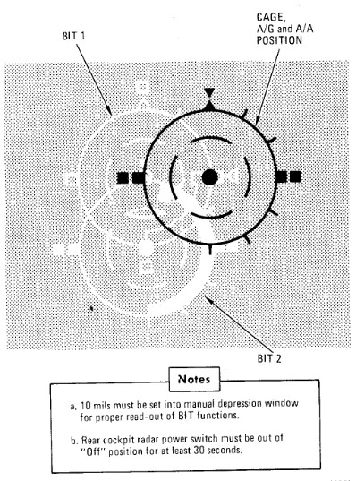

# Optical Sight Test

| Step | System                                                             | Action              |
|------|--------------------------------------------------------------------|---------------------|
| 1.   | Pinky switch                                                       | RADAR               |
| 2.   | Sight shutter lever                                                | OPEN                |
| 3.   | Sight mode knob                                                    | CAGE                |
| 4.   | Reticle depression knob                                            | 35 MILS             |
| 5.   | Reticle intensity knob                                             | AS REQUIRED         |
| 6.   | Armament switches                                                  | OFF/SAFE            |
|      | a. Station green/amber lights                                      | OFF                 |
| 7.   | Delivery mode knob                                                 | DIRECT              |
| 8.   | Armament safety override button                                    | PUSH IN             |
| 9.   | Sight mode knob                                                    | CAGE to A/G to A/A  |
|      | a. Pipper (at RBL) Moves no more than ±2 mils.                     |                     |
| 10.  | Reticle depression knob                                            | 10 MILS             |
| 11.  | Sight mode knob                                                    | BIT 1 (figure 2-21) |
|      | a. Reticle jumps   25 ±4 mils left.                                |                     |
|      | b. Roll tabs rotate     90° clockwise.                             |                     |
|      | c. Range bar indicates       4000 feet (3 o'clock within ±15°.)    |                     |
| 12.  | Sight mode knob                                                    | BIT 2 (figure 2-21) |
|      | a. Reticle drops down               25 ±4 mils.                    |                     |
|      | b. Roll tabs indicate      Level flight.                           |                     |
|      | c. Range bar indicates 6700 feet (12:30 o'clock within ±15°).      |                     |
| 13.  | Sight mode knob                                                    | A/A                 |
|      | a. Pipper returns to RBL.                                          |                     |
| 14.  | (WSO) Radar power knob                                             | TEST                |
| 15.  | (WSO) Test knob                                                    | SET 5               |
| 16.  | (WSO) Range knob                                                   | AI 5                |
| 17.  | (WSO) Radar mode knob                                              | BST                 |
| 18.  | (WSO) Lock on first BIT target                                     |                     |
| 19.  | Pinky switch                                                       | RADAR to HEAT       |
|      | a. Pipper remains at RBL.                                          |                     |
| 20.  | Pinky switch                                                       | GUNS                |
|      | a. Head-up GUN light                                               | ON                  |
|      | b. Range bar indicates 6000 feet (1 o'clock within ±15°).          |                     |
|      | c. Reticle slowly depresses according to the corresponding AOA:    |                     |
|      | AOA Units                                                          | (Mils)              |
|      | 0                                                                  | (36)                |
|      | 5                                                                  | (31)                |
|      | 10                                                                 | (27)                |
|      | 15                                                                 | (22)                |
|      | 20                                                                 | (17)                |
|      | 25                                                                 | (13)                |
|      | 30                                                                 | (8)                 |
| 21.  | Cage button                                                        | PRESS AND HOLD      |
|      | a. Pipper moves to 1000 feet cage range (approx 2 mils below RBL). |                     |
|      | b. Range bar remains at 6000 feet (1 o'clock within ±15°).         |                     |
| 22.  | (WSO) Break radar lock                                             |                     |
|      | a. Range bar                                                       | OFF                 |
|      | b. Pipper moves to                                                 | RBL.                |
| 23.  | Cage button                                                        | RELEASE             |
|      | a. Pipper moves to 1000 feet cage range (approx 2 mils below RBL). |                     |
| 24.  | Sight mode knob                                                    | STBY or CAGE        |
| 25.  | Delivery mode knob                                                 | OFF                 |
| 26.  | Armament safety override button                                    | RESET               |

