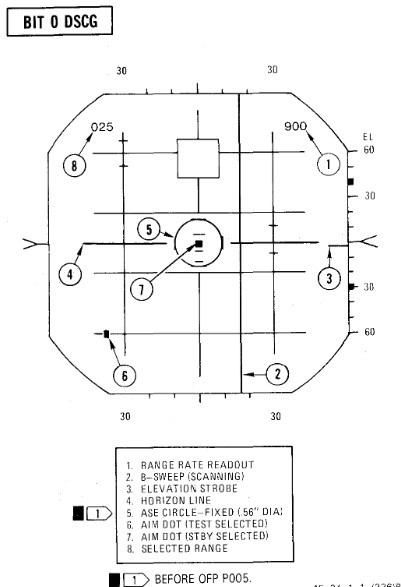

# Radar Air-to-Air Bits

## BIT 0 Aim Dot and Range Rate Calibration

| Step | System                                      | Action               |
|------|---------------------------------------------|----------------------|
| 1.   | Radar Power Knob                            | STBY                 |
| 2.   | DSCG Mode Knob                              | RDR BIT              |
|      | a. Test Grid                                | Aligned ±1/16 inches |
| 3.   | Test Knob                                   | DOT BAL and HOLD     |
|      | a. Aim Dot                                  | Centered             |
|      | b. Range Rate                               | ±20 knots            |
| 4.   | Radar Power Knob                            | TEST                 |
| 5.   | Test Knob                                   | DOT BAL and HOLD     |
|      | a. Aim Dot                                  | In Calibration Area  |
|      | b. Range Rate                               | 900 ±50 knots        |
| 6.   | Adjust Horizon Line                         | Zero Pitch           |
| 7.   | Radar Range Knob                            | AI 10                |
| 8.   | DSCG Mode Knob                              | DSCG TEST            |
|      | a. Search Display                           | Eight Shades of Gray |
|      | b. Adjust BRT                               | Optimal              |
|      | c. Adjust CONTR                             | Optimal              |
| 9.   | DSCG Mode Knob                              | RDR BIT              |
| 10.  | Radar Range Knob                            | AI 25                |
| 11.  | Position EL Strobe                          | 30° Down             |
|      | (Prevents radar antenna from hitting stops) |                      |
| 12.  | Stab Switch                                 | OUT                  |
|      | a. Horizon Line                             | Removed              |
| 13.  | Stab Switch                                 | NOR                  |
| 14.  | Radar Power Knob                            | STBY                 |

## BIT 1 Minimum Discernible Signal, Lockon Sensitivity, Range Track Memory

| Step | System                                                             | Action                                               |
|------|--------------------------------------------------------------------|------------------------------------------------------|
| 1.   | Test knob                                                          | Set 1                                                |
| 2.   | Radar power knob                                                   | TEST                                                 |
|      | a. Monitor meter (RDR MAG)                                         | Indicates 1.4 to 1.8.                                |
|      | b. Horizon line                                                    | Within limit markers as shown.                       |
| 3.   | Adjust indicators                                                  | For optimum contrast (CONTR) and brightness (BRT).   |
|      | a. Minimum targets                                                 | 11 targets visible in search.                        |
|      | b. Position range knob                                             | To 5, 10, 50, 100, 200, and 25 while checking video. |
| 4.   | Place acquisition symbol beyond the last target.                   |                                                      |
| 5.   | Move range strobe down while holding full action.                  |                                                      |
|      | a. Range strobe locks on before passing seven targets.             |                                                      |
|      | b. Maintain lockon for 5 seconds.                                  |                                                      |
| 6.   | Test knob                                                          | Set 0                                                |
|      | a. System unlocks in 4 to 6 seconds.                               |                                                      |
| 7.   | Test knob                                                          | Set 1                                                |
| 8.   | Pulse switch                                                       | SHORT                                                |
|      | a. Monitor meter (RDR MAG)                                         | Indicates 0.9 to 1.15.                               |
|      | b. Minimum targets                                                 | Eight targets visible in search.                     |
| 9.   | Place acquisition symbol beyond the last target.                   |                                                      |
| 10.  | Move range strobe down while holding full action.                  |                                                      |
|      | a. Range strobe locks on before passing eight targets.             |                                                      |
|      | b. Maintain lockon for 5 seconds.                                  |                                                      |
| 11.  | Test knob                                                          | 0 for 3 seconds then select TEST 1                   |
|      | a. System goes into memory for 3 seconds, then re-acquires lockon. |                                                      |
|      | b. Range rate readout flashes at 4 HZ for 3 seconds.               |                                                      |
| 12.  | (P) Radar missile power                                            | STBY FOR 1 MINUTE                                    |
| 13.  | (P) Radar missile power                                            | CW ON                                                |
|      | a. RDR light                                                       | ON STEADY 1 MINUTE                                   |
| 14.  | Meter selector                                                     | KLY                                                  |
|      | a. Meter reads                                                     | 0.25 to 1.25                                         |
| 15.  | Lock on third target                                               |                                                      |
|      | a. Aim dot in box                                                  |                                                      |
|      | b. Range rate 900 ±200 knots                                       |                                                      |
|      | c. Break lock                                                      |                                                      |

## BIT 2 Range Track Acceleration, Antenna Position

| Step | System                                                             | Action |
|------|--------------------------------------------------------------------|--------|
| 1.   | Test knob                                                          | Set 2  |
| 2.   | Lock on 10th target                                                |        |
|      | a. System breaks lock in less than 30 seconds.                     |        |
| 3.   | Lock on second target                                              |        |
|      | a. System maintains lock for at least 30 seconds.                  |        |
|      | b. Range rate readout 900 ±200 knots                               |        |
| 4.   | Break lock                                                         |        |
| 5.   | Pulse switch                                                       | AUTO   |
|      | **BEACON CHECK**                                                   |        |
| 6.   | Radar mode knob                                                    | BEACON |
|      | a. BIT targets disappear and at least one beacon target reappears. |        |
| 7.   | Radar mode knob                                                    | MAP    |

## BIT 3 Angle Track

| Step | System                                                                                                       | Action |
|------|--------------------------------------------------------------------------------------------------------------|--------|
| 1.   | Test knob                                                                                                    | Set 3  |
|      | a. B-sweep and EL strobe at 0 ±0.2° (before lockon).                                                         |        |
| 2.   | Lock on fourth target                                                                                        |        |
|      | a. Aim dot rotates between ASE circle and the segmented circle (not exceeding either by more than 1/4 inch). |        |
|      | b. Rmax and Rmin at 15 and 5 miles.                                                                          |        |
|      | c. ASE circle as shown.                                                                                      |        |
|      | d. EL strobe goes 30° down (after lockon).                                                                   |        |
| 3.   | Break lock and lock on 10th target                                                                           |        |
|      | a. Aim dot rotates inside ASE circle.                                                                        |        |
| 4.   | Maintain lockon for BIT 4.                                                                                   |        |

## BIT 4 HOJ, Angle Track Memory, AOJ, Pseudo & Simulated Doppler, Corridor Scan

| Step | System                                                                                                   | Action                                   |
|------|----------------------------------------------------------------------------------------------------------|------------------------------------------|
| 1.   | Test knob                                                                                                | Set 4 (figure a).                        |
|      | a. All BIT targets disappear but lockon presentation remains.                                            |                                          |
|      | b. H light ON                                                                                            |                                          |
|      | c. Range rate readout flashing, indicates 900 ±.200 knots, and last digit is replaced with the letter H. |                                          |
| 2.   | (P) Radar missile power switch                                                                           | OFF (or when AIM-7 missiles are turned). |
| 3.   | Position B-sweep and EL strobe                                                                           | At 0° for reference.                     |
| 4.   | Radar power knob                                                                                         | STBY.                                    |
|      | a. B-sweep and EL strobe drift less than +5° before unlock.                                              |                                          |
| 5.   | Radar power knob                                                                                         | TEST.                                    |
| 6.   | Action switch                                                                                            | FA (figure b).                           |
|      | a. AOJ display appears.                                                                                  |                                          |
|      | b. Range rate readout disappears And H light OFF.                                                        |                                          |
| 7.   | Track switch                                                                                             | AOJ OUT.                                 |
|      | a. System returns to search.                                                                             |                                          |
| 8.   | Track switch                                                                                             | AUTO.                                    |
| 9.   | Display                                                                                                  | VI.                                      |
|      | a. B-sweep covers 3 bars on selected CAA corridor.                                                       |                                          |
|      | b. EL-strobe scans from -21° to +57°.                                                                    |                                          |
| 10.  | Display                                                                                                  | B-wide.                                  |

 _Figure a_

 _Figure b_

## BIT 5 Range Rate Noise, PLMS, CAA

| Step | System                                                               | Action            |
|------|----------------------------------------------------------------------|-------------------|
| 1.   | Test knob                                                            | Set 5             |
| 2.   | Lock on third target                                                 |                   |
|      | a. Range rate readout 0 ± 300 knots.                                 |                   |
|      | b. Aim dot inside of ASE circle.                                     |                   |
|      | c. ASE circle 0.56 inch diameter.                                    |                   |
| 3.   | Break lock                                                           |                   |
| 4.   | Pulse switch                                                         | SHORT             |
| 5.   | (P) Sight mode knob                                                  | A/A               |
| 6.   | Radar mode knob                                                      | BST               |
| 7.   | Range knob                                                           | AI 5              |
| 8.   | (P) Auto acq button                                                  | PRESS and RELEASE |
|      | a. Radar locks on first target                                       |                   |
| 9.   | (P) Auto acq button                                                  | PRESS and RELEASE |
|      | a. Radar breaks lock, range gate sweeps to next target and locks on. |                   |
|      | b. Repeat this step through all targets.                             |                   |
| 10.  | Air-to-air button                                                    | PRESS             |
|      | a. Air-to-air light                                                  | OFF               |
|      | b. Radar control transfers to RCP.                                   |                   |
| 11.  | Break lockon                                                         |                   |
| 12.  | Radar mode knob                                                      | MAP               |
| 13.  | Range knob                                                           | AI 25             |
| 14.  | Pulse switch                                                         | LONG              |
| 15.  | Lock on fifth target                                                 |                   |
|      | a. RDR MAG indicates 1.4 to 1.8.                                     |                   |
| 16.  | Pulse switch                                                         | AUTO              |
|      | a. RDR MAG indicates 0.9 to 1.15 (PLMS).                             |                   |
| 17.  | Aspect knob                                                          | TAIL              |
|      | a. Range rate readout displays fighter heading (0°-360°)             |                   |
| 18.  | Display knob                                                         | VI                |
|      | a. Updates fighter heading   display.                                |                   |
| 19.  | Display knob                                                         | B-WIDE            |
|      | a. Discontinues fighter  heading update.                             |                   |

## BIT 6 AIM-7 Attack Display and Interlocks

| Step | System                                                                                                                                                                                                                                                                                                                   | Action                            |
|------|--------------------------------------------------------------------------------------------------------------------------------------------------------------------------------------------------------------------------------------------------------------------------------------------------------------------------|-----------------------------------|
| 1.   | Test knob                                                                                                                                                                                                                                                                                                                | Set 6                             |
|      | The T (track) light illuminates but SKIN TRK light remains OFF during this test. This is a normal indication with the DSCG.                                                                                                                                                                                              |                                   |
| 2.   | Radar power knob                                                                                                                                                                                                                                                                                                         | TEST                              |
| 3.   | Missile power switch                                                                                                                                                                                                                                                                                                     | STBY                              |
| 4.   | Position range strobe                                                                                                                                                                                                                                                                                                    | Beyond 15 miles.                  |
|      | a. Rmax at 15 ± 1.5 miles, Rmin at 5 ± 1.25 miles.                                                                                                                                                                                                                                                                       |                                   |
|      | Range rate 000 knots Indicates AIM -7E missiles/plugs installed or stations empty. 900 knots indicates AIM-7F missiles/plugs installed. After OFP P005, the OFP version number will be displayed for the first 10 seconds in place of range rate readout; for example, OFP version P005 will be approximately 500 knots. |                                   |
| 5.   | Move range strobe down                                                                                                                                                                                                                                                                                                   | (with half action or full action) |
|      | a. Aim dot stationary inside box.                                                                                                                                                                                                                                                                                        |                                   |
|      | b. HOLD ALT light ON beyond 15 miles, OFF at 15 miles.                                                                                                                                                                                                                                                                   |                                   |
|      | c. IN RANGE and SHOOT lights ON when range strobe is between Rmax and Rmin.                                                                                                                                                                                                                                              |                                   |
|      | d. ASE circle remains fixed in size.                                                                                                                                                                                                                                                                                     |                                   |
|      | e. Break X occurs, ASE Circle and range rate readout disappear, IN RANGE/SHOOT lights OFF at 5 miles or less.                                                                                                                                                                                                            |                                   |
| 6.   | Radar power knob                                                                                                                                                                                                                                                                                                         | STBY                              |

