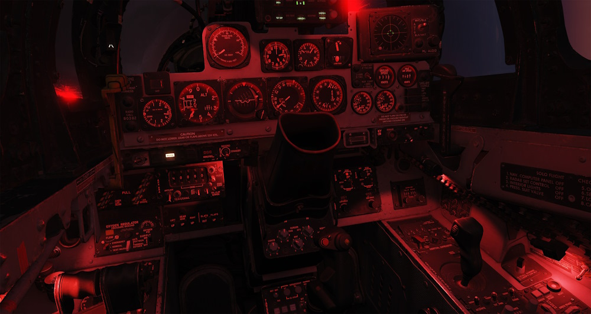
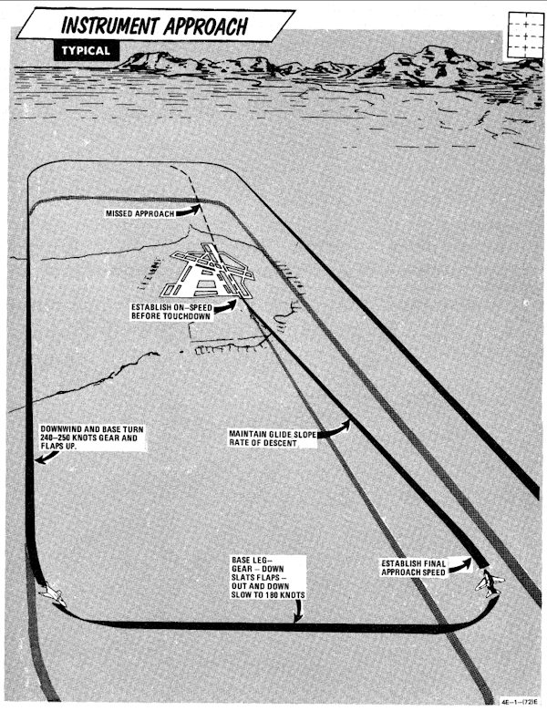

# 仪表进近和着陆

## 等待 / 滞空

飞行员可采用 280 节空速以及大约 30° 坡度来在绝大多数高度上保持在等待航线或保持滞空飞行。

## 仪表下高

下图为典型的战术航线。

> 💡 不要将推力减少到 80% rpm 以下（单发 85%），确保系统有足够的风挡除雾/除雨/发动机防冰效果。如果
> 在强降水条件下将油门收至慢车，可能会出现低于正常慢车转速指示。

> 💡 低空时，应交叉检查气压高度表和雷达高度表确认地形间隔。

## 精确进近

下图为典型的战术航线。

1. 在五边 10 海里外时或四边时（视情况而定）下高到地面控制进近（GCA）接管高度并过渡到着陆构型。
2. 保持最低最佳进近迎角。

收到指令后开始下高：

1. 油门收到大约 82-84% rpm。
2. 调整油门和俯仰来保持所需的下降率。

直接 TACAN 战术进近随后的 GCA 或 ILS 最后进近需要大概 500-800 磅燃油。复飞后的二次 GCA 需要额外约
1000 磅燃油执行。

## 盘旋进近

从 TACAN 最后进近定位点开始盘旋 TACAN 进近的建议空速为 180 节，同时放下起落架和襟翼。

## 复飞

1. 油门握把 - 军推
2. 起落架 - 收上
3. 缝翼/襟翼 - NORM (最低 180 节)
4. 调整推力保持 240-250 节并保持 1500 到 2500 英尺每分爬升率。
5. 跟随公布的复飞程序。
