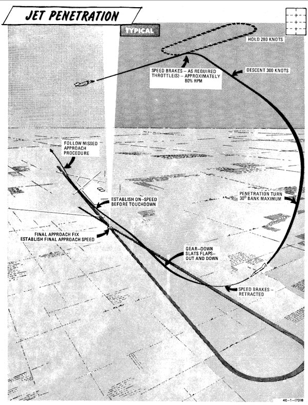

# Instrument Approach and Landing

## Holding / Loiter

Holding patterns or loitering flight may be flown at most
altitudes at 280 knots, using approximately 30° of bank.

## Instrument Descent

This figure represents typical penetration pattern.

> 💡 Do not reduce thrust below 80% rpm (85% single
> engine) to ensure adequate windshield
> defogging/rain removal/engine anti-ice
> effectiveness. If the throttle is retarded to idle in
> heavy precipitation a lower than normal idle rpm
> indication may be noted.

> 💡 The pressure altimeter should be crossed checked
> with the radar altimeter to confirm terrain
> clearance at low altitude.

## Precision Approach

This figure represents typical penetration pattern.

1. Descend to GCA pick-up altitude and transition to
landing configuration approximately 10 miles out
on final or base leg (as appropriate).
2. Maintain minimum on-speed angle of attack.

When directed to commence descent:

1. Retard power to approximately 82-84% rpm.
2. Adjust power and pitch as necessary to maintain
desired rate of descent.

A straight-in TACAN penetration followed by a GCA or
ILS final requires approximately 500-800 pounds of fuel.
A missed approach followed by a second GCA requires an
additional 1000 pounds of fuel.

## Circling Approach

Recommended airspeed from TACAN final approach fix
for a circling TACAN approach, is 180 knots with gear and
flaps extended.

## Missed Approach

1. Throttles - MILITARY
2. Gear - UP
3. Slats flaps - NORM (minimum of 180 knots)
4. Power as required to maintain 240-250 knots and
maintain a 1500 to 2500 feet per minute climb.
5. Follow published missed approach procedures.
