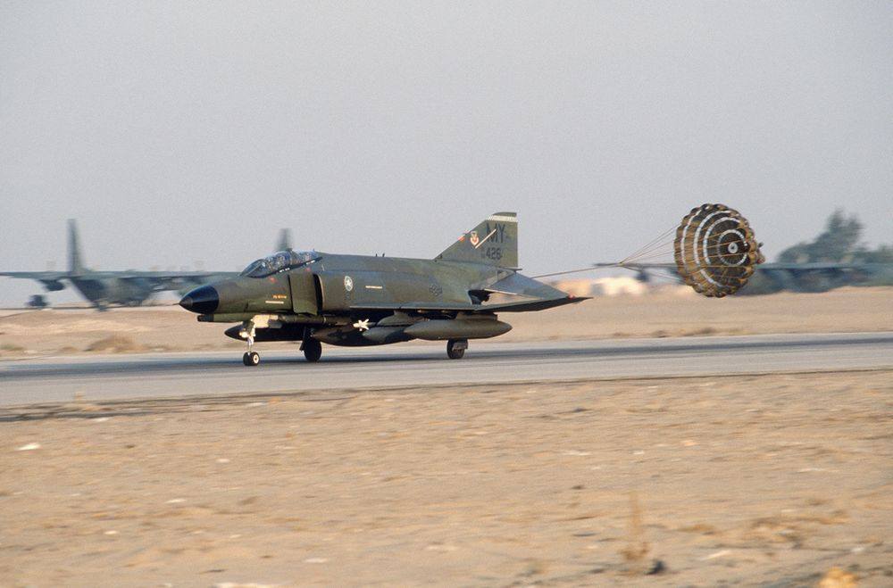

# Landing

This chapter describes landing techniques.

<!--  -->

<!-- https://nara.getarchive.net/media/
an-f-4e-phantom-ii-aircraft-from-the-tactical-airlift-command-lands-with-a-5a6411 -->
<!-- https://nara.getarchive.net/media/
an-airman-retrieves-a-drag-chute-from-a-70th-tactical-fighter-squadron-f-4e-969fa1 -->