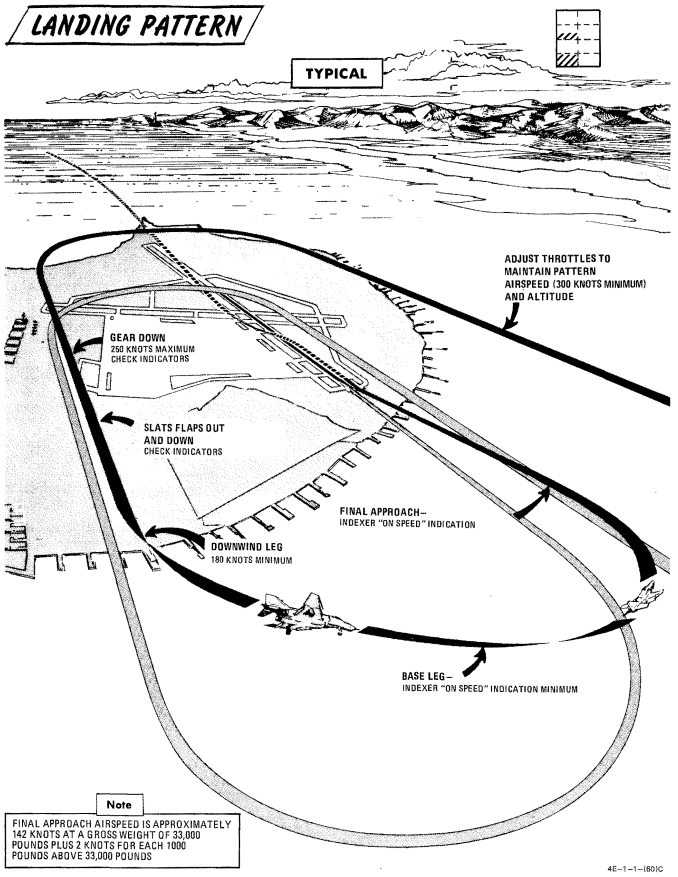
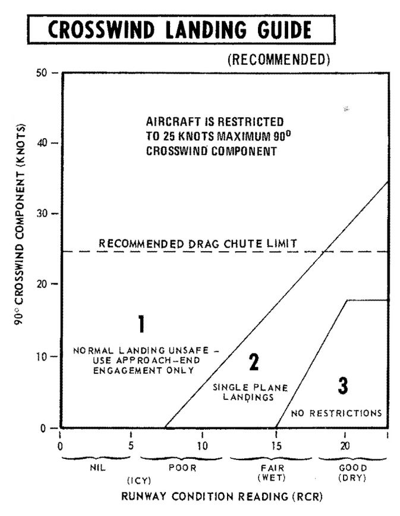
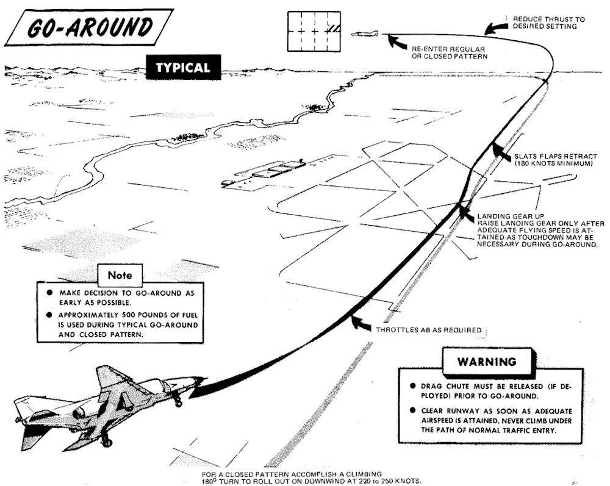

# Visual Landing

## Descent / Before Landing

The Descent/Before Landing check should be
accomplished above 10,000 feet AGL and at a time when
mission/flight demands are not critical. Prior to
performing a rapid descent, the windshield and canopy
surfaces should be preheated to prevent the formation of
frost or fog. If it becomes necessary to dump fuel during a
descent, thrust settings in excess of 85% rpm may be
required to ensure rapid inflight dumping.

> 💡 Due to limited forward visibility, it is advisable to raise
> the seat up before entering the pattern.

## Landing Technique

For a normal landing, fly the pattern as illustrated in
figure. Enter the pattern as local policy dictates.

> 🔴 WARNING: If high angles of attack develop during the turn
> to downwind, the rudder should be used as a
> primary means of rollout since adverse yaw may
> be introduced by the use of ailerons. Altitude may
> be insufficient for recovery if uncontrolled flight
> is encountered.

Avoid buffet throughout the landing pattern. Adjust
power, as necessary, to attain allowable gear lowering
airspeed. Extend landing gear and slats and flaps in level
flight on downwind. Actual flap extension may not occur
until slowing to 210 knots. Ensure slats out-flaps down
prior to initiating turn to base leg. The optimum indicated
AOA for approach is 19.2 units, and is adequate for all
gross weight and normal slat flap configurations. The
AOA aural tone system provides an audible cue to
maintain an on-speed approach (steady tone played at medium pitch).
During very gusty flight
conditions, full aileron may not be sufficient to correct a
wing low condition. When landing in gusty or crosswind
conditions, with wake turbulence, with high internal fuel
load (aft CG), or with an abnormal configuration (slats in,
asymmetric slats or slats partially extended), a 17 unit
AOA approach is recommended. A transition to ON
SPEED and a flared landing will reduce the touchdown
speed. The AOA indexer and aural tone indications
remain unaffected. Establish and maintain On Speed
angle-of-attack on the base leg or final approach,
adjusting pitch attitude to maintain AOA and power to
maintain desired glide slope/rate of descent. Cross-check
computed airspeed and On Speed AOA to detect gross
errors in AOA. When the aircraft reaches 20 to 30 feet
altitude above the ground, ground effect will tend to rotate
the aircraft in the nose-down direction. Maintaining pitch
attitude will result in transition to a slightly slow
indication at touch-down which is desired. Flying a 2 1/2°
to 3° glide slope will produce an approach rate of descent
of about 700 feet per minute. Sink rate at touchdown will
be appreciably reduced by ground effect.

> 🟡 CAUTION: Flying a steeper than normal final approach or
> not maintaining pitch attitude when entering
> ground effect, can cause touchdown sink rates to
> exceed the design limit of the main landing gear
> struts.
<!-- (Refer to section V for touchdown sink
rates vs gross weight limitations.) -->

At touchdown, reduce power to idle and deploy drag chute.
Use full aft stick to help decelerate. Use rudder and
ailerons for directional control down to 70 knots then use
differential braking. Nose gear steering should not be
required for directional control in light crosswind
conditions. However, if rudder, aileron, and/or
differential braking are not effective in maintaining
directional control, use nose gear steering as required.
Engage nose gear steering only with the rudder at or near
neutral.

> 🔴 WARNING: Nose gear steering malfunctions can cause loss of
> directional control if engaged at high ground
> speed; therefore, it should not be engaged above
> taxi speed unless required to maintain directional
> control during crosswind landing conditions. If no
> response is noted or unscheduled steering
> responses are detected when engaging nose gear
> steering, disengage immediately and do not
> reengage.

During braking, cycling of the anti-skid system can be
detected by a change in longitudinal deceleration. Cycling
may not be apparent when braking at high speed
immediately after landing, with drag chute failure, or
with a wet or icy runway. Do not misinterpret this as
anti-skid failure.

## No-Flap Landing

Refer to [EMERGENCY PROCEDURES](../../emergency_procedures/overwiew.md)
<!-- TODO: add specific procedure link -->

## Short Field Landing

Short field landings require that normal final approach
procedures be followed with precision and the aircraft be
touched down as close to the end of the runway as safety
permits. Full aft stick throughout the landing roll
increases both aerodynamic drag and wheel brake
effectiveness. Apply maximum braking by fully
depressing the brake pedals to the pedal stops as soon as
the nose gear is on the ground and nose gear steering is
engaged. Nose gear steering should be used to maintain
runway alignment and supplemented with differential
braking only if required.

Operation on the AM-2 aluminum mat is similar to that
conducted on a concrete runway of equivalent size.
Arrestment should be regarded as an emergency
procedure. However, since the aircraft is fully suitable for
arrested landings, extremely adverse meteorological or
operational conditions may warrant consideration of
landing into a suitable approach-end arresting gear.

## Crosswind Landing (Dry Runway)

Carefully compensate for crosswind in the traffic pattern
to guard against undershooting or overshooting the final
turn. Fly the final approach course with the aircraft
ground track properly aligned with the runway. The
crosswind may be compensated for either by using the
wing low method, the crab method, or a combination of the
two. When using the wing low method, the ARI can be
overpowered by use of the rudder pedals or the ARI can be
disengaged by pulling the rudder trim circuit breaker. If
the crab method is employed, the aircraft heading should
be aligned with the runway just prior to touchdown. After
touchdown, use rudder, aileron and spoiler, and nose gear
steering as required to maintain directional control.
Crosswind effect on the aircraft is not severe; however,
rudder, differential braking, and/or nose gear steering
must be used as required to maintain alignment with the
runway. Use of the drag chute intensifies the weather
vane effect for any given deployment condition. The
weather vane effect increases as the forward velocity of
the aircraft decreases, therefore, if the drag chute is to be
used, it should be used at the initial portion rather than
the latter portion of the landing roll. This also assures use
of the drag chute in the speed region where it is most
effective. If the drag chute is used and excessive
weathervaning is encountered, jettison drag chute. Since
the nose gear will rapidly assume a position relative to the
rudder pedals, nose gear steering should be initiated with
the rudder pedals at or near the neutral position. For this
reason the use of nose gear steering is advocated early in
the landing roll rather than at a time when large amounts
of rudder are required to hold the aircraft aligned on the
runway. Keep in mind that only really tiny amounts of nose gear steering should be used as there is
a high risk of a nose gear steering hardover. The most important aspect of directional control
under crosswind conditions is keeping the aircraft
precisely aligned with the runway rather than trying to
correct back to the runway centerline after it has deviated.

## Wet or Icy Runway Landing

Wet or icy runway conditions pose severe problems in
directional control and braking effectiveness. On wet
runways, these problems are primarily the result of
hydroplaning where the tire rides on a thin layer of water
and produces little or no traction. The probability of
hydroplaning increases with increased water depth,
increased ground speed, decreased tire pressure and
decreased tire tread depth and is also affected by runway
surface texture and tire tread design. Hydroplaning can
occur on runways which appear only damp if severe
braking is applied at high speeds. Hydroplaning and glare
ice present essentially the same problems. Due to the
reduced directional control, all landings on a wet or icy
runway should be made utilizing a crosswind technique.
Refer to the Crosswind Landing Guide (figure 2-7) to
determine the advisability of making an approach-end
engagement. The pilot should also consider the
desirability of delaying the landing to permit the runway
to dry or diverting to another field. Gross weight should be
reduced to the minimum practicable. Plan the pattern to
be well established on final with the aircraft tracking
straight down the runway centerline with an ON SPEED
indication. Use a wings - level crab, if required, to
maintain the track. Establish the rate of descent at 800
fpm (slightly steeper than normal) and plan to touchdown
on the centerline within the first 500 feet. Make a firm
touchdown (500-600 fpm) while maintaining the
wings-level crab. Immediately after touchdown retard the
throttles to idle. Do not attempt to align the aircraft
heading with the runway as this will result in a drift off
the runway if the aircraft is sliding or hydroplaning.
Maintain full forward stick to increase nosewheel
traction. As wheel cornering capability overcomes
aerodynamic effects the aircraft will align itself with the
runway. Do not attempt to hasten this process. When the
aircraft heading is aligned with the runway centerline,
deploy the drag chute. Be prepared to jettison the drag
chute if the weathervaning effect interferes with
maintaining the track straight down the runway
centerline. Nose gear steering is the primary method of
directional control and should be utilized as early as
possible. Nose gear steering should be engaged only with
the rudder pedals at or near neutral. When directional
control is firmly established utilize maximum anti-skid
braking. Brake pedals must be fully depressed to achieve
maximum deceleration. At high speeds the braking
potential will be very low and little deceleration will be
felt. As braking potential increases with decreasing speed,
the anti-skid system will increase deceleration
accordingly. Unless the pilot is familiar with the variables
in braking potential, the low deceleration at high speed
may be mistakenly interpreted as a brake or anti-skid
failure.

> 🟡 CAUTION: Rubber deposits on the last 2000 feet of wet
> runway make directional control a difficult
> problem even at very low speeds. Braking should
> be started in sufficient time so as not to require
> excessive braking on the last portion of the
> runway.

## Heavy Gross Weight Landing

The heavy gross weight landing pattern is the same as the
basic pattern shown in figure 2-6 with the exception that
it should be expanded slightly to compensate for the lower
maneuvering capability of the heavy gross weight aircraft
at low speeds. As in the normal pattern, an on-speed
indication on the indexer will provide the optimum angle
of attack and airspeed for the aircraft in the landing
configuration for both level flight and maneuvering flight.
Refer to Performance Data, appendix A, for airspeed
versus gross weight at approach AOA.

## Go-Around

Any decision to go around should be made as early as
possible. When the decision to go around is made,
smoothly increase thrust to military (afterburner if
required). Do not attempt to rotate the nose or stop
rate-of-descent until adequate airspeed is built up.
Continue to use the on speed indication as the optimum
angle of attack until level flight is attained. As airspeed
increases, establish normal takeoff attitude, retract gear
when a positive rate of climb is established, retract slats
and flaps at a safe airspeed (180 knots minimum) and go
around. Rudder jumps may occur during flap retraction
with lateral stick input. For a closed pattern, accomplish
a climbing 180° turn to roll out on downwind at 220 to 250
knots. Refer to Go-Around, figure 2-8. During go-around
a rapid trim change is required to preclude high forward
stick forces.

> 🔴 WARNING: Do not exceed 18 units AOA during go-around
> with gear retracted.

## Touch-And-Go

After making a normal approach and touchdown,
smoothly advance throttles to full military power. Apply
aft stick until the nose rotates 10° to 12° of pitch attitude
maintaining this attitude until the aircraft is flying. When
definitely airborne retract the gear, followed by the flaps
as the aircraft accelerates through 180 knots minimum.

