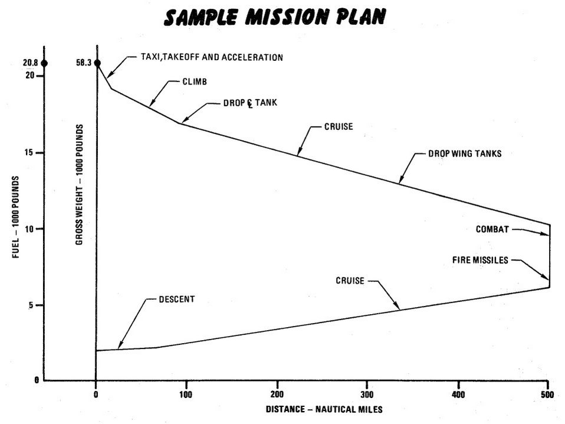

# Mission Planning

> 🚧 This section is under construction.

Optimum use of the aircraft to obtain maximum performance with minimum fuel
consumption requires careful preflight planning for the mission. The planning of
a mission involves many things which are beyond the scope of this publication.
As used here, mission planning will cover certain key phases of a mission and
explain the use of performance charts.

The following sample Counter Air mission demonstrates features of performance
data. Although the sample problem does not cover the many mission capabilities
of the aircraft, it familiarizes the aircrew with the use of performance data so
that any mission may be preflight planned in a short time.

The sample problem illustrates, through a graphical solution, how performance
charts can be integrated to form a complete mission flight plan. The steps used
to develop such a plot are shown with the problem.

## Counter Air Mission Profile

Perform maximum thrust takeoff and climb at military thrust. Cruise at optimum
altitude and maximum range speed to a combat zone 500 miles from the air base.
Drop external tanks when empty. Perform combat maneuvering at maximum thrust for
the full duration — allowed by return and landing fuel requirements. Missiles
and gun rounds are assumed to be expended at the end of the combat period.
Return to the airfield at optimum altitude and airspeed. Descend at maximum
range descent, arriving at the destination with 2000 pounds landing fuel
reserve. The Counter Air Mission Overview and the Sample Mission Plan depict the
overall mission plan.

## Mission Data

Configuration

- (4) AIM-9 Missiles, Pylons and Launchers
- (4) AIM-7D Missiles
- (1) Nose-gun (639 rounds ammo)
- (2) 370 Gallon External Wing Tanks
- (1) 600 Gallon Centerline Tank
- Useable Fuel (includes external tanks) 20,768 pounds

## Mission Factors

Sure, here's your information converted into Markdown tables:

Takeoff:

| Parameter          | Value            |
| ------------------ | ---------------- |
| Wind               | Calm             |
| Pressure altitude  | 2000 Ft          |
| Temperature        | +38.5°C          |
| Runway             | 020°             |
| Runway length      | 9000 Ft          |
| Climb out wind     | (headwind) 20 Kt |
| Cruise out wind    | (headwind) 50 Kt |
| Cruise return wind | (tailwind) 50 Kt |
| Descent wind       | (tailwind) 20 Kt |

Landing:

| Parameter         | Value   |
| ----------------- | ------- |
| Wind              | 020°/10 |
| Pressure altitude | 2000 Ft |
| Temperature       | +20°C   |
| Runway            | 020°    |
| Runway length     | 9000 Ft |

## Figures

<!--  -->

