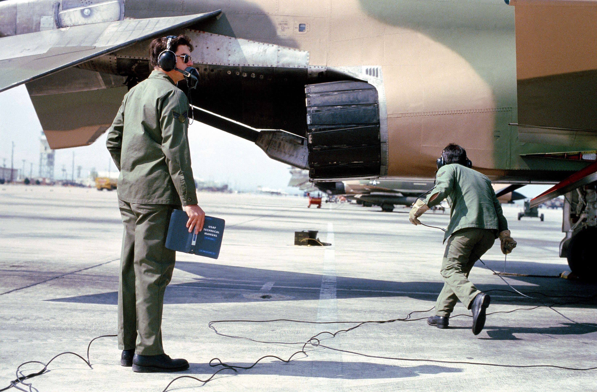

# Normal Procedures

This chapter contains standard procedures for operating the F-4E Phantom II.

The aircrew procedures through the
[Before Taxi](taxi.md#before-taxi)
paragraph are separated into individual
procedures for the **pilot** and **weapon system
officer**. These separate procedures allow the
individual crewmember to perform the checks
without requiring him to read the checks
performed by the other crewmember. The
remaining procedures are combined and are
coded for applicable crewmember action. Items
coded **(P-WSO)** are applicable to both the pilot
and weapon system officer. Items coded **(WSO)**
are applicable to the weapon system officer only,
and items **not coded** are applicable to the pilot
only.

Here is an explanation of the designations used:

* Entries marked **bold** are necessary to be performed.
* The 🔧 icon indicates that the given step involves or may involve
[crew chief](../crew_chief/overview.md) interaction.

