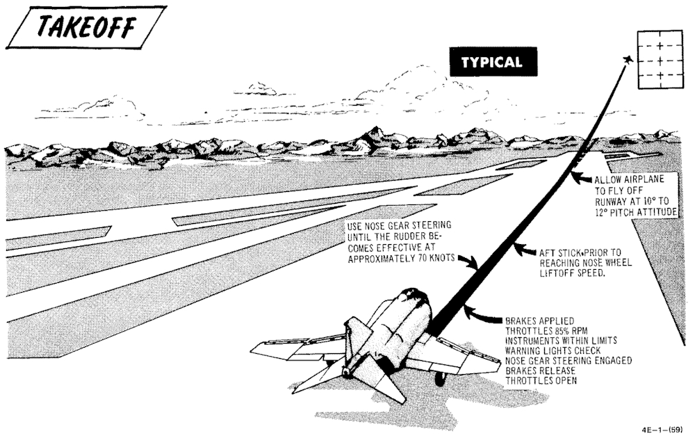

# Takeoff

## Before Takeoff (Pilot)

| Step    | System                 | Action                    |
|---------|------------------------|---------------------------|
| 1.      | Internal Wing Transfer | NORMAL                    |
| **2.**  | **STAB AUG Switches**  | **ENGAGE**                |
| 3.      | Flight Controls        | UNRESTRICTED              |
| 4.      | Slats & Flaps          | CHECK OUT & DOWN          |
| 5.      | Anti-Ice               | AS REQUIRED               |
| 6.      | STAB Trim              | CHECK 1-3 units NOSE DOWN |
| 7.      | Fuel Quantity          | CHECK                     |
| **8.**  | **Canopy**             | **CLOSE & CHECK**         |
| 9.      | Defog & Temperature    | AS REQUIRED               |
| **10.** | **Ejection Handle**    | **ARM**                   |

### After Runway Line-Up

| Step   | System            | Action             |
|--------|-------------------|--------------------|
| 1.     | External Transfer | AS DESIRED         |
| **2.** | **Anti Skid**     | **ON & LIGHT OUT** |
| 3.     | Compass Heading   | CHECK              |
| **4.** | **Pitot Heat**    | **ON**             |
| 5.     | IFF               | AS REQUIRED        |
| 6.     | Circuit Breakers  | CHECK IN           |
| 7.     | Warning Lights    | CHECK              |

### On Runway

| Step | System                                                                                      | Action                       |
|------|---------------------------------------------------------------------------------------------|------------------------------|
| 1.   | Wheel Brakes                                                                                | APPLY                        |
| 2.   | Throttle                                                                                    | 85% RPM MAX                  |
| 3.   | Engine gauges                                                                               | CHECK                        |
|      | a. Exhaust gas temperature                                                                  | 450°C                        |
|      | b. Fuel flow                                                                                | 4000 pph                     |
|      | c. Nozzle                                                                                   | 1/4                          |
|      | d. Oil pressure                                                                             | 30-40 psi                    |
| 4.   | Wheel brakes                                                                                | RELEASE                      |
| 5.   | Throttle                                                                                    | ADVANCE MIL THEN AFTERBURNER |
|      | Maintain directional control using nose gear steering, at 70 knots rudder becomes effective |                              |
| 6.   | Stick                                                                                       | MOVE AFT AT 80 KNOTS         |
|      | When Nose starts rising keep pitch attitude of 10° to 12° until lift-off                    |                              |
|      | Keep attitude during acceleration                                                           |                              |
| 7.   | Trim                                                                                        | ADJUST AS JET ACCELERATES    |

## After Takeoff

### Climb

| Step   | System            | Action                   |
|--------|-------------------|--------------------------|
| **1.** | **Gear**          | **UP**                   |
| **2.** | **Slats & Flaps** | **NORM (180 knots MIN)** |

### Cruise

| Step | System                              | Action      |
|------|-------------------------------------|-------------|
| 1.   | Altimeter                           |             |
|      |                                     | SET         |
|      |                                     | CHECK STBY  |
|      |                                     | RESET       |
|      |                                     | COMPARE     |
| 2.   | Radar Altimeter                     | AS REQUIRED |
| 3.   | OPS Check                           |             |
|      | a. Oxygen Quantity/Pressure/Blinker | CHECK       |
|      | b. Cockpit Pressure                 | CHECK       |
|      | c. Fuel Quantity/Transfer Switches  | CHECK       |
|      | d. STBY Compass                     | CHECK       |
|      | e. Circuit Breakers                 | CHECK       |
| 4.   | Anti-Ice Switch                     | AS REQUIRED |
