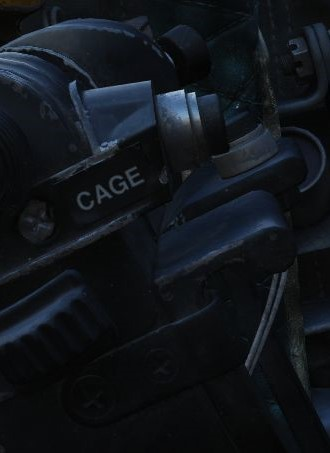
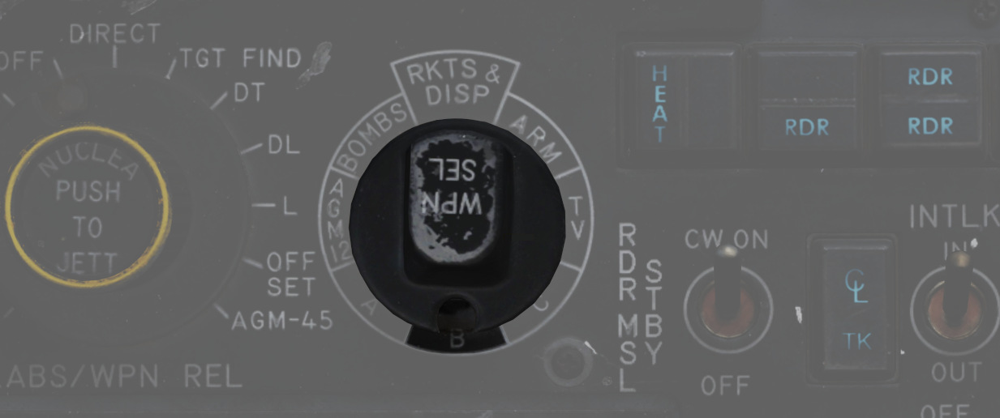
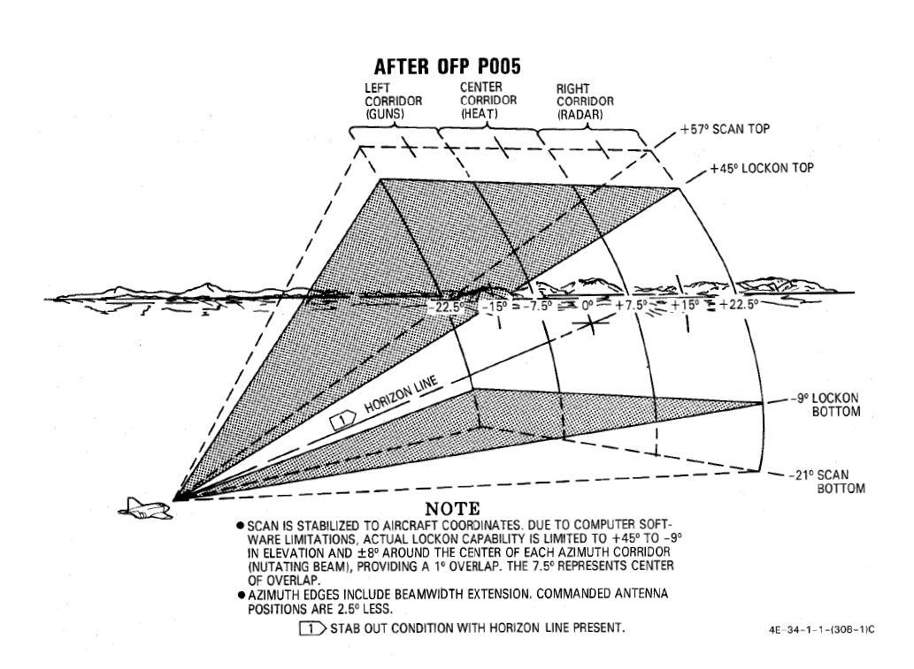

# ACM Modes

## CAGE Mode

In the event that
an [AIM-7](../../stores/air_to_air/aim_7.md), [AIM-9](../../stores/air_to_air/aim_9.md),
or [M61A1](../../stores/guns.md) must be employed
against an airborne target with
the [sight](../../cockpit/pilot/dscg_controls.md#sight-mode-knob)
in A/G mode (for example, the flight is bounced by
opposing aircraft),
the [optical sight](../../cockpit/pilot/dscg_controls.md#sight-mode-knob)
reticle can immediately be slewed to the
Radar Boresight Line using the Cage Button, found on the inboard (right)
throttle handle. Cage mode commands the radar into BST mode with a five-mile
range, and short pulse, and sets the firing circuit for the currently selected
air-to-air weapon relative to the Pinky Switch. For the optical sight, the command activates the
respective elevation and azimuth tracking, roll mark, and range functions of the reticle for the
chosen weapon, without the pilot having to remove a hand from throttle or stick to swap the sight
mode or weapon control panel functions.

Should a track condition exist prior to pressing Cage and the Pinky switch is in
Radar or Heat position, the lock is broken when the button is pressed, and the
antenna slaves to boresight when released. If the Pinky Switch is in the Gun
position, the lock is not broken.

Cage mode can be exited from either cockpit, by
placing [Weapon Select knob](../../cockpit/pilot/weapon_management.md#weapon-selector-knob)
in the pilot cockpit to the B position momentarily, or by the WSO pressing the Air
to Air button on the rear cockpit panel. If the pilot leaves
the [Weapon Select knob](../../cockpit/pilot/weapon_management.md#weapon-selector-knob)
in B, it does not preclude a later entry into Cage mode.

## Computer Automatic Acquisition Mode (CAA)

Once in Cage mode, the radar can be selected in to Computer Automatic
Acquisition using
the [Nose Gear Steering button](../../systems/flight_controls_gear/gear_ground_handling.md#nose-gear-steering).
In CAA, the radar enters a
vertical-oriented scan pattern 78 degrees in height by 15 degrees in width. Actual
radar lock capability within this scan pattern is from +45 degrees above the
horizon line to -9 degrees below the horizon line due to APQ software
limitation. In the event that the radar finds a suitable target within the scan
volume, the target will be locked. Should the flight crew find the locked target
not be the one intended,
the [Nose Gear Steering button](../../systems/flight_controls_gear/gear_ground_handling.md#nose-gear-steering)
can be pressed on either
stick grip to return the radar back to the search pattern.

In CAA mode, the radar's search pattern can be shifted left or right utilizing
the Pinky Switch. 

| Selection | Focus              |
|-----------|--------------------|
| Guns      | Radar Focus Left   |
| Heat      | Radar Focus Center |
| Radar     | Radar Focus Right  |

To exit CAA, the pilot can select position B on
the [Weapon Select knob](../../cockpit/pilot/weapon_management.md#weapon-selector-knob),
or the WSO can push
the [Air to Air button](../../cockpit/wso/left_sub_panel.md#air-to-air-light).
Should a radar lock be in place at the time
of mode exit, it will be retained.
