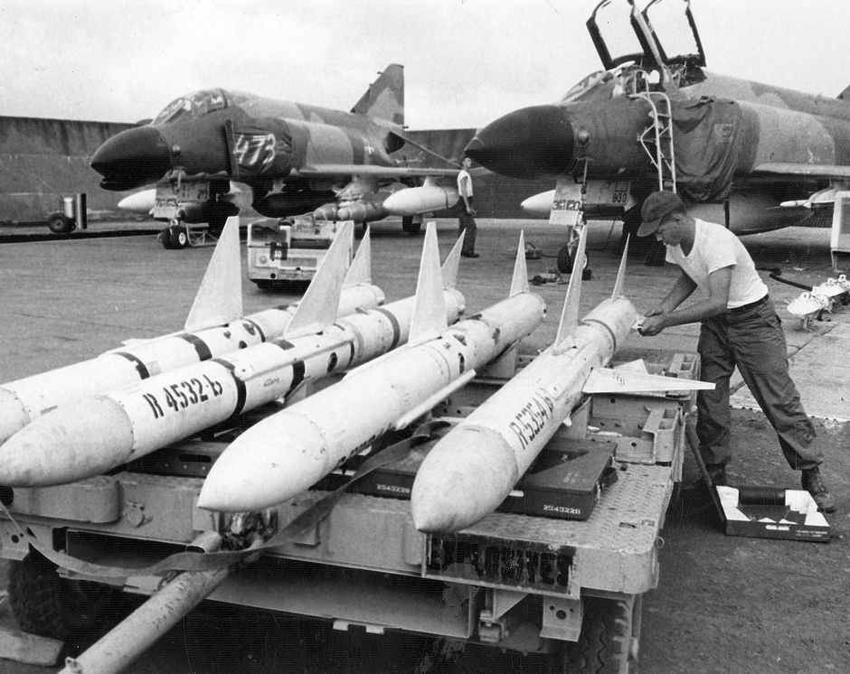

# AIM-7 Sparrow

The AIM-7 is a semi active radar missile with a maximum launch range of approx. 26 nautical miles.

Originally designated the AAM-N-6 Sparrow III, the AIM-7 Sparrow saw initial service entry with the
United States Navy in 1958. Unlike the beam-riding AIM-7A (AAM-N-2 Sparrow I), which required the
launching aircraft to maintain boresight on the target for the flyout of the weapon, the semi-active
radar homing AIM-7C could effectively engage a maneuvering target well off boresight, so long as the
designating aircraft's radar could maintain a lock during the missile's intercept. The AIM-7C
quickly gave way to the 7D, which saw a number of kills over Vietnam, and the 7E, which scored the
majority of the type's kills in Southeast Asia. Additionally, the F-4E saw compatibility with the
AIM-7F and AIM-7M.

Utilization of the AIM-7 begins with tuning the onboard rounds, performed with the [RDR MSL
switch](../../cockpit/pilot/weapon_management.md#radar-missile-power-switch) , selecting it into the
CW ON position. This tuning process takes approximately one minute, and can be initiated once power
has been applied for at least one minute to the radar (any position out of OFF) in most operating
environments (ambient temperature below 90 degrees F). The missiles are properly tuned when the
[missile status light](../../cockpit/pilot/weapon_management.md#missile-status-lights) (RDR) is
illuminated in each station carrying a Sparrow missile for at least one minute. After successful
tuning, the [RDR MSL switch](../../cockpit/pilot/weapon_management.md#radar-missile-power-switch)
can be returned to the STBY (Standby) position. The status lamps will turn off once returned to
STBY. Once in the combat area, the [RDR MSL
switch](../../cockpit/pilot/weapon_management.md#radar-missile-power-switch) should be returned to
the CW ON position, to maintain proper missile tuning state during the engagement.

To employ an AIM-7,
the [optical sight](../../cockpit/pilot/dcsg_controls.md#sight-mode-knob)
should be placed into the A/A position,
which stabilizes the Reticle at the Radar Boresight Line in the window. The roll
tabs function to provide the pilot with relative roll attitude guidance in
instrument conditions (weather or nighttime), and the right side of the 50 mil
diameter circle (outer) functions as a range bar when a radar lock is achieved
against a target, displaying ranges up to 20,000' (top) to 3000' (bottom), with
12,000' signified at the 3 o-clock position. It is also possible to employ an AIM-7 using the ACM
Mode via pressing the Cage Button first and than pressing the CAA Button to accomplish a lock.

When radar lock against a target is achieved with AIM-7 selected, a pair of strobes surround the
locked target in azimuth. Identified as Rmax and Rmax 2, they represent effective ranges against a 1
G target (Rmax), and a high rate maneuvering target based on altitude (Rmax 2, representing 8G up to
20k, 6G to 35k, and 4G above 35,000'). When a missile is launched, the Rmax 2 strobe falls to the
bottom of the display, and begins driving upwards towards the target lock; this functions as a
missile flyout timer. When the timer reaches the locked target, it can be assumed the missile has
arrived. The display does not provide Rmin, but instead reverts to a break X warning superimposed
over the radar image should Rmin be attained for a Sparrow launch.

Prior to engagement, a determination must be made as to whether or not the missile
[interlocks](../../cockpit/pilot/weapon_management.md#interlock-switch) will be kept in, or
positioned out. The interlocks preclude an AIM-7 shot when outside of effective firing parameters,
those being the missile in range (illuminating the [IN RANGE
light](../../cockpit/pilot/dcsg_controls.md#in-range-light)), the target aim dot within the ASE
(Allowable Steering Error) circle on the radar display, and the radar display mode out of VI
(Vis-Ident mode).

With the [interlocks](../../cockpit/pilot/weapon_management.md#interlock-switch) in, should any of
the three aforementioned restrictions be met - target out of range, aim dot outside the ASE, or the
radar left in VI, a trigger actuation will not cause the release of a missile. With
[interlocks](../../cockpit/pilot/weapon_management.md#interlock-switch) out, an AIM-7 will be
released no matter the condition of the three interlocks.

When parameters are met, the [SHOOT lamps](../../cockpit/pilot/overhead_indicators.md#shoot-lights)
will illuminate. Found in both cockpits, these lights reinforce the condition of good launch
conditions for the AIM-7. In the event a target enters a main beam clutter situation (aspect angle
between 81 and 99 degrees and lower than 5 degrees above the horizon), the lights will turn off,
even though the interlock requirements are met. Maneuver should be utilized to bring the target
outside this region prior to launch.

At the point of engagement, AIM-7 missiles are selected using the Pinky Switch on the outboard
(left) throttle arm, selecting the forward position. This illuminates the RADAR lamp on the [Head Up
Display panel](../../cockpit/pilot/weapon_management.md#head-up-display-indicators).

Before employing the AIM-7E Sparrow, a delay of four seconds should be given if the [Master Arm
switch](../../cockpit/pilot/weapon_management.md#master-arm-switch) is set in the ON position prior
to radar lock on, or a delay of two seconds if the [Master Arm
switch](../../cockpit/pilot/weapon_management.md#master-arm-switch) is set to ON after radar lock
on. This is due to the set-in period of the missile speed-gate. With the AIM-7F, this delay is
reduced to two seconds with [Master Arm
switch](../../cockpit/pilot/weapon_management.md#master-arm-switch) On prior to lock, or immediately
after selecting [Master Arm switch](../../cockpit/pilot/weapon_management.md#master-arm-switch) to
On if lock on was achieved first. Should these delays not be adhered to, the missile may fail to
track because of improper target doppler injection.

With the target in parameters or
[interlocks](../../cockpit/pilot/weapon_management.md#interlock-switch) out, pressing the trigger
fires off an AIM-7. A second AIM-7 can be fired immediately at the same target, if desired, by
releasing, then squeezing the trigger a second time- holding it on the second actuation.

## Launch Sequence

 (todo fix - jnelson)

The launch sequence for the AIM-7 missile is

1. Left Forward
2. Right Forward
3. Left Rear
4. Right Rear

In the event of a centerline store or tank precluding forward missile release, the [CL TK
lamp](../../cockpit/pilot/weapon_management.md#centerline-tank-aboard-light) will illuminate. Rear
missiles may still be fired, and the forward missiles may be fired if the centerline tank is dropped
or MER is jettisoned. The lamp also illuminates in the event of a BRU-5/A in the centerline
position, however, a missile can be launched in that condition. The Aero-27 precludes any release,
even if the round has been dropped.

## Variants

The following variants of the AIM-7 family are available for this variant of the Phantom:

| Type  | Description |
|-------|-------------|
|AIM-7E | The E Sparrow was an early version of the Sparrow missile, entering service in the 1960s, which uses proportional navigation and Semi Active Radar Homing to guide. |
|AIM-7E2| Changes were made to improve the performance in close range dogfight situations, at the expense of energy retention in longer ranged engagements. Fuzing time is also reduced allowing for proper fuzing in close engagements. |
|AIM-7F | The F Sparrow was upgraded to be solid state, have a higher performance two stage motor (boost and sustainer) and have improved electronics including the ability to coast targets through the main lobe clutter and altitude lines. These changes also make the seeker able to detect targets from further range and with increased countermeasure resitance and track using both continuous wave and pulse doppler guidance signals unlike the E,E2 and E3 which can only guide on continuous wave.
|AIM-7M | The M was the first inverse monopulse sparrow providing increased tracking precision, it also has improved motor performance and electronics, including improved clutter and countermeasure rejection. The M like all sparrows can also guide using continuous wave, at a degraded tracking precision.

Below is a very basic comparitive summary of each sparrow's performance in some general areas.

| Type  | Seeker | Range | Dogfight | Countermeasure Resist / Clutter Rejection |
|-------|--------|-------|----------|-----------------------|
|AIM-7E |poor    |fair   |no        |poor                   |
|AIM-7E2|poor    |poor   |yes       |poor                   |
|AIM-7F |fair    |good   |yes       |fair                   |
|AIM-7M |good    |good   |yes       |good                   |
