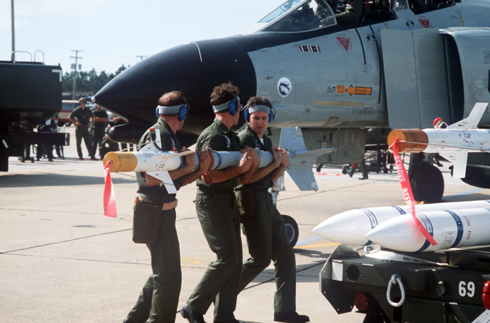
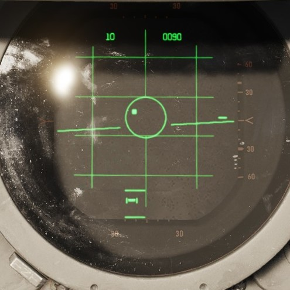
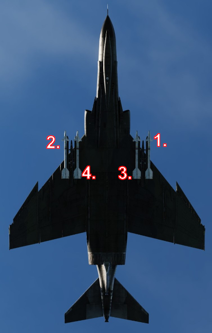

# AIM-9 Sidewinder

Entering service with the United States Navy in 1956, and finally accepted by
the United States Air Force in 1964, the short range, infrared seeking AIM-9
Sidewinder is considered by most to be the world's first truly effective air to
air guided missile. Beginning with the AIM-9B and maintaining compatibility to
the AIM-9M in US service, the Sidewinder provided the Phantom II with a capable
close-in weapon system against rapidly maneuvering opponents.

Employment of the AIM-9 can be performed with or without a radar lock, and is
initiated by selecting Master Arm to ON and selecting the Throttle Pinky Switch
to the center position for Heat. The HEAT lamp on the Head Up Display will
illuminate, and available AIM-9 missiles will illuminate on the Missile Status
Panel. The Optical Sight should be selected to A/A, and the reticle will
stabilize at the Radar Boresight Line, which is the boresight location for the
Sidewinders on the rails.

Should a radar lock be achieved, the sight will display the range bar on the
right side as previously described, with 20,000' indicated at the top, and
3,000' range indicated at the bottom. With a radar lock on, the radar will
display a pair of strobes signifying Rmax and Rmin for the Sidewinder against
the target under current launch conditions.

> 💡 The AIM-9 does not receive a guidance handoff from the APQ-120 like on
> later aircraft to direct the seeker's look angle. Instead, the ASE circle
> presents the aim dot against the target to bring it to the RBL.

Centering the aim dot in the ASE aligns the target to the RBL, thus allowing for
rapid acquisition by the seeker of the selected AIM-9. Once the missile's tone
changes to signify lock, the pilot can then hold down the ARR button on the grip
to allow for Sidewinder self-track (seeker uncage); this function allows the
seeker to maintain acquisition of the target (noted by the shifted audio tone),
while permitting maneuver of the aircraft to a better aspect angle or range
solution prior to launch if the situation allows. The amount of maneuver
available to a given Sidewinder type is based on the variant, and should be
considered before making the selection.

## Launch Sequence

Once the desired firing solution is attained, the AIM-9 is launched using the
trigger.

AIM-9 Launch Sequence:

1. Left Outboard
2. Right Outboard
3. Left Inboard
4. Right Inboard

## Variants

The following variants of the AIM-9 family are available for this variant of the
Phantom:

| Variant   | Description                                                                                                                                                                                                          |
| --------- | -------------------------------------------------------------------------------------------------------------------------------------------------------------------------------------------------------------------- |
| B         | First operational version of the Sidewinder family, entering service in the 1950s. It utilized an infrared homing seeker for target acquisition and tracking, making it a heat-seeking missile.                      |
| J         | Featuring enhanced guidance and performance characteristics. It retained the infrared homing seeker but had improved sensitivity and better resistance to countermeasures.                                           |
| JULI      | Variant of the AIM-9J developed by Germany. It featured modifications to meet specific operational requirements.                                                                                                     |
| L         | Significant upgrade with improved infrared homing capabilities, allowing for better target discrimination. It introduced all-aspect targeting, meaning it could engage targets from any angle, not just from behind. |
| M         | Improved guidance and counter-countermeasures capabilities. It had enhanced maneuverability and improved target-tracking algorithms, making it more effective in combat situations.                                  |
| P         | Developed for export and used by various nations. It featured improvements over earlier models in terms of reliability and seeker performance.                                                                       |
| P-3       | Improves the P version by using a reduced-smoke motor and improving the guidance system. Base of the swedish RB-24J missile.                                                                                         |
| P-5       | Further improves counter-countermeasures capabilities, as seen in the M version. Base of the swedish RB-24L missile.                                                                                                 |
| Captive M | Non-functional version used for training and testing purposes.                                                                                                                                                       |

Below is a basic comparative summary of each Sidewinder's performance in some
general areas, whereas ✔️ means _good_, ⚠️ _fair_ and ❌ _poor_.

| Type      | Lock-Tone | Uncage | Aspect | Maneuverability | CM Resist | Motor |
| --------- | --------- | ------ | ------ | --------------- | --------- | ----- |
| B         | ❌        | ❌     | Rear   | ❌            | ❌        | ❌    |
| J         | ❌        | ✔️     | Rear   | ⚠️            | ⚠️        | ❌    |
| JULI      | ✔️        | ✔️     | All    | ⚠️            | ✔️        | ⚠️    |
| L         | ✔️        | ✔️     | All    | ✔️            | ✔️        | ✔️    |
| M         | ✔️        | ✔️     | All    | ✔️            | ✔️        | ✔️    |
| P         | ❌        | ✔️     | Rear   | ⚠️            | ⚠️        | ❌    |
| P-3       | ❌        | ✔️     | Rear   | ⚠️            | ⚠️        | ⚠️    |
| P-5       | ✔️        | ✔️     | All    | ⚠️            | ✔️        | ⚠️    |
| Captive M | ✔️        | ✔️     | All    | ✔️            | ✔️        | ✔️    |

Some variants have a null-seeker. These missiles do not produce a tone when
fully aligned with a target. This can lead to confusion, thinking the missile
does not track while it is actually locked perfectly on the target.

The AIM-9B is unable to uncage in order to dynamically track a target that is
not on its boresight.
