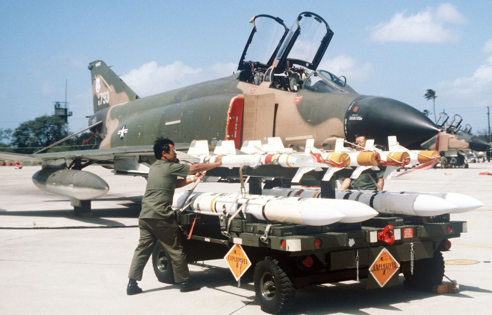
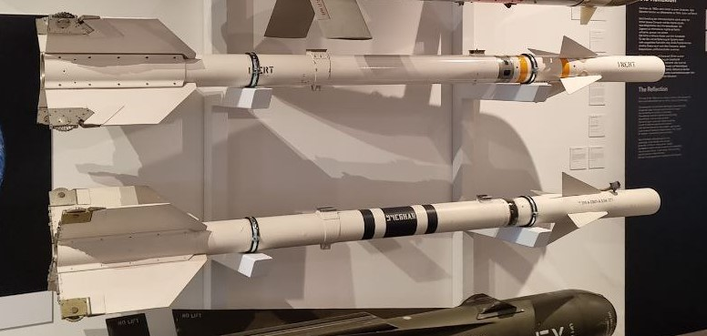

# Air to Air

The F-4E Phantom II stands as an enduring testament to aerial supremacy, owing much of its
reputation to its formidable air-to-air capabilities.

The [AIM-7 Sparrow missile](./aim_7.md) takes center stage in the Phantom II's air-to-air
capabilities. Comprising a substantial portion of the F-4E's air-to-air armament,
the [Sparrow's](./aim_7.md) radar-guided system allows pilots to engage adversaries before they
enter the visual horizon.

In close-quarters engagements, the F-4E relies on the [AIM-9 Sidewinder,](./aim_9.md) a short-range,
infrared-guided missile celebrated for its agility and responsiveness. Constituting a vital
component of the Phantom II's air-to-air weaponry, the Sidewinder excels in the intense and dynamic
scenarios of dogfights.

