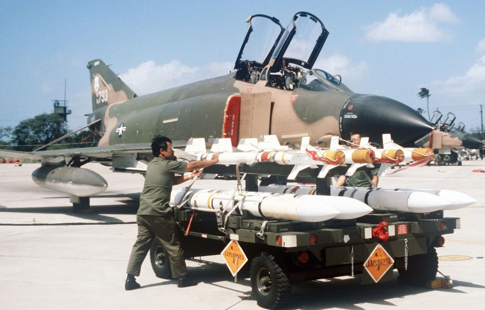

# 空对空

F-4E “鬼怪”II 战斗机作为不朽的空中霸主，其盛名在很大程度上归功于其强大的空对空作战能力。

[AIM-7 “麻雀”导弹](./aim_7.md) 在 F-4E “鬼怪” II 战斗机的空对空能力中占据核心地位。作为 F-4E 空对空
武器库的重要组成部分，[“麻雀”的](./aim_7.md) 的雷达制导系统使得飞行员能够在敌机进入视距之前进行攻击
。

在近距离格斗中，F-4E 依赖于 AIM-9 “响尾蛇”导弹，“响尾蛇”一种近程、红外制导导弹，以其敏捷性和响应速
度而著称。作为鬼怪 II 空对空武器库的重要组成部分，“响尾蛇”导弹在紧张且多变的空战场景中表现出色。

