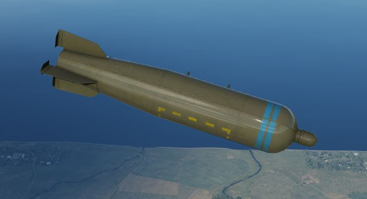
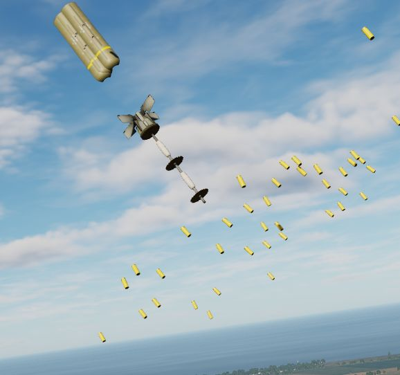

# Cluster Bombs

Available cluster bombs are:

| Variant  | Sub-Munition | Amount | Description      |
| -------- | ------------ | -----: | ---------------- |
| Mk-20    | Mk 118       |    247 | HEAT             |
| CBU-52B  | BLU-61A/B    |    220 | HE               |
| CBU-87   | BLU-97/B     |    202 | Combined Effects |
| CBU-1A/A | BLU-4B       |    513 | HE               |
| CBU-2/A  | BLU-3        |    361 | HE               |
| CBU-2B/A | BLU-3B       |    418 | HE               |

## Mk 20 Rockeye

Carrying 247 Mk 118 anti-tank bomblets, the Mk 20 Rockeye is used to deliver
said potency across a wide dispersal area. The Mk 20 has a base schedule
dispersal time depending on variant (4 seconds in the Mod 2 variant, and 1.2
seconds in the Mod 3), along with a ground crew selectable option time that is
programmed prior to takeoff. In concert, once over the target area the pilot can
select the necessary option through the Nose/Tail Arming switch, and deliver the
weapon with the profile most suited to the target.

## CBU-52B

Cluster bomb using a SUU-30 submunitions dispenser loaded with 220 BLU-61A/B
anti-personnel and anti-material incendiary high explosive fragmentation bombs.

## CBU-87

Free falling bomb consisting of a SUU-65B canister with a timed fuze. Carries
202 BLU-97/B submunitions.

Each bomblet is attached to a a small ballute that slows them down and increases
their spread while falling. Upon impact, they have a combined shaped charge,
fragmentation and incendiary effect, which makes them suitable for
anti-personnel, anti-material and also anti-armor.

## CBU-1, CBU-2

Dispensers with 19 tubes each loaded with either 27 BLU-4B, 19 BLU-3 or 22
BLU-3B HE bomblets. Upon impact with the ground, each bomblet discharges high
velocity fragments in a radial pattern.

In the case of the CBU-2/A and CBU-2B/A, the carried BLU-3 bomblets are loaded
with steel balls suitable even for unarmored vehicles. The CBU-1A/A, carrying
BLU-4B bomblets, is loaded with anti-personnel shrapnel material.

## Employment

With the exception of the CBU-1 and CBU-2, cluster bombs are deployed using the
BOMBS setting on the
[Weapon Selector Knob](../../../cockpit/pilot/weapon_management.md#weapon-selector-knob).

The CBU-1/-2 however, are dispensers that technically have more similarities
with a rocket launcher than they have with a conventional bomb. The setting RKTS
& DISP has to be used to employ them properly.

The A setting can also be used as a backup mode which will send a single pulse
signal to all selected pylons on each press of the Bomb Button.

Technically, all bombing modes on the
[Delivery Mode Knob](../../../cockpit/pilot/weapon_management.md#delivery-mode-knob)
are supported, see the [4.3.3.6. Employment](employment/overview.md) section for
details.

However, since bomblets are often deployed by a timed fuze, best results are
achieved if they are dropped directly above the target area with laydown modes
DL or L. Modes DT and TGT FIND, as well as Direct, TL or OFFSET can also be used
effectively.
