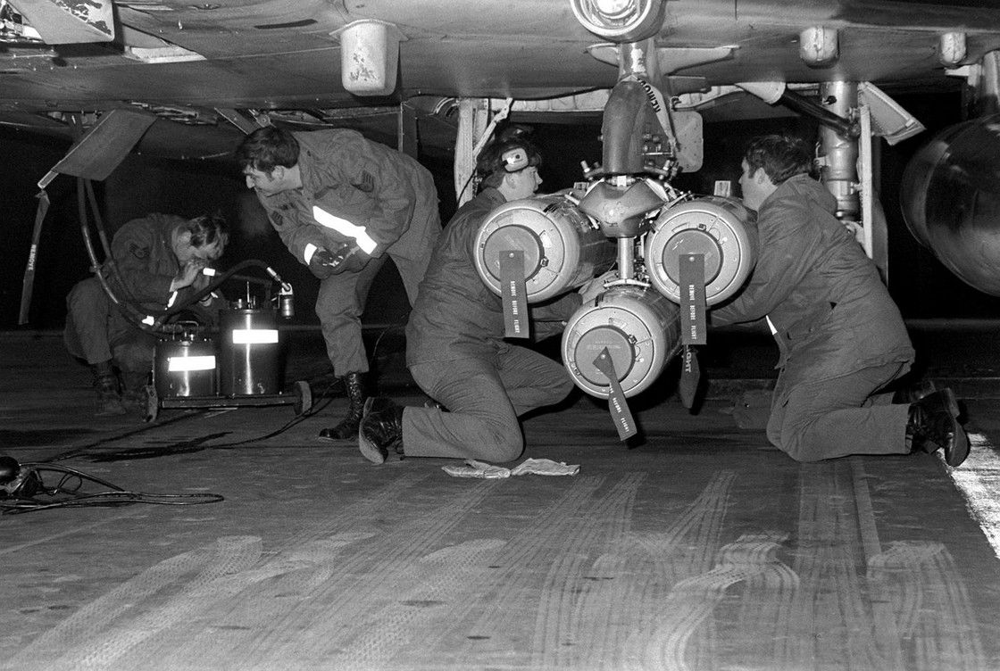
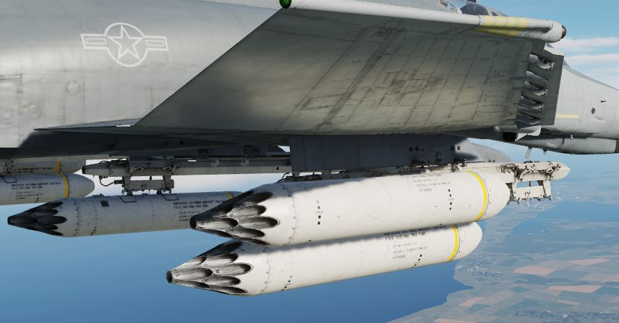

# 集束炸弹

可用集束炸弹包括：

| 型号     | 子弹要    | 数量 | 描述     |
| -------- | --------- | ---: | -------- |
| Mk-20    | Mk 118    |  247 | HEAT     |
| CBU-52B  | BLU-61A/B |  220 | HE       |
| CBU-87   | BLU-97/B  |  202 | 复合效应 |
| CBU-1A/A | BLU-4B    |  513 | HE       |
| CBU-2/A  | BLU-3     |  361 | HE       |
| CBU-2B/A | BLU-3B    |  418 | HE       |

## Mk 20 “石眼”

携带 247 枚 Mk 118 反坦克子弹药的 Mk 20 “石眼” 用于大面积布撒子弹药来提高杀伤效能。Mk 20 根据型号拥
有基础布撒时间制度（Mod 2 型为 4 秒，Mod 3 型为 1.2 秒），以及由地勤人员在起飞前进行编程的可选预设
时间。这样一来，在飞机进入目标区域后，飞行员可以通过头部/尾部引信开关选择必要的选项，并以最适合目标
的方式投放武器即可。

## CBU-52B

集束炸弹使用 SUU-30 子弹药撒布器，携带 220 枚 BLU-61A/B 反人员和反器材高爆破片燃烧弹。

## CBU-87

自由落体炸弹，由一个带有定时引信的 SUU-65B 布撒器组成。可携带 202 枚 BLU-97/B 子弹药。

各枚子弹药都带有一个小减速伞来在下落过程中减速并增加散布范围。在命中时，子弹药产生聚能，破片和燃烧
效果进行杀伤，对人员以及器材以及装甲目标有着不错的杀伤效果。

## CBU-1, CBU-2

19 管布撒器，可装载 27 发 BLU-4B、19 发 BLU-3 或 22 发 BLU-3B HE 子弹药。命中后，每枚子弹药都会以放
射状发射高速破片。

在 CBU-2/A 和 CBU-2B/A 中，携带的 BLU-3 子弹药中装有钢珠，非常适用于无装甲车辆。携带 BLU-4B 子弹药
的 CBU-1A/A 则包括反人员金属破片材料。

## 武器投放

除 CBU-1 和 CBU-2 外，集束炸弹都将通过
[武器选择旋钮](../../../cockpit/pilot/weapon_management.md#武器选择旋钮) 上的 BOMBS 档位来进行投放
。

不过，比起传统航弹，CBU-1/-2 是一种从技术上讲，与火箭发射器更相似的布撒器。要正确使用 CBU-1/-2，飞
行员必须选择 RKTS & DISP 档位。

A 档位还可用作后备模式——每按下一次航弹投放按钮将会向所有选定的挂架发送一个脉冲信号。

从技术上讲，CBU-1/-2 支持[投放模式旋钮](../../../cockpit/pilot/weapon_management.md#投放模式旋钮)
上的所有投弹模式，详见 [4.3.3.6. 武器投放] 部分。

然而，由于子弹药通常是通过定时引信进行起爆，因此如果使用铺投模式 DL 或 L 在目标区域正上方投放，可实
现最佳打击效果。DT 和 TGT FIND 以及直接、TL 或 OFFSET 模式也可以有效布撒子弹药。
