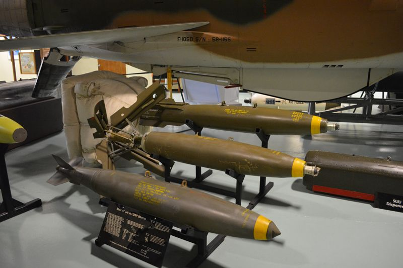
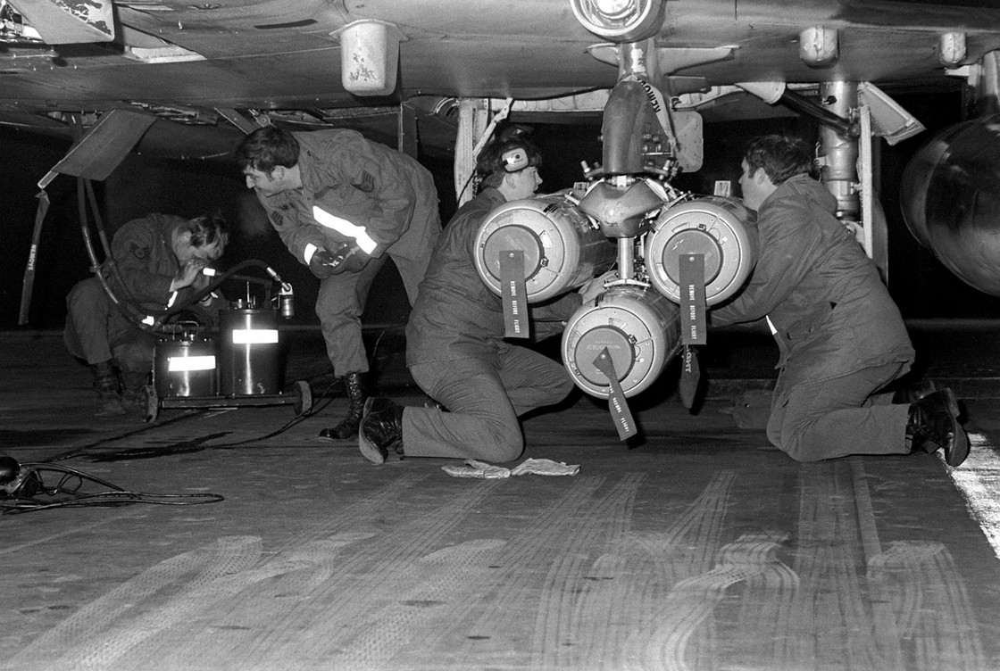
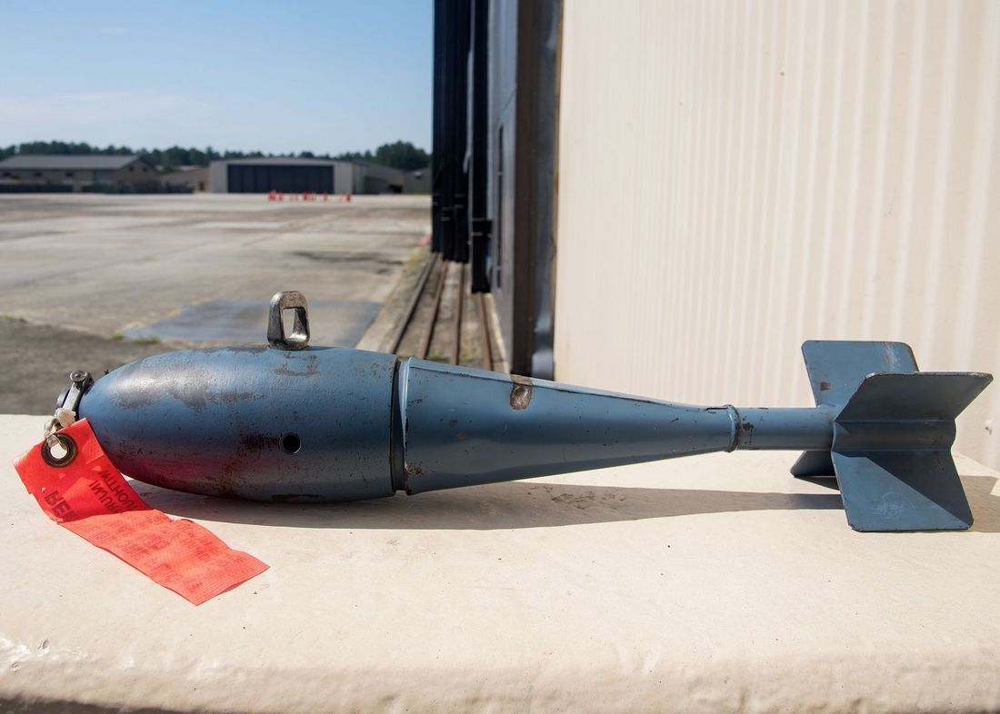
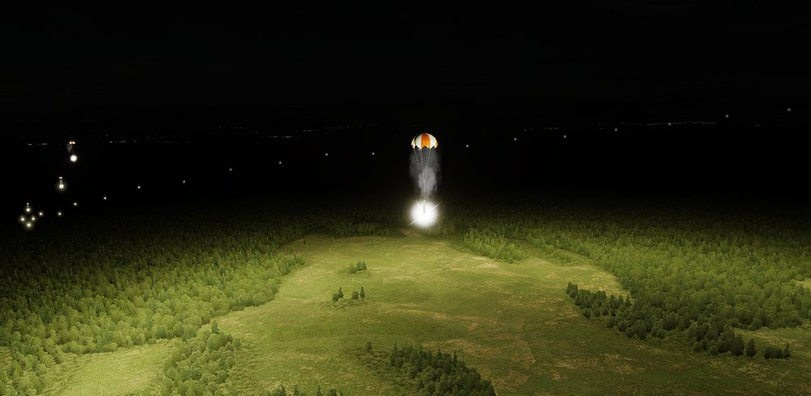

# Conventional Bombs

## Mk 80 Series

The Phantom II's bread and butter in the air to ground role, the Mk 80 series
conventional bombs were first dropped in combat over North Vietnam. The F-4E is
able to deliver the 500 lb Mk 82, the 1000 lb Mk 83, and 2000 lb Mk 84. Of note
is the selectable drag option Mk 82 variant known as Snakeye. With the
selectable fin arrangement on the round, the deployable fins remain in position
in the low drag profile, and deploy as a cruciform aerobraking device in the
high drag setting. This change in setting is managed with the Nose/Tail Arming
switch.

### Variants

Available conventional unguided bombs are:

| Variant       | Warhead | Description         |
| ------------- | ------: | ------------------- |
| Mk-81         |  250 lb | Low Drag            |
| Mk-82         |  500 lb | Low Drag            |
| Mk-82 AIR     |  500 lb | Low/High Drag Chute |
| Mk-82 Snakeye |  500 lb | Low/High Drag       |
| Mk-83         | 1000 lb | Low Drag            |
| Mk-84         | 2000 lb | Low Drag            |
| M-117         |  750 lb | Low Drag            |

> 💡 MK-82 Air and Snakeye can be switched between Low and High drag configuration depending
> on the [Fuze Arm Switch](../../../systems/weapon_systems/multiple_weapons_system.md#nosetail-arm-switch).
> The nose fuze arms the bomb, while the tail fuze puts the bomb into High Drag if set
> and Low Drag if not set.

## Anti-Tank Cluster Bombs - Mk 20 Rockeye

Carrying 247 Mk 118 anti-tank bomblets, the Mk 20 Rockeye is used to deliver
said potency across a wide dispersal area. The Mk 20 has a base schedule
dispersal time depending on variant (4 seconds in the Mod 2 variant, and 1.2
seconds in the Mod 3), along with a ground crew selectable option time that is
programmed prior to takeoff. In concert, once over the target area the pilot can
select the necessary option through the Nose/Tail Arming switch, and deliver the
weapon with the profile most suited to the target.

### CBU Variants

Available cluster bombs are:

| Variant | Amount | Description      |
| ------- | -----: | ---------------- |
| Mk-20   |    247 | HEAT             |
| CBU-52B |    220 | HE               |
| CBU-87  |    202 | Combined Effects |

## BDU Series Training Bombs

Depending on the training requirements and range needs, the Phantom II can carry
the BDU-33 25 lb training bomb, the BDU-45 500 lb training bomb, or the BDU-50
500 lb training bomb, in either low or high drag configuration, to simulate the
carriage and release profile of standard Mk 82 and Snakeye rounds.

### BDU Variants

Available variants of the BDU family include:

| Variant | Warhead | Description  |
| ------- | ------: | ------------ |
| 33      |   25 lb | Low Drag     |
| 50 HD   |  500 lb | High Drag    |
| 50 LD   |  500 lb | Low Drag     |
| 45 LG   |  500 lb | Laser Guided |

## SUU-25 Target Marker Flares

Container loaded with 8 parachute illumination flares for marking target areas or
providing battlefield illumination at night.

To employ, select DIRECT Delivery Mode and RKTS & DISP on the Weapon Selector Knob.
Release them directly over the target area. The flares last for around 4 minutes and
should be dropped below 4920ft(1500m) AGL if battlefield illumination is desired.
