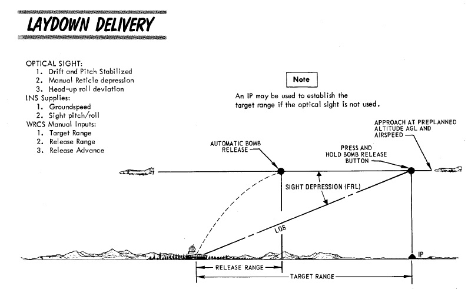

# 武器投放

“鬼怪”战机有着各种武器投放模式可用于投弹。大多数模式都需要 WSO 向
[ARBCS](../../../systems/weapon_systems/arbcs.md)/[WRCS](../../../systems/weapon_systems/wrcs.md)
输入数据来使用。

如需计算辅助，请查看 [轰炸计算器章节](../../../dcs/bombing_computer.md)。玩家可在游戏内按下
<kbd>RCTRL</kbd> + <kbd>B</kbd> 开开关计算器页面。

## 上仰轰炸（LOFT）

上仰投弹用于最小化暴露于地面火力和在不飞越目标的情况下投放多枚炸弹。正如其名称所示，飞机从低空拉起
到高空，在预先计算的点上抛投武器来命中目标。

规划执行上仰投弹需要知道的目标位置，以便计算起始点（IP）和对应炸弹的投放距离。弹道表用作确定投放剖
面和拉起距离。有了这些信息，就可以决定投弹的数量，这将决定覆盖范围，并且知道拉起距离——可选的相对 IP
的拉起点的距离。由于从起始点到拉起点的路线将以恒速飞行，接着拉起距离就可用于确定路线飞行时间来将数
据输入至拉起计时器中。并且有了低角度的弹道表参考，即可设置投放剖面。

在进入目标区域后，飞行员沿着预定航线飞往起始点，并一旦飞越，按住航弹投放按钮以开始攻击。飞行员直接
或修正风偏侧飞至拉起点，保持按住航弹投放按钮，并在预计的武器投放完成前，按住按钮。

在 LOFT 模式下，[ARBCS](../../../systems/weapon_systems/arbcs.md) 将使用 4.0G 拉起制度进行编程，并
且在轰炸程序开始后、计时器计时结束且调整至预设的低仰角（陀螺）角度，ARBCS 将自动投放选择的武器。在
轰炸程序开始，按下投弹按钮时，ARBCS 将超控
[ADI](../../../cockpit/pilot/flight_director_group.md#attitude-director-indicator) 上提供的任何其它
导航引导指示，并接手指针指令信号来预设攻击剖面的相对偏差。垂直指针用来指示飞行员是否需要偏航输入来
保持对准目标。接近上仰点时，水平针显示相对 1.0G 飞行路径的偏差。当拉起计时器计时结束，指示开始 4.0G
拉起时，水平指针的偏差将相对预设的 4.0G 拉起进行显示，指针开始偏移代表要在两秒内加至 4.0G 过载。水
平指针保持居中表示飞行员以适当速度增加并保持过载，此时将最大化投弹准确度。在飞行员投放完最后一颗所
需的航弹并松开航弹投放按钮前，[AN/AJB-7](../../../systems/weapon_systems/arbcs.md) 将保持控制 ADI。

## 计时越肩轰炸 - (TIMED) O/S

上仰模式的衍生模式，计时越肩投弹适用于可以直接飞越目标情况，将从已知 IP 位置开始，以任务规划期间确
定的已知高度和空速执行轰炸。设置好 LABS 系统需要时间（使用从设定的起始点到目标飞越点的已知距离和预
期空速计算得出）和计算出的投放角度来输出解算空速和武器——数据被输入到高角设置中；高角度数值必须超过
90 度，而低角度和次要计时器设置可以输入任意值。以正确的空速朝向合适的航向保证飞越目标，计时器到时后
，飞行员将听音调提示指示开始拉起，同时拉起灯也会亮起。通过在起始点上方按下航弹投放按钮并在轰炸全程
保持按住按钮来启动计时动作。

像上仰模式一样，拉起信号指示也会触发
[ADI](../../../cockpit/pilot/flight_director_group.md#attitude-director-indicator) 中的水平和垂直指
针来显示合适的的俯仰和角度指示，来保持飞机朝向合适能够准确进入投放点，目标拉起过载为 4.0G。指针引导
将指引飞机执行一次英麦曼机动，系统将在到达输入的高角度值时投放航弹。在轰炸全程保持水平指针居中来实
现最大化准确度，就像上仰模式一样，在轰炸程序的最后，一旦预定武器都已投放完毕后松开投弹按钮，ADI 就
会恢复到先前的功能。

## 实时越肩轰炸 - INST O/S

计时越肩投弹的另一衍生模式，实时越肩投弹提供了与用于攻击随遇目标，计时 O/S 相同的结合攻击/脱离剖面
。INST O/S 通过省去对起始点（IP）位置和解算时间的需求，仅需要输入超过 90 度仰角的高角度值。一旦飞机
直接飞过目标上方，飞行员需要按下并保持航弹投放按钮，并开始 4.0G 机翼水平拉起进入英麦曼机动。LABS 计
算机将与在上仰和计时 O/S 模式下一样超控
[ADI](../../../cockpit/pilot/flight_director_group.md#attitude-director-indicator) 显示，将水平指针
置于中央来实现 4.0 G 拉起，而垂直指导显示偏差来在机动过程中引导飞机保持在合适的坡度。在达到预定仰角
后，武器开始分离，一旦预定武器都已投放完毕即可松开投弹按钮——松开后将复位 ADI 显示。

## 计时低角度伞投 - T LAD(D)

设想用于战术核弹的投放法，正如其名所示以计时低角度伞投进行投放。TLAD (D) 模式执行低空进入，通过
3.5G 上仰过渡到 45 度爬升剖面，在爬升顶端上仰投放武器，此时武器将放伞缓慢下高至目标，以便载机能够逃
出杀伤范围。虽然最初设计用于投放战术核弹，但这种方法为使用高或高到低脱离来准确投弹提供了另一选项。

从轰炸表开始规划 T LADD 攻击，确定选定武器的正确进入高度和空速，以及从开始拉起到投放的解算高度增益
和时间——将作为投放控制计时器数值使用，以及爬升机动的飞行距离。使用这个距离作为基线，确定一个适当的
接近角度，并选择一个合适的起始点（IP）航点。根据计划剖面空速评估 IP 与拉起点之间的距离，这将提供另
一个时间输入——拉起计时器值。

通过以正确的空速和高度沿预定截击航向飞越 IP 并在飞越 IP 时按下航弹投放按钮来执行攻击，整个机动过程
中保持按下。按下按钮将开始拉起计时器
。[ADI](../../../cockpit/pilot/flight_director_group.md#attitude-director-indicator) 指针将居中，然
后显示相对初始航向的偏差——垂直指针表示横滚，指针水平来保持当前高度。在拉起计时器结束时，系统将播放
拉起警告音，拉起灯将亮起；随后，投放计时器将开始计时，ADI 水平指针将转变显示相对预定 3.5G 拉起的偏
差，然后在到达 45 度仰角后稳定。正确定时和 3.5G 过载拉起将保持指针居中。

在投放计时器结束时，系统将投放预编程的武器，拉起灯将熄灭，ADI 指针将收起。在投放完最后一发航弹后，
飞行员即可松开航弹投放按钮，并执行所需的逃逸机动。

## 计时水平轰炸 - TL

计时水平投弹是最基础的 [ARBCS](../../../systems/weapon_systems/arbcs.md) 模式——仅使用投放计时器；拉
起计时器应设置为 000，高低投放设置可以不做更改。根据所选武器确定的炸弹投放距离，参考目标上方的预计
飞行高度和空速，找到投放计时器的设置。投放决定了武器从飞机分离的点。相对航弹投放距离来选择起始点
（IP），然后根据所选空速，使用投放点与 IP 之间的距离计算投放计时器值。

执行攻击需要通过输入必要的投放计时器数值，在飞越 IP 时按下并保持航弹投放按钮，并在目标上方以计划的
空速和高度保持直线和水平飞行，直到武器投放完成。与其它 LABS 模式不同，TL 没有拉起音调提示或 ADI 指
针超控来指示仰角或横滚偏差——完全依赖于飞行员保持机翼水平飞行。

## 直接轰炸

直接投弹正如其名：经典的、直接的目视轰炸，可以俯冲和水平轰炸投放执行。直接投放模式中不使用
[ARBCS](../../../systems/weapon_systems/arbcs.md) 和
[WRCS](../../../systems/weapon_systems/wrcs.md)，飞行员根据投弹表中为预定武器的剖面飞行，按表格设置
瞄准具准星下压，并手动操纵飞机，使准星直接对准目标，来按照投弹表命中目标。一旦准星对准目标，就按下
航弹投放按钮，武器将根据指定的程序设置进行投放。虽然是“鬼怪”中最基本模式，但在条件允许的情况下，直
接轰炸仍是一种可靠的投弹方法，可用于攻击机组能够看到的任何目标——即随遇目标，或在近距离空中支援
（CAS）环境中使用。

## 偏置轰炸

偏置轰炸提供纯仪表轰炸选项，使用一体化
[WRCS](../../../systems/weapon_systems/wrcs.md)、[INS](../../../systems/nav_com/ins.md) 和
[雷达](../../../systems/radar/overview.md) 组合，以高空和低空飞行剖面执行轰炸。偏置轰炸可以在目视和
仪表条件下使用，用于投放航弹或布撒武器（使用 RKTS & DISP 模式）。

偏置轰炸将基于相对于已知目标位置的选择起始点（IP）展开。使用目视攻击时，它被称为 VIP——目视识别点，
通过直接飞越 VIP 来执行开始导航辅助。使用仪表攻击时，IP 被称为 RIP——雷达识别点——在 MAP-PPI 模式下使
用雷达锁定截获该点，截获后将生成飞向目标的导航解算。规划时应该注意，VIP 或 RIP 相对目标的位置决定了
一对偏置值（该模式的名称来源）；一个在南北轴，另一个在东西轴。两个偏置量的单位为英尺，每个轴的最大
偏置量为 99900 英尺（16.44 海里）。同时在任务规划中需要确定是 IP 的高度，使用相应武器的投弹表进行选
择、超出目标的高度、空速和的查找表进行选择，注意炸弹投放距离。准备 WRCS 输入时，偏置始终以 IP 到目
标为基准。选择 IP 应尽可能靠近目标，以通过缩短导航时间和距离来最小化系统导致的漂移，且接近 IP 时应
专注于最少化机动量来在 IP 截获（RIP）或飞越（VIP）后将机头指向目标。

### 偏置 RIP 低空注意事项

在 RIP 模式中特别需要注意的是，如果飞进到目标时以低于 RIP 的高度飞行，需要补偿高度差。因为
[WRCS](../../../systems/weapon_systems/wrcs.md) 和导航系统执行的计算是机械性的，选择一个高于航线的
RIP 目标高度可能会导致干扰损伤。执行以下步骤来缓解这个问题，：

1. 记录接近高出平均海平面。 2. 将 RIP 高出平均海平面减去接近平均海平面高度. 3. 从接近高度减去 2. 中
   的结果值。

结果值用于目标高度值，飞行员在目标冻结和插入操作期间按正常计划的接近姿态飞行。

最终攻击程序的差异如下所述：

### 偏置目视 IP

在飞越 IP 之前，应输入南北和东西偏差量、投放距离（按窗口的 x10 或使用
[WRCS](../../../systems/weapon_systems/wrcs.md) 面板上的 x100 开关修改器），以及任何所需的投放提前
设置。此外，应在 [AWRU](../../../systems/weapon_systems/awru.md) 上选择所需的投放计时和数量。

偏置目视起始点（VIP）攻击在飞越 VIP 时开始，此时飞机处在所需的投放高度和速度；当飞机飞越 VIP 时
，WSO 同时按下游标控制面板上的冻结信号和目标插入信号按钮；这样将开始
[INS](../../../systems/nav_com/ins.md) 目标跟踪。此时，垂直
[ADI](../../../cockpit/pilot/flight_director_group.md#attitude-director-indicator)、瞄准具、BDHI 和
HSI 助航设备将全部显示相对计算出的投放点的偏差，以及 HSI 和 BDHI 显示上的目标距离。

由飞行员通过操纵飞机对准投放点航线来完成攻击，保持计划的投放空速和高度，并在接近投放点之前，按住航
弹投放按钮。如果在武器投放前，在未到达编程的投放距离前松开了航弹投放按钮，重新按下航弹投放按钮即可
恢复攻击。开始投弹后，上仰灯将亮起以确认开始投弹。如果在超过投放点后才按下航弹投放按钮，在飞过目标
前，系统不会投放航弹；因此，应在误投炸弹前松开投弹按钮以取消轰炸。

攻击完成后，系统将保持设定目标的导航程序。尽管 INS 自然漂移可能降低这第二次攻击的准确性，但飞行员仍
可以尝试重新攻击。

### 偏置雷达 IP

在 RIP 冻结以及目标插入前，应输入南北和东西偏差量、RIP 高度、投放距离（按窗口的 x10 或使用
[WRCS](../../../systems/weapon_systems/wrcs.md) 面板上的 x100 开关修改器），以及任何所需的投放提前
设置。此外，应在 [AWRU](../../../systems/weapon_systems/awru.md) 上选择所需的投放计时和数量。在开始
前，飞行员应该在按所需飞行高度和空速剖面进入目标区域。WSO 应准备好 APQ-120 进行攻击，在 MAP-PPI 模
式下有良好的 [雷达](../../../systems/radar/overview.md) 信息、NOR 稳定模式、WIDE 扫描、以及 10 或
25 英里的显示距离，观察到 RIP 的回波。

攻击将从将纵向距离光标（在雷达显示器上呈现扩大的半球，用来确定 RIP 的距离）放置在接近预定 RIP 回波
的下方处。设置好后，横向距离光标（一条垂线）转动到 RIP 上。确定好交点后，WSO 稍作等待，直到 RIP 距
离缩短并落在交点上。此时，WSO 需要按下冻结按钮。按下冻结按钮将开始雷达跟踪 RIP，并还为 WSO 提供调整
纵向和横向距离光标交点的机会。在确定好精确点后，WSO 需要按下插入目标按钮，按下按钮后目标引导将转移
至 INS，并立即将纵向和横向距离光标从 RIP 转至偏差目标。

此时，[ADI](../../../cockpit/pilot/flight_director_group.md#attitude-director-indicator)、瞄准具
、[BDHI](../../../cockpit/wso/upfront_indicators.md#bearing-distance-heading-indicator-bdhi) 和
[HSI](../../../cockpit/pilot/flight_director_group.md#horizontal-situation-indicator)上将提供 INS
导引和距离信息。WSO 应继续监控雷达显示器——如果实际目标随着距离缩短而出现在显示器上，可以在
[WRCS](../../../systems/weapon_systems/wrcs.md) 面板上输入目标的实际已知高度，并使用控制旋钮来控制
纵向和横向距离光标来进一步提高投放准确度。

在到达投放距离之前，飞行员必须按住航弹投放按钮。在航弹投放完毕后，拉起灯将亮起以确认投弹。

如果 RIP 剖面由于天气条件转变为可能进行 VIP 攻击剖面，WSO 可以保留
[WRCS](../../../systems/weapon_systems/wrcs.md) 中的偏置设置，飞行员简单地飞越 RIP，WSO 同时按下冻
结和目标插入按钮，就像进行 VIP 攻击一样即可。

## 目标搜寻 - TGT FIND

目标搜寻最初只是从偏置模式衍生出来的一种公用模式；不提供标准的投放信号给火控系统和
[AWRU](../../../systems/weapon_systems/awru.md) 来开始炸弹投放。相反，它被用来在不投放的情况下确认
目标位置，用于训练用途，或者在必要时进行 INS 系统更新。

然而，安装了 [Pave Spike](../../../systems/weapon_systems/pave_spike/overview.md) 瞄准吊舱后，目标
搜寻将指示 WRCS 使用吊舱视线确定的目标进行俯冲改出投弹，而不是通过雷达锁定来确定目标。

在这种情况下，将 Pave Spike 对准目标（开启激光来取得更准确的斜距）并按住航弹投放按钮。类似于常规的
俯冲改出投放，HUD 上会出现转向提示。当满足弹道解算的参数时，系统将自动投放炸弹。

### 目标搜寻 INS 更新

通过 VIP 或 RIP 来执行 [INS](../../../systems/nav_com/ins.md) 更新——INS 更新的地点即为目标位置。INS
更新开关应拨至 SET 档位，并将目标的纬度和经度坐标输入到导航控制面板中。使用 RIP 或 VIP 截获程序来生
成 IP 更新，使用冻结和目标插入按钮来定义更新的目标位置。飞行员将按解算引导飞行，而 WSO 需要将 INS
更新开关保持在 FIX 档位。一旦 BDHI DME 读数为零且方位指针穿过 90 度，松开更新开关，此时 INS 更新完
成。

## 俯冲改出轰炸 - DT

俯冲改出利用 [WRCS](../../../systems/weapon_systems/wrcs.md)
[雷达](../../../systems/radar/overview.md) 跟踪，结合其它飞机传感器，来实时进行投放解算。飞行员可以
从任何方向、空速和俯冲角度接近目标，WRCS 根据截获跟踪、武器阻力系数设置以及任何投放提前控制输入（结
合 [AWRU](../../../systems/weapon_systems/awru.md) 设置）计算合适的投放点。

如需执行俯冲改出攻击，首先 [雷达](../../../systems/radar/overview.md) 必须设置在 AIR-GRD 模式下、显
示距离设置为 5 或 10 英里。设置完成后，飞行员需要将光学瞄准具设置为空对地模式，准星自动锁定在 RBL
上。然后飞行员在投放模式旋钮上选择 DT、将武器选择旋钮设置为 BOMBS 并在相应的
[AWRU](../../../systems/weapon_systems/awru.md) 旋钮上选择所需的间隔和数量。此时，飞行员可以开始攻
击。

飞行员将从俯冲开始攻击。DT 所需的俯冲角度大约比直接轰炸模式高 20%，以此取得有效的
[雷达](../../../systems/radar/overview.md) 地面锁定；也就是说，雷达必须起的稳定地面回波，而不是直接
看到实际将被轰炸的目标。一旦锁定成功，飞行员然后操纵飞机将准星指向预定的目标，保持机翼水平，接着按
住航弹投放按钮将雷达距离插入到 [WRCS](../../../systems/weapon_systems/wrcs.md)，随后开始所需的改出
机动，保持机翼水平。在飞行员按下航弹投放按钮后，此时不再需要雷达地面锁定。改出机动必须尽可能保持恒
定的转弯率来最大化投弹准确度。

到达计算出的投弹点时，WRCS 提供投放信号，并根据选择的数量和间隔设置投弹。

## 俯冲铺投 - DL

与俯冲改出相似，俯冲铺投适用于饱和投放高阻武器，其中距离对预定投放参数的影响很小。在 DL 中并非计算
投放距离，而是直接在 [WRCS](../../../systems/weapon_systems/wrcs.md) 面板中设置投弹表投放区间，飞行
员在目标上方的一定高度以弹道表空速（真空速或地速）飞行来实现特定投放区间。

飞行员需要通过将投放模式旋钮转至 DL 来选择俯冲铺投，并选择 RKTS & DISP（仅限布撒器/CBU）或 BOMBS。
所需的投放区间需要在 [WRCS](../../../systems/weapon_systems/wrcs.md) 面板上输入，并且如果必要，还有
投放提前控制。

攻击的开始与俯冲改出相同；执行一个比正常更高的俯冲角度、雷达设置在 AIR-GRD 模式下、显示距离为 5 或
10 英里，截获稳定回波然后飞行员将准星放置在预定目标并按住航弹投放按钮。完成这些后，飞行员在轰炸表计
划高度改出俯冲，保持目标空速和航向以及机翼水平，炸弹在预期投放区间自动投放。在这种模式下提高准确度
的关键因素是在投放点保持正确高度和俯仰。

## 铺投 - L

铺投攻击模式使用已知的光学瞄准具准星下压值（或 IP）来确定目标的距离，并根据轰炸表中所需的目标距离来
投弹。这个飞行剖面最适用于使用高阻炸弹进行低空轰炸。

设置铺投攻击需要在 [WRCS](../../../systems/weapon_systems/wrcs.md) 面板上输入轰炸表的目标距离和高出
目标的高度。光学瞄准具应设置为空对地模式，并使用表格中注明的下压值，且接近目标时应以轰炸表中列出的
真空速（或地速）参数飞行，保持机翼水平。[AWRU](../../../systems/weapon_systems/awru.md) 和 WRCS 投
放提前设置应按需输入，并将武器选择旋钮转至 BOMBS 或 RKTS & DISP（仅限布撒器）。

当准星飞越目标时，飞行员应当在武器投放完成前按住航弹投放按钮。

