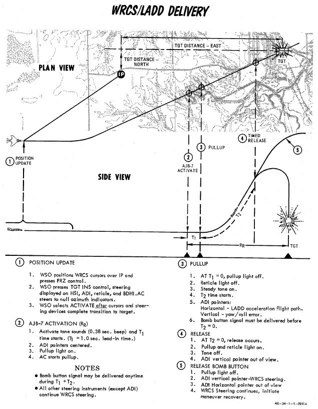
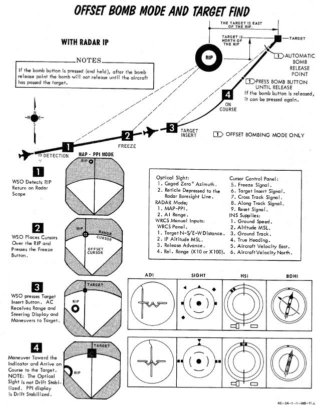
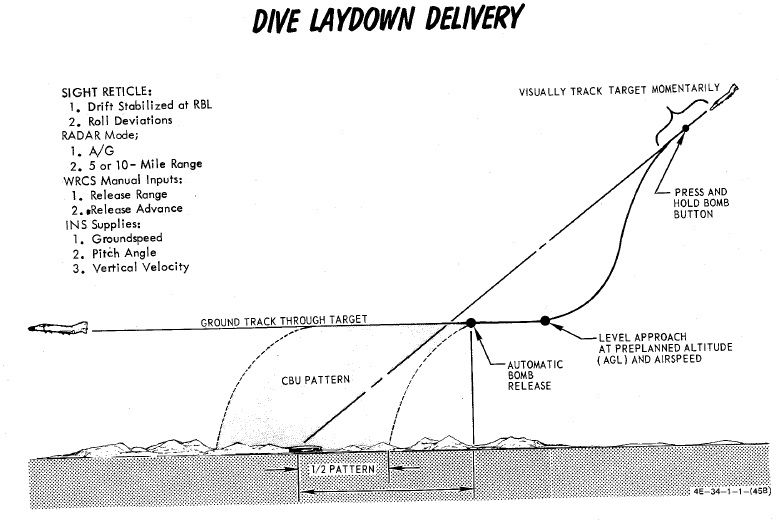

# Employment

The Phantom has a wide range of weapon modes to employ bombs.

## LOFT

Loft bombing is utilized to deliver multiple bombs with minimum exposure to
ground fire and no target flyover. As the name entails, the aircraft transitions
from a low altitude to a higher one in a pull-up, thus lofting the released
munitions at a pre-calculated point that reaches the target.

Planning for a loft attack requires a known target location, so that distances
for the IP and respective bomb ranges can be calculated. The ballistics tables
are references to determine delivery pattern and pull-up-to-target range. With
this information, the number of bombs can be decided, which determines the
spread, and knowing the pull-up to target range- the pull-up point distance to the
IP can be chosen. As the path from IP to pull-up is flown at a constant speed,
this can then be used to determined time from said distance for pull-up Timer
entry. And with the ballistic table reference for the LOW angle, the profile is
set.

Upon entry to the target area, the pilot flies the intended course to the IP,
and once over, presses and holds the bomb release button to initiate the run.
Flying direct or crabbed to the pull-up point, the pilot maintains the bomb
release button in the down position, and holds it until the desired munitions
have released.

In LOFT mode, the ARBCS programs for a 4.0 G pull-up schedule, and will
automatically release the selected munitions once the bombing run is initiated,
timer runout has occurred, and pre-set LOW pitch (gyro) angle is achieved. At
the initiation of the bomb run, upon pressing the bomb button, the ARBCS
overrides any other navigational guidance provided on the ADI and assumes
command of the pointers to show deviation relative to the programmed attack
profile. The vertical pointer offsets in the direction requiring yaw input to
maintain target alignment. On approach to the loft point, the horizontal needle
shows deviation from a 1.0 G flight path. When the pull-up timer completes
signaling the 4.0 G pull-up, deviation of the horizontal needle is relative to
the desired constant 4.0 G pull, with the initial drift representing achieving
4.0 G of load in two seconds. Maintaining the horizontal needle centered means
the pilot has increased and held G at the proper rate for maximum accuracy.
Control of the ADI by the AN/AJB-7 is maintained until the pilot releases the
bomb button after the last desired munition is released.

## Timed Over the Shoulder - (TIMED) O/S

Derived from the Loft mode, Timed Over the Shoulder bombing is available for
circumstances in which a direct target flyover is possible, originating from a
known IP position, with the attack flown at a known altitude and airspeed
determined during mission planning. Setup of the LABS system requires time
(calculated using the known distance from the set IP to the target flyover point
and the intended airspeed) and calculated release angle for the resulting
airspeed and munition, which is entered into the High Angle setting; this value
must be in excess of 90 degrees, and the Low Angle and secondary timer settings
can be left at any value. Flying the appropriate heading at the correct speed
guarantees target flyover, and upon timer runout an audible tone will be heard
to initiate pull-up, along with the Pull Up Lamp illuminating. This timing action
is initiated by pressing the bomb button over the IP, and holding it throughout
the attack run.

Like Loft mode, the pull-up signal indications will also trigger the horizontal
and vertical pointers on the ADI to display appropriate pitch and angle
indications to maintain proper aircraft orientation for accurate release point
entry, and the target pull rate is 4.0G The guidance drives the attacking
aircraft through an Immelmann, and the bombs will release at the entered High
Angle value. Maximum accuracy is achieved through maintaining a centered
horizontal needle during the entire bombing run, and like Loft, the ADI reverts
back to the previous function once the bomb button is released after the last
intended munition for the run has been dropped.

## Instantaneous Over the Shoulder - INST O/S

Further derived from the Timed O/S mode, Instantaneous Over the Shoulder bombing
provides the same combined attack/escape profile as the former against targets
of opportunity. It does this by dispensing with the need for an IP location and
the resulting time, and simply requires entry of a High Angle value in excess of
90 degrees pitch. Once the aircraft is directly over the target, the pilot
presses and holds the bomb release button and initiates the 4.0 G wings level
pull up into the Immelmann maneuver. The LABS computer performs the same ADI
display overrides as Loft and Timed O/S, placing the horizontal director needle
at the pitch appropriate for a 4.0 G pull, and the vertical director displays
deviation to maintain proper angle of bank through the maneuver. Upon reaching
the necessary angle of pitch, the munitions separation begins, and the bomb
release button can be released once all desired rounds have been ejected from
the aircraft, thus resetting the display of the ADI.

## Timed Low Angle Drogue Delivery - T LAD(D)

Conceived as a delivery method for tactical nuclear bombs, Timed Low Angle
Drogue Delivery is performed just like it sounds. The mode performs a low
altitude ingress, transitioning through a 3.5 G pull-up into a 45 degree climb
profile that allows for a lofted release of a weapon at the top of the climb,
allowing an escape attempt as the munition's deployed drogue slows the decent to
the target. While originally designed with nuclear intent, the method provides
yet another option for accurate bomb delivery with a high, or high to low,
escape option for appropriate targets.

Planning of the T LADD engagement begins in the bombing tables, determining the
correct entry altitude and airspeed for the selected weapon, as well as the
resulting altitude gain and time from pull up initiation to release- which will
be used as the Release control timer value, as well as the distance downrange
this climb maneuver will take the aircraft. Using this range as a baseline, an
appropriate approach angle is determined, and a suitable IP waypoint is chosen.
The distance between the IP and the pull-up point is evaluated against the
planned profile speed, which provides another time entry- this will be the
pull-up timer value.

The attack is performed by flying over the IP along the desired intercept
heading to the target at the correct speed and altitude, and actuating the bomb
release button upon flyover of said IP, holding it down throughout the maneuver.
This begins the pull-up timer. The ADI needles will center, then show deviation
against the initial heading course- vertical being roll, horizontal being level
to maintain current altitude. At timeout of the pull-up timer, a pull-up warning
tone will be provided, and the pull-up Lamp will illuminate; subsequently, the
Release timer will begin its count, the horizontal ADI needle will transition
into show deviation from the intended 3.5 G pitch angle, and then stabilize once
45 degrees nose up pitch is attained. Proper timing and loading of the 3.5 G
pull-up will maintain the needle centered.

At timeout of the Release timer, the programmed munitions will release, the
pull-up light will turn off, and the ADI needles will be stowed. Once the last
round is ejected, the bomb release button can be released, and the desired
escape maneuver performed.

## Timed Level - TL

Timed Level bombing is the most basic ARBCS mode, utilizing only the Release
timer; the pull-up timer should be set to 000, and the High and Low Release
settings can be left at any value. The setting for the Release timer is found
based on the bomb range value determined for the chosen weapon, referencing the
desired flight altitude above the target and airspeed. This range determines the
point where the munition(s) will be released from the aircraft. An IP is chosen
relative to the bomb range distance, and the Release timer value is then
calculated using the distance between the point of release and the IP based on
the chosen airspeed.

The attack is performed by entering the necessary Release timer value, pushing
and holding the bomb release button upon IP flyover, and maintaining straight
and level flight at the planned airspeed and altitude at the target until the
weapons are released from the aircraft. Unlike the other LABS modes, there is no
pull-up audio or ADI needle takeover to illustrate pitch or roll deviation- it is
simply dependent on the pilot to maintain wings level flight.

## Direct

Direct bombing is exactly as it sounds: classic, direct visual bombing, with
both dive and level bombing release passes possible. Both the ARBCS and WRCS are
excluded from this release mode, and the pilot flies the profile as found for
the intended munition in the bombing tables, setting the sight depression to
match, and hand flying the aircraft to place the pipper directly onto the target
in accordance with the desired type of attack. Once pipper on is achieved, the
bomb release button is pressed, and the selected number of munitions with the
given program settings will be released. While the most basic mode available to
the Phantom, Direct remains a reliable method when conditions permit, and can be
used against any target the crew can see- namely, targets of opportunity, or in
the CAS environment.

## Offset

Offset bombing provides a blind bombing capability, with high and low level
bombing profiles, using the full integration of the WRCS, INS, and radar in
combination. Offset bombing can be used in both visual and instrument
conditions, to release either bombs or dispensed munitions (with the RKTS & DISP
mode).

The setup for an Offset bomb attack is based around the selection of an IP
relative to a known target location. For a visual attack, it is called VIP- the
Visual Identification Point, and initiation of the navigation assistance is
performed with a direct flyover of the VIP. In an instrument conditions attack,
the IP is called the RIP- the Radar Identification Point, and acquisition of
this point using a radar lock in MAP-PPI mode generates a navigation solution to
the target. When chosen during planning, he VIP or RIP's position relative to
the target determines a pair of offset values (hence the name of the mode); one
in the North/South axis, the other East/West. Both offsets are noted in feet,
and the maximum amount of offset in each axis is 99,900', or 16.44 nautical
miles. Also founding during mission planning is the altitude of the IP, and
selection is made using the lookup tables for the respective weapon, altitude
above target, and speed, taking note of the bomb range. When preparing the WRCS
entries, the offsets are always referenced from the IP to the target. Selection
of an IP should be as close as possible to the target to minimize system drift
by way of smaller navigation time and distance, and approach to the IP should be
flown with a focus on minimizing maneuvering required to put the target nose on
after IP acquisition (RIP) or flyover (VIP).

### Offset RIP Low Altitude Considerations

Of special note in the RIP mode is the need to compensate for altitude
difference in the event the ingress to target will be flown below the altitude
of the RIP itself. Because the computations performed by the WRCS and navigation
system are mechanical, selecting a RIP target altitude above the course can
cause interference damage. To alleviate this, perform the following:

a. Note the approach altitude above MSL. b. Subtract the approach altitude MSL
from the RIP altitude above MSL. c. Subtract the resulting value found in b from
the approach altitude.

The resulting value is used for the target altitude value, and the pilot flies
the planned approach attitude during the target freeze and insert operations as
per normal.

The differences in final attack procedures are described below:

### Offset Visual IP

Prior to IP overflight, the N/S and E/W offsets, release range (x10 per the
window, or using the x100 switch modifier on the WRCS initiate panel), and any
desired release advance setting should be entered. Additionally, the desired
release timing and count should be selected on the AWRU.

The Offset Visual IP attack commences on overflight of the VIP, with the
aircraft at the desired release altitude and speed; as the aircraft overflies
the VIP, the WSO simultaneously presses the Freeze Signal and Target Insert
Signal buttons on the Cursor Control Panel; doing so initiates INS target
tracking. At this time, the vertical ADI, Sight, BDHI, and HSI navigation aids
will all show offset from the calculated release point, as well as target range
on the HSI and BDHI.

Completion of the attack is performed by the pilot through maneuvering the
aircraft to align course to the release point, maintaining the planned release
airspeed and altitude, and, prior to reaching the release point, pressing and
holding the bomb release button. If the bomb release button is released prior to
munitions release, but at a range greater than the programmed release range, the
attack can be recovered by pressing and holding the bomb release button until
release occurs. When this takes place, the pull-up light will illuminate to
confirm drop initiation. Should the bomb release button not be pressed until
after the release point is passed, the bombs will not release until the target
is passed; ergo, the bomb button should be released to cancel the run prior to
errant bomb drop.

Once an attack is completed, the navigation program against the set target is
maintained. The aircraft can attempt a re-attack, although natural INS drift may
reduce the accuracy of this second attack.

### Offset Radar IP

Prior to RIP Freeze and Target Insert, the N/S and E/W offsets, RIP altitude,
release range (x10 per the window, or using the x100 switch modifier on the WRCS
initiate panel), and any desired release advance setting should be entered.
Additionally, the desired release timing and count should be selected on the
AWRU. Prior to initiation, the pilot should enter the target area at the desired
profile altitude and airspeed. The WSO should have the APQ-120 prepared for the
attack with a good radar picture in MAP-PPI mode, NOR stab mode, WIDE scan, and
a range of 10 or 25 miles, with an observed return from the RIP.

Initiation of the attack begins with placing the Along Track cursor (presented
as a growing hemisphere on the radar display defining range to the RIP) in
proximity to, but below, the intended RIP return. When this is set, the Cross
Track cursor (a vertical line) is slewed over the RIP. Once the intersection is
defined, the WSO waits momentarily until the RIP range decreases and falls onto
the intersection. At this time, the WSO pushes the Freeze button. This initiates
radar tracking of the RIP, and provides the opportunity for the WSO to better
the intersection point between the Along Track and Cross Track cursors. Once the
precise point is attained, the WSO pushes the Insert Target button, which hands
target guidance off to the INS and performs an immediate slew of the Along Track
and Cross Track cursors from the RIP to the offset target.

At this time, the INS presents guidance and range information on the ADI, the
sight, the BDHI, and the HSI. The WSO should continue to monitor the radar
display- should the actual target appear on the display as range decreases, the
actual known altitude of the target can be entered on the WRCS panel and the
Along Track and Cross Track cursors can be touched up using their controls to
further increase release precision.

Prior to release range, the pilot must press and hold the bomb release button.
Once the bombs have released, the pull-up light will illuminate to confirm
release.

In the event that a RIP profile, due to breaking weather conditions, transition
to a VIP-possible profile, the offsets can be kept in the WRCS, and the pilot
simply fly over the RIP, with the WSO pressing the Freeze and Target Insert
buttons simultaneously, just like a VIP attack.

## Target Find - TGT FIND

Target Find is a utility mode derived from Offset; it does not provide a
standard release signal to the fire control and AWRU to initiate bomb drop. It
is instead used to confirm target location without release, for training
purposes, or, if necessary, perform an INS system update.

Note: with Pave Spike installed, Target Find **can** initiate a weapon release,
and so Master Arm should be kept in the OFF position until positive target
confirmation is achieved.

### Target Find INS Update

INS update is performed using offsets again a convenient VIP or RIP, with the
target location being where the INS update occurs. The INS update switch should
be placed in SET, and the latitude and longitude coordinates of the target
entered into the navigation control panel. The RIP or VIP acquisition procedures
are used to generate the fix to the IP, with the Freeze and Target Insert
buttons used to define the target location for update. The pilot flies the
resulting guidance, while the WSO holds the INS update switch in the FIX
position. Once the BDHI DME reads zero and the bearing needle passes through 90
degrees, the update switch is released, and the INS update is complete.

## Dive Toss - DT

Dive Toss uses WRCS radar tracking, in conjunction with other aircraft sensors,
to calculate the release solution in real time. The target can be approached
from any direction, airspeed, and dive angle, and the WRCS computes the proper
release point relative to the the acquired track, munition drag coefficient
setting, and any release advance control input (in conjunction with AWRU
settings).

To perform a Dive Toss attack, the radar must be set in AIR-GRD mode, with a 5
or 10 mile range setting. Once set, the pilot initiates the attack with the
Optical Sight in Air-to-Ground mode, and the reticle automatically cages in
elevation along the RBL. The pilot then selects DT on the Delivery Mode Knob,
places Weapon Selector Knob in BOMBS, and selects the desired Interval and
Quantity on the respective AWRU knobs. At this point, the pilot can initiate the
attack.

The attack is initiated in a dive. The required dive is roughly 20% higher than
that required for a Direct mode attack, as to achieve effective radar ground
lock; that is, the radar must get a solid ground return, rather than see the
actual target being bombed. Once lock-on is achieved, the pilot then maneuvers to
place the pipper over the intended target, wings level, then presses and holds
the bomb button to insert radar range to the WRCS, and then begins the desired
pullout maneuver, maintaining wings level. After the pilot pushes the bomb
release button, radar ground lock is no longer required. The pullout maneuver
must maintain as constant a rate of turn as possible for maximum precision.

At the point where the bomb computed trajectory will intersect the target, the
WRCS provides the release signal, dropping rounds based on the settings chosen
for number and interval.

## Dive Laydown - DL

Similar to Dive Toss, Dive Laydown is available for saturation delivery of high
drag weapons where range has little effect on the intended release parameters.
Rather than a computed release range, the bombing table release range is set
directly in the WRCS panel, and the pilot flies the ballistic schedule speed
(true airspeed or ground speed) at the given altitude above the target to
produce the given release range.

Dive Laydown is selected by placing the Delivery Mode Knob in DL, and choosing
either RKTS & DISP (for dispensers/CBU only) or BOMBS. Desired release range is
entered on the WRCS panel, and, if necessary, the release advance control.

The start of the attack is the same as Dive Toss; a higher than normal dive
angle is flown, with the radar in AIR-GRD mode at 5 or 10 mile range, a solid
return is generated, and the pilot then positions the pipper on the intended
target and holds the bomb release button. Once this is completed, the pilot
pulls out of the dive at the bombing table plan altitude, maintains the target
speed and heading with wings level, and the bombs release automatically at the
desired range. The key factors for accuracy in this mode are correct altitude
and pitch angle at the point of release.

## Laydown - L

The Laydown attack mode uses a known optical sight depression value (or IP) to
determine range to target, and releases the munitions based on a desired range
to target from the bombing tables. The profile is most useful for lower altitude
attacks using high drag munitions.

Setup for the Laydown attack requires the bombing table target range and
altitude above target to be entered on the WRCS panel. The Optical Sight should
be set to the depression noted from the tables in Air-to-Ground mode, and the
approach to the target should be flown at the true airspeed (or ground speed)
listed in the bombing tables for the parameters, wings level. The AWRU and WRCS
Release Advance settings should be entered as desired, and the Weapon Select
Knob placed in BOMBS or RKTS & DISP (for dispensers only).

As the pipper crosses the target, the bomb button should be held until the set
spread of munitions has released.

